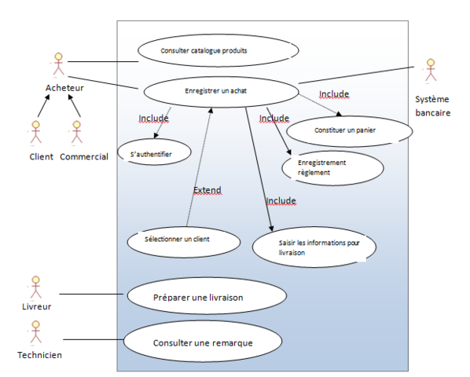

# Architecture Système Embarqué

# Table of contents
- [Architecture Système Embarqué](#architecture-système-embarqué)
- [Table of contents](#table-of-contents)
- [Objectif du cours](#objectif-du-cours)
- [Introduction](#introduction)
- [Vue d'ensemble](#vue-densemble)
  - [Ingénieurie logicielle des systèmes complexes vs ingénieurie logicielle pure](#ingénieurie-logicielle-des-systèmes-complexes-vs-ingénieurie-logicielle-pure)
  - [SysML](#sysml)
    - [Diagramme comportement](#diagramme-comportement)
    - [Diagramme structurels](#diagramme-structurels)
  - [Diagramme](#diagramme)
- [Diagrammes d'études](#diagrammes-détudes)
  - [Cas d'utilisation](#cas-dutilisation)
  - [Activité](#activité)
- [Atelier 1 - Etude & conception d'un VAL](#atelier-1---etude--conception-dun-val)
- [Cours 2 02/02/21](#cours-2-020221)
  - [Correction atelier 1](#correction-atelier-1)
  - [Exigences](#exigences)
  - [Blocs (sous forme d'ébauche)](#blocs-sous-forme-débauche)
    - [Exemple - Cas d'un serrure à carte](#exemple---cas-dun-serrure-à-carte)
  - [Atelier 2 - VAL/APM Exigences Blocs](#atelier-2---valapm-exigences-blocs)
- [Cours 3 - 08/02/21](#cours-3---080221)
  - [Définition de blocs](#définition-de-blocs)
    - [Structure & Propriétés](#structure--propriétés)
    - [Comportement](#comportement)
    - [Accessoire](#accessoire)
  - [Vision interne des blocs](#vision-interne-des-blocs)
    - [Diagramme de bloc interne](#diagramme-de-bloc-interne)
    - [Du BDD vers l'IBD](#du-bdd-vers-libd)
  - [Atelier 3](#atelier-3)
  - [Résumé](#résumé)
- [Cours 4 - 08/02/21](#cours-4---080221)
  - [Dynamique et spécifications](#dynamique-et-spécifications)
  - [Atelier 4](#atelier-4)

Lien MyLearningBox  : https://mylearningbox.reseau-cd.fr/course/view.php?id=24676  
Une seule personne du groupe remet, bien préciser les noms des personnes. 
Nombre de personnes maxi: 3 à 4 personnes

# Objectif du cours

L'idée est de voir un language commun le __SysML__, dérivé d'UML, qui est un language permettant à tout type d'ingénieur système ou participant à l'implémentation d'un système embarqué
(ingénieur en électronique, mécanique, pneumatique, hydraulique...). Il faut savoir mettre en place et modéliser, et formaliser les exigences d'un projet à l'aide d'un langage dérivé d'UML.    

Des bases d'UML se reconmmandées mais non-obligatoires.  

Il faudra se projeter dans une entreprise et imaginer un besoin proche du réel.   

Il faudra partir de diagrammes (SysML) afin de pouvoir écrire du code.  

Il sera possible de passer d'un diagramme blocs à la génération de code.

# Introduction

Système plus gros, utilisant de l'embarquer (interagir le logiciel avec des système mécaniques ou pneumatiques)

Exemple de système embarqué:
- système de lecture de carte pour ouverture de portes d'un établissement
- robot autonome de collecte de qualité de l'air

Exemple de plus gros système :
- __VAL__(Véhicules Automatique Léger).  

Outils:
- draw.io
- Eclipse EMF/ Papyrus  

Il faudra faire interagir du matériel avec du logiciel.

# Vue d'ensemble

## Ingénieurie logicielle des systèmes complexes vs ingénieurie logicielle pure  

Nous allons voir les caractéristiques d'un système complexe et effectuer une comparaison par rapport l'ingénierie logicielle. Ainsi nous verrons comment mettre en place les spécifications liées à
l'ingénierie des systèmes complexes en utilisant un langage commun: le __SysML__.  

__Un système c'est des éléments en interactions__, un tout. Par exemple: la matière est composé d'atomes en interactions, il s'agit donc d'un système. Un système contient des frontières définissant ce qui s'y trouve à l'intérieur et extérieur, si le système est ouvert ou fermé (on parle d'interaction avec l'environnement). Si le système est __ouvert__, il peut interagir avec l'extérieur, s'il est __fermé, il ne le pourra pas.   

__Un système complexes est un ensemble constitué d'un grand nombre d'entités en interaction qui empêchent l'observateur de prévoir sa rétroaction, son comportement ou évolution par le calcul__. La __théorie du chaos__ traite notamment des systèmes complexes. Les interactions vont s'ajuster les unes par rapport aux autres. 

Un système devient complexe si les interactions sont non-linéaires. 
Exemple: cours avec échanges ou dialogues interropant la linéarité. L'intervenant
__La théorie du chaos (années 1980)__: très vite nous pouvons ne plus arriver à prévoir ce qu'il va se passer, une équation peut se complexifier. C'est représenter par l'effet papillon: un battement d'aile d'un papillon peut provoquer une tempête à l'autre bout du monde de part les conséquences dans l'air. Cela met en avance toute petite variation et remet en cause un peu les formalisme dans les mathématiques. L'approche Cartésienne devient inadéquate.   

En mathématiques, __la théorie du chaos étudie le comportement des systèmes dynamiques très sensibles aux conditions initiales__, un phénomène généralement illustré par __l'effet papillon__. Pour de tels systèmes, des différences infimes dans les conditions initiales entraînent des résultats totalement différents, rendant en général toute prédiction impossible à long terme.  

Une illustration de cette théorie est le double pendule au comportement déterministe (car répondant aux lois newtoniennes) mais imprédictibles. La sensibilité aux conditions initiales provoque une divergence des mouvements de deux pendules, initialement identiques (le changement est ici provoqué par une instabilité numérique survenant au cours de la résolution).  

  

Pour rappel, un système embarqué est un sous-système se devant d'être fiable et résistant

L'ingénrierie des systèmes complexes est un assemblage de technologies variées (mécanique, électronique, logicielles...)

Deux grandes théories:
- __Cybernétique__ (Wiener) en 1948. Les cybernétique est l'étude des mécanismes d'information des systèmes complexes, standardisés en 1947 par Norbert Wiener. Le but des acteurs de cette standardisation était de donner une vision unifiée des domaines naissants de l'automatique, de l'électronique et de la théorie mathématique de l'information en tant que "théorie entière de la commande et de la communication, aussi bien chez l'animal que que dans la machine".
- __Théories sur les frontières de systèmes biologiques complexes__ (Maturana / Varela) en années 1980. Les acteurs Humberto Maturana et Francisco Varela, formalisent dans les années 1980 le principe d'autopoïèse.  

Outil pour comprendre les systèmes complexes:
- simulation

L'ingénieurie de système complexe s'inscrit dans le cadre:
- AFIS (1968) en France, ressemblant des entreprise françaises. __AFIS__ signifie __Association Française pour l'Information Scientifique__ est une association loi de 1901, fondée en 1968. 
- ISO 15288: norme
- INCOSE (1991): à l'international: __INCOSE__ signifie __International Council on Systems Engineering__ est une organisation à but non lucratif, de type société savante, dédiée à la promotion de l'ingénierie des systèmes, à son développement et à son usage auprès des ingénieurs systèmes. Sa mission est de favoriser la définition, la compréhension et la pratique de l'ingénierie des systèmes dans l'industrie, le monde universitaire et le gouvernement. En France, l'INCOSE est représentée par l'association __AFIS__, fondée en 1968.  
- secteurs: aérospatial, transports...

Le tout est le produit des interactions et non plus la somme des parties.  

L'ingénieurie des systèmes complexes diffère de l'ingénieurie logicielle dans le sens où elle rassemble des acteurs (ingénieurs) provenant de différents domaines tels que la mécanique, l'électronique, l'hydraulique...  

Ainsi afin de rassembler les différents ingénieurs travaillant sur des systèmes complexes, il nous faudra des languages communs. Nous nous focaliserons sur le __SysML__.

## SysML

Le SysML est un language de modélisation qui formalise l'architecture et exigences d'un système qu'il soit informatique ou mécanique (élément qui n'ont rien de logiciel).   

Nous travaillerons sur la version 1.4 de SysML parue en 2015.  

Il y a plusieurs niveaux d'approches:
- niveau opérationnel
- niveau système
- niveau composant

Il y a 9 diagrammes en SysML:
- 4 sur la partie comportementale
- 4 sur la partie structurelles
- 1 transversal qui permet d'unifier tout cela  

Le schéma ci-dessous résume les diagrammes:  

### Diagramme comportement

Tout comme l'UML, nous retrouvons:   

### Diagramme structurels

Les diagrammes structurels sont les suivants:  

## Diagramme

# Diagrammes d'études

Ils nous permettront de recenser les exigences.  

## Cas d'utilisation

Énumérer toutes les actions du systèmes et environnements autour, en insistant sur les acteurs primaires/secondaires et associations (pas de flèche en termes de diagrammes pour les associations).  
Les cas d'utilisation sont appelés Use Case en anglais.  

Ex: Un thermostats pour une maison peut avoir les cas d'utilisations suivant:  
- définition d'une nouvelle température de référence
- connexion au système de chauffage de la maison

Ce diagramme peut contenir:
- des inclusions
- des extensions

  

Voici l'exemple pris pour la correction de l'atelier 1 concernant la mise en place d'un VAL pour un aéroport:  

  
 

## Activité

Provenant de l'UML 2:
Décrire un processus et voir les flux d'actions et conditions. Voir un détail de choses que l'on ne voit pas dans un diagramme de Use Case.  

Nous utiliserons des noeuds, couloir...   

Voici un exemple de diagramme d'activité:  

  

Voici l'exemple pris pour la correction de l'atelier 1 concernant la mise en place d'un VAL pour un aéroport:  

  

Une fois les Use Case et le diagramme d'activité réalisés, il va falloir songer aux exigences et au diagramme de blocs.  

# Atelier 1 - Etude & conception d'un VAL  

Le TP consiste à entamer l'étude d'un projet de __VAL (Véhicule Automatique Léger) / APM (Automated People Mover)__ pour le transport de passagers en transit entre les terminaux d'un aéroport (plan ci-dessous).  

Ce type de véhicule est un métro sur pneus, automatique (sans conducteur). Le projet comprend deux rames (1 pour chaque sens de circulation) qui interagissent avec :  

- les usagers : prévention des dangers de toute nature, arrêts d'urgence, blocage de porte, ...
- un système de porte palière (ou PSD Platform Screen Door)
- le canal d'information des passagers pour l'affichage horaires de vol
- le service de supervision et de maintenance de l'aéroport  

__Étape 1 :__ Modéliser les cas d'utilisation du système avec pour chacun, au minimum 1 cas d'utilisation, 1 acteur primaire et les éventuels acteurs secondaire.  

__Étape 2 :__ Modéliser le diagramme d'activité d'au moins 1 cas d'utilisation qui mette en jeu des usagers   

__Compétences__    
- Aborder méthodiquement un projet d’ingénierie des systèmes
- Modéliser ses interactions avec son environnement  

__Livrable__    
- Pdf comprenant les diagrammes  

# Cours 2 02/02/21   

## Correction atelier 1  

La correction est disponible via les captures d'écrans évoqués plus haut.  

## Exigences

Un diagramme d'exigence est un diagramme spécifique à SysML. Il permet de décrire les exigences qualitatives(sous forme textuelles) du projet, de ce que l'on veut faire de notre système, et peut être réalisé sous la forme d'une matrice afin de faciliter sa maintenance. Il nous permettra de tracer les exigences tout au long de la conception.  

Un diagramme d'exigences peut comporter les __relations__ suivantes:

- exigences contenant d'autres exigences (contains) (déplacement du VAL -> exige un moteur avec un couple suffisant)
- des héritages (derive)
- des blocs satisfaisant des exigences (bloc capteur satisfera le bloc de repérage des usages pour un VAL)
- des use cases rattachés aux exigences
- des test cases permettant de vérifier une exigence (ex: tester le système de transport)  

Voici un exemple de diagramme d'exigence:  

  

Voici un exemple de diagramme mis sous forme de matrice, en lien avec [l'ébauche de diagramme de bloc mentionné ci-dessous](#blocs-sous-forme-débauche).  

  

## Blocs (sous forme d'ébauche)
  
Le diagramme de bloc, central dans ce cours, est également un diagramme du SysML.  

Avant de faire un diagramme de bloc, il faut réaliser une ébauche de blocs.  

Un diagramme de bloc ressemble quelque peu à un diagramme de classe.  

### Exemple - Cas d'un serrure à carte

Après les Use Case et diagramme d'activité établis nous pouvons travailler sur les exigences et une ébauche de diagramme en blocs.  

  

Les sujets suivants peuvent maintenant être traités:  
- approche structurée d'un système embarqué
- énumération des interactions 
- recensement des exigences 
- premier découpage  

## Atelier 2 - VAL/APM Exigences Blocs  

__Sujet__
En se basant sur les documents d'étude joints et sachant que :  

- les accélérations et décélérations ne doivent pas dépasser un plafond maximum paramétrable (ex: 1,1m/s²)
- la vitesse en ligne droite ne doit pas dépasser 25km/h
- la vitesse en entrée de courbe doit être paramétrable
- des boucles magnétiques peuvent être posées à n'importe quel endroit de la voie pour identifier des points significatifs
__Étape 1 :__ Proposer une arborescence d'exigences spécifiques au déplacement du VAL entre deux arrêts,  

__Étape 2 :__ Ébaucher un diagramme de bloc  

__Étape 3 :__ Transformer la liste du (1) en matrice, possédant une colonne par bloc. Cocher les exigences satisfaites par chaque bloc  

__Compétences__  
- Formaliser les exigences du système
- Énumérer les composants répondant aux exigences
__Livrable__  
Pdf contenant l'ébauche de diagramme de blocs ainsi que la matrice d'exigence par bloc.

# Cours 3 - 08/02/21  

## Définition de blocs

Au cours du SysML il y a le diagramme de blocs, qui:
- effectue une liste exhaustive des blocs d'un système
- fourni une description complète de chaque bloc
- établi des connexion et interface entre chaque bloc
- offre une vision des moyens d'inreraction   

Il donne tous les aspects.  

Un bloc est une représentation faite par un rectangle, plus proche d'une classe/modèle et différent d'une instance. Le nom du bloc est en haut: "block" + nom du texte
Il comporte des compartiments (équivalents des champs et méthodes de classes). Ils sont de types:
- structurel: parties, valeurs, contraintes, ports
- comportementaux: opérations, signaux/réceptions

Il comporte aussi des associations entre les blocs:
- composition/association, dépendances
- généralisation/ spécialisation  

Ci-dessous un exemple de diagramme de bloc concernant le système d'un satellite:  
  

### Structure & Propriétés
Les diagrammes de bloc se composent de __structures & propriétés__:  
- __Les parties (parts)__ peuvent définir des blocs, avec entre crochets la cardinalité. On peut choisir d'utiliser un compartiment de type parts ou alors de schématiser en utilisant la __composition__. Syntaxe: `<nom>: <type> [<cardinalité]`.   
- __Les référecnes (references)__ faisant référence à un composant dont dépend le bloc. Il y a ici un lien d'association sous-entendu. Syntaxe: `<nom>: <type> [<cardinalité]`.   
- __Les valeurs__: ce sont les caractéristiques scalaire(nombres) d'un bloc, souvent renseigné afin de détailler le bloc. La syntaxe est la suivante: `<nom>: <type> [cardinalité] = <valeur par défaut>`. Les valeurs peuvent dès fois être calculées(dites dérivées). Si tel est le cas, elles sont précédées dun `/`.  
- Les contraintes (assertions, domaine de définitions): domaine de définition d'une ou plusieurs valeurs. Il est possible d'utiliser deux syntaxes:
  - `{assertion  représentant la contrainte en inline}`: défini la contrainte sur le tas dans le bloc 
  - `<nom> : <type>`: fait référence à une contrainte qui doit être défini dans un bloc dédié (voir exemple du diagramme de bloc du satellite) via `<type>` positionné ailleurs dans le diagramme.    
- __Les ports__: comment s'interconnecte nos blocs. Représenté par des flèches en gras soit vers la gauche, soit vers la droite. Ils standardisent un service ou requis connoté par le bloc et peut également se caractériser par un cercle ou demi-cercle par interface/requis (voir exemple du satellite). On parle également de __flux__.  
  - si flux d'entrée: `<nom>: <type>` 
  - si flux de sortie: `<nom>: ~<type>`
  - si flux complexe (non-atomique i.e. composé de plusieurs données comme une valeur en Voltage, une température...): `<>` en carré. Un __flux non-atomique__ nécessite 1 bloc contenant un `flowSpecification` (Voir l'exemple du diagramme de Satellite pour la notion `Housekeping Data`)    

### Comportement

Il y a également une partie de __comportement__ qu'il est possible de décrire dans notre définition des blocs par le biais de:
__Opérations__  
- Il s'agit d'une liste des __services "appelables"__ du bloc (équivalent des méthodes dans l'UML et son diagramme de classe)
- Syntaxe: `<operation> (<paramètres>): retour [cardinalité]`. 
- Il est possible de préciser les entrées/sorties ou entrées-sorties avec la syntaxe suivante: `<in | out | inout> <paramètre>: <type> [cardinalité] = <def>`   

__Signaux/Réception (signal)__  
- Il s'agit d'une liste de stimuli du bloc (événements), une façon de découplé l'appelant ou appelé, signaux, émis et reçus par notre bloc sans pour autant être connecté.  
- La syntaxe est la suivante: `"signal" <operation> (<paramètre>)`. Il n'y a pas de retour.  
- La syntaxe pour les paramètres est la suivante: `<paramètre>: <type> [cardinalité] = <def>`. Le paramètre n'est qu'en entrée ou sortie. Il ne peuvent être qu'en entrée vu que le signal est émis.  

### Accessoire

Il est possible d'ajouter des __symboles d'accessoires__ sur nos diagrammes de blocs afin d'étayer certains détails. Nous pouvons par exemple avoir recours à:
- des __dépendances__ (flèches pointillés), complémentaires des associations
- des __acteurs__ pour se rapprocher des Use Case afin de montrer les interactions dans notre système. Ajouter les acteurs est en général rarement utile car l'ajout a tendance à alourdir le schéma.
- des __types de valeurs__ qui sont des blocs définissant des types complexes de valeurs, avec de l'héritage possible.    

Dans cette partie __accessoire__, il est également possible de définir des __blocs de contraintes__, contraintes évoquées plus haut au sein de cette section: 
- représentation: Bloc `constraint`, parties: "constraints" et "parameters".  
- contrainte: assertion entre accolades
- paramètres: comporte en la liste et types des littéraux des contraintes.   

Nous pouvons poussons notre théorie plus loin et étudier la vision interne des blocs.  

## Vision interne des blocs  

Une fois que l'on a un diagramme de définition, nous allons pouvoir détailler nos blocs. Pour se faire nous procéderons à une __description interne des blocs (notée IBD pour Internal Block Description)__.  
Cela permettra de:
- d'effectuer de la conception à partir de la définition des blocs
- de visualiser des composants et interfaces au sein de chaque bloc
- de voir les inrerconnexions et flux entre parties  

### Diagramme de bloc interne

Un diagramme interne de bloc va offrir le détail d'un bloc ainsi que sa structure interne.  
Il est composé de tout sauf des blocs:
- parties
- références
- flux entre parties

__Attention: il ne doit pas y avoir de bloc dans un diagramme interne de bloc__, __nous nous placons à l'intérieur d'un bloc__.  

Ainsi comment passer d'un __diagramme de blocs (BDD)__ vers un __diagramme de bloc interne (IDB)__?   

 

### Du BDD vers l'IBD  

Avoir un BDD et un IBD permet d'offrir une complémentarité.  

La figure ci-dessous illustre le passage du BDD à l'IDB:  
   

Les deux diagrammes doivent correspondre parfaitement et nous devons retrouver les `parts` du __bdd__ dans l'__IBD__. Nous devons également y retrouver en annexe des références (`eps`) ainsi que les cardinalités. En ajout, il est possible d'implémenter des connecteurs et flux.    

Par conséquent, pour un bloc, il faut penser à tous les facteurs évoqués plus haut.  

Les parties (__parts__):
- syntaxe: `nom: type`
- placement de la cardinalité: soit en haut à droite du cadre, soit écrit entre crochets (voir images ci-dessus).  

Les références (__references__):  
- syntaxe: `nom: type`
- sont écrit à l'intérieur d'un cadre en pointillés (voir exemple ci-dessus)  

Il est également possible d'orienter nos architecture en services. On parle peut aussi imbriquer nos parties. Reprenons notre exemple de système de gestion de données de satellite et supposons que nous voulons scinder l'archtecture en fonction des ordinateurs de secours et placet le système en tant que sous-système: 

  

Notons que les cercle et demi-cercle rattachés à `statusReporting` et `powerGeneration`, connote une __liaison__ sous la forme d'interface entre le `housekeepingData` et l'`eps`.  

De plus, le système parent `Star Sensor`, qui est un capteur basé sur un axe x, envoie par le biais de deux canaux respectifs (`ch3`, `ch4`) les signaux vers l'ordinateur de vol ainsi que les ordinateurs de vol de backup. Bien entendu, ce diagramme ne décrit pas le système de manière exhaustive: on suppose que le capteur de détection des étoiles en haut du système possèdent d'autres fonctionnalités.  

De plus, on s'aperçoit que le système d'alimentation en électricité possède une liaison avec une source de lumière, ce que fait sens car les satellites fonctionnent par le biais de panneaux solaires (photovoltaïque). Sur le schéma, deux panneaux récupèrent la lumière et la transforme en énergie électrique. L'eps, une fois l'énergie récupérée la disperse vers les sous-système des ordinateurs de vol.  

Les connecteurs (__connecteurs__) comme observé sur le schéma, ont des ports externes et afin d'être bien schématiser doivent posséder:  
- les association: 
  - `nom: type`
  - de la cohérence avec le BDD: nom et ou type, en plus du line avec les propriétés
- les ports:
  - voir le BDD: carré sur bordure
  - écrit soit `nom:type`, soit `~nom:type`

__Ce qu'il faut retenir: avec ce schéma, il est possible d'imbriquer les sous-systèmes via des sous-parties sous la forme d'un IBD et ce diagramme ne comporte aucun bloc__.    

## Atelier 3 

__Sujet__  

L'atelier consiste à compléter le diagramme de définition des blocs (fichier draw.io joint) du robot de purification de l'air Samsung Bot Air présenté au CES 2019 (extrait de démo ci-dessous). Il est autorisé d'ajouter des blocs si nécessaire.

## Résumé  

Nous avons vu la complémentarité des BDD par le biais des IDB, qui permettent d'apporter de la précision concernant les composants ainsi que les interfaces entres les différents composants d'un bloc.  

# Cours 4 - 08/02/21

## Dynamique et spécifications  

Cette section traitera de:
- activité de blocs
- des diagrammes de séquence et état (UML)
- du diagramme paramétrique (SysML)
- du diagramme d'allocation (SysML)  

Les objectifs sont de:
- voir la dynamique d'un système embarqué
- faire un inventaire des paramètres des sous-systèmes
- effectuer une formalisation du cahier des charges

Nous pouvons définir la dynamique d'un système embarqué par:  
__Activité des blocs__:
- se fait avec un diagramme d'activité un peu arrangé, en amont de l'analyse, et montre le fonctionnement attendu d'un bloc.
  - les flux/contrôle de matière, énergie ou données: flux = flèches pleine, contrôle = flèche en pointillés
  - activité de traitement: rectangle aux coinc arrondis
  - alternatives/ regroupement : losange
  - Object: etat: rectangle à coins saillants
  - Symbole de temporisation: sablier formé de deux triangles. On met le temps rattachés
Ce sont des symboles d'UML 2.  

__Diagramme de séquence__: défini les interactions entre les blocs autonome, et favorise le multi-tâches (synchrone(flèche pleines), asynchrone(flèche en pointillés))
- lignes de vie(trait en pointillés verticaux) et messages (traits sous formes de signaux)
- barre d'exécution (activité de notre bloc sous forme de rectangle)
- contraintes de temps/paramétrique que l'on place entre crochets.
- des alternatives ou boucles (notée `alt` ou `loop` sur les schémas) qui encadre et traite par alternative ou boucle une zone de traitement sur le diagramme.

Ci-dessous un exemple:  
  

__Diagramme d'état__(dérivé du diagramme d'activités): utile quand notre bloc passera d'état à état, afin de traduire ses comportement(cf machine à états)
- etat des blocs et transitions possibles 
- encadrement de l'implémentation
- visualisation des cas et transitions non gérés
- Elément:
  - état initial/final
  - simple ou composite (au sein d'un état nous pouvons avoir des sous-état)
  - transitions éventuellement temporelles

Le diagramme ci-dessous est un exemple de diagramme d'état:  

  

Tout ce qui est évoqué plus haut représente des diagrammes connus d'UML. Maintenant nous allons voir deux diagrame dynamiques de SysML:
1. Le diagramme paramétrique
2. Le diagramme d'allocation  

1. __Le diagramme paramétrique__ va permettre de définir et préciser les paramètres de chaque système ou sous-système, définir les équations internes, ce qui entre et sort...

Ci-dessus, un exemple de diagramme avec l'étude d'un système d'ajustemenet de température. Nous pouvons obsever par exemple, que pour une entrée notée *i*, nous effectuerons différentes actions sur la température. Nous pourrons rendre compte des différentes équations qui régissent de notre système.  

2. __La diagramme d'allocation__ défini les allocations de ressources entre blocs ou au sein d'un bloc.

Ci-dessus, un léger exemple d'un diagramme d'allocation pour un système de modulation et traction de freinage. Il est situé en haut à droite et est liéaux autres diagrammes de la figure. 
  

Il est également possible via une synthèse matricielle d'écrire un diagramme d'allocation avec:
- sur chaque colonne (y), les blocs
- sur chaque ligne: les rôles, tâches à effectuer: `activie "allocate"`  

Cela ressemblera à un diagramme d'exigence sauf que dans ce cas nous avons déja vu au préalable les blocs.  

Nous avons vu les diagrammes fondamentaux de SysML en lien aux diagrammes UML existants.  

## Atelier 4  

__Sujet__  
Groupe de 2 max  

A partir du diagramme de définition de blocs, dans un des langages suivants : Java, C#, Python, C/C++, js, PHP :  
- Créer une interface IMotion inspirée du bloc Motion,
- Proposer une implémentation de la méthode scan() qui utilise IMotion pour scanner une pièce et remplir une grille de 66x66 entiers.  

On suppose que : l’unité est 40cm, le bot part d’un coin de la pièce case (1,1), mur sur la gauche.
Une case inaccessible vaut -1, inexplorée 0, accessible 1. Au début, les colonnes et lignes 0 et 65 sont à -1, la case (1,1) à 1, les autres à 0.

Cas de figures: le robot commence à la case en position (1,1) tout en haut à gauche de la pièce, la pièce sera carré et donc mesurera 4 radians au max. 1 radian = un arc de 90°:
Cas passant:
- le robot se déplace sur une distance faisable
- le robot effectue une rotation et se déplace vers une distance faisable

Cas bloquant:
- le robot se déplacer sur une distance trop longue (attendra le -1 et le boolean renverra `false` et donc le robot ne bougera pas)  
- le robot effectue une rotation vers un côté vers lequel il ne pourra pas avancer 
