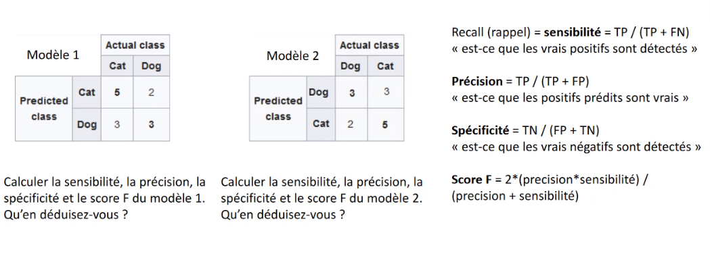
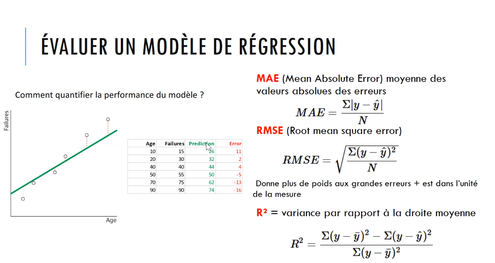
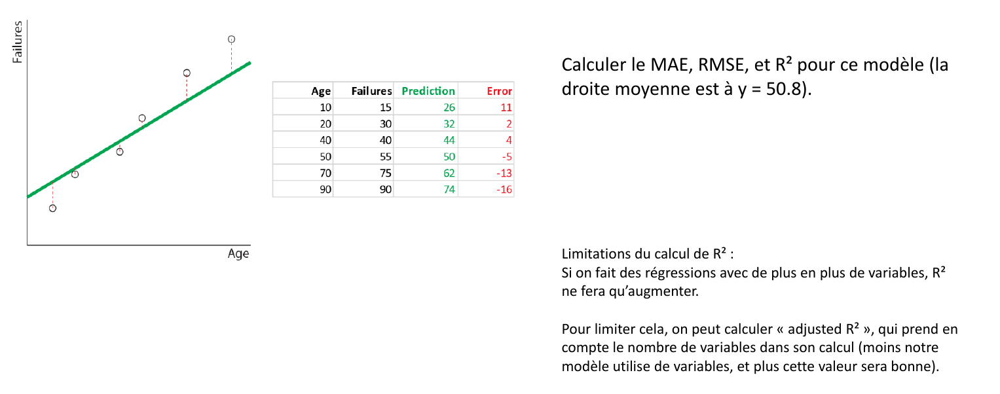

# Big Data & Machine Learning

# Table of contents
- [Big Data & Machine Learning](#big-data--machine-learning)
- [Table of contents](#table-of-contents)
- [Introduction & Objzctifs](#introduction--objzctifs)
- [Cours 1 - 11/02/21](#cours-1---110221)
  - [Apprentissage Supervisé](#apprentissage-supervisé)
    - [Apprentissage Supervisé](#apprentissage-supervisé-1)
      - [Classification](#classification)
      - [Régression](#régression)
    - [Underfitting & Overfitting](#underfitting--overfitting)
    - [Biais & Variance](#biais--variance)
    - [Évalution d'un modèle de classification binaire](#évalution-dun-modèle-de-classification-binaire)
      - [Validation croisée](#validation-croisée)
    - [Evaluation d'un modèle de régression](#evaluation-dun-modèle-de-régression)
  - [K-nearest - K plus proche voisin](#k-nearest---k-plus-proche-voisin)
  - [Arbre de décision  - Decision Tree](#arbre-de-décision----decision-tree)
  - [Pour aller plus loin](#pour-aller-plus-loin)
  - [Languages pour le Machine Learning](#languages-pour-le-machine-learning)
  - [Exercices](#exercices)
- [Cours 2 - 03/03/2021](#cours-2---03032021)
  - [Apprentissage par renforcement (RL)](#apprentissage-par-renforcement-rl)
  - [Algorithmes](#algorithmes)
- [Projet Final](#projet-final)
- [Glossaire](#glossaire)
- [Références](#références)

# Introduction & Objzctifs 

My LearningBox: https://mylearningbox.reseau-cd.fr/course/view.php?id=24699  

- Instructice: Claire PERROT 
- Cours juqsqu'à mi-mars avec 2 blocs principaux  
- Tous est disponible sur MyLearningBox  
- Outil: Google Python Collab, fichiers *.ypnb*
- QCM: 11/02/21  
- Séance d'autonomie sur l'apprentissage par renforcement: 08/03/21  
- Durée: 20h de module + 6h d'autonomie 
- Evaluation: à déposer sur MyLearningBox, perte de point par heure de retard ou si envoi par mail   

Objectifs:
- type d'apprentissage
- implémentation par TD
- utilisation de map/reduce
- implémentation d'algo d'apprentissage par renforcement via un exemple 

# Cours 1 - 11/02/21  

## Apprentissage Supervisé

__Machine Learning__: en français "apprentissage automatique" car des algorithmes permettront à une machine d'apprendre. Nous avons des données de départ et allons les transformer en données traitables par la machine. On les transforme en nombres et on établi des motifs pour ces nombres.  
Depuis l'avênement du Big Data (début années 2000), le machine learning est davantage utilisé.   
La qualité du modèle de machine learning dependra du nombre de données et qualité fournie

__Apprentissage automatique__ se découpe en trois domaines:
- __non-supervisée__: l'algorithme ne connaît pas la structure et motif des données et doit le découvrir (cluster(établir des groups), réduction de dimensionalité(compression de la donnée sans perdre en qualité))
- __supervisée__: se retrouve sous deux déclinaisons problème de régression(chercher une valeur: prédire la météo, une valeur d'un bien immobilier) et problème de classification (classifier des données et chercher des classes de données: images chiens et chats). On connaît la structure de données et on s'en sert.
- __par renforcement__: il contient beaucoup d'algorithmes, et cherche à maximiser une certaines valeur (appelée la récompense) en utilisant un "agent" qui se déplacera dans un espace afin de favoriser la maximisation de la valeur. Le but est d'avoir le comportement le plus efficace. On fait donc tester différent comportements à notre algorithme afin de voir quel est le plus efficace.  

### Apprentissage Supervisé  

- dans 95% des cas il s'agira de classification ou de la régression 
- création de données étiquettées (corpus d'apprentissage)  
- on prend ce corpus et on le sépare en deux groupes (données train et données test): entraîner l'algo sur le train et vérifier qu'il est correct sur les données de tests ensuite. En général c'est 80% train et 20% tests.  
- on recherche un algorithme conforme au type de problème identifié(classification, régression...)  
- on lance l'algo sur le train (afin d'optimiser/minimiser une fonction d'erreur de notre algorithme). Exemple: si 2 images de chats alors qu'une de chien alors 50% d'erreur. A optimiser
- ensuite, une fois trained, on récupère le modèle afin de le tester sur les données de tests (le modèle ne connaissant pas ce dernière jeu de données). Ces données sont également étiquettées
- Une fois le modèle évalué, il faut le lancer et répeter si besoin.  

#### Classification

Il s'agit d'établir des classes. Nous pouvons représenter ces occurrences

Classification(assignation de classes via des motifs que l'on connaît) != cluster (problème d'apprentissage non-supervisée où l'on assigne des couleurs/classes via des motifs que l'on ne connaît pas au préalable)  
 
- __classification binaire__: seuelement deux classes (chat & chien) ou (prédire si un patient a une maladie X ou Y en fonction d'un symptôme donné)  
- __classification multi-classe__: plusieurs classes (chat, chien, coq, lion....)(reconnaître des chiffres manuscrits)(classification des iris)
- __classification un-contre-reste__: one-against-all. Exemple une image de chat à répérer dans un modèle contenant pleins d'autres type d'images  

#### Régression

Nous avons un facteur commun/ une corrélation avec des variables et cherchons à prédire une variable Y en fonction de N (le nombre de variable qui sont corrélées)

- Exemple: déterminer le prix d'un bien immobilier (en fonctionde l'age de la maison, nombre de pièces, électricité aux normes...) Il y aura donc une corrélation entre l'ensemble de ces critères et le prix final de la maison.  

L'idée est de calculer une valeur quantitative, qui est une variable par rapport aux variables corrélées.  

- Exemple: déterminer l'âge d'un client en fonction de son historique.  

Il y a de la régression linéaire simple: quand x dépend d'une seule variables (ax + b). Le Y dépendra de X. Nous pourrons déterminer une courbe moyenne en fonction un ensemble de points.  
En opposition, une fonction logistique, sera représenté par une courbe logistique.  

### Underfitting & Overfitting  

Lors de l'apprentissage, le modèle peut avoir des soucis d'underfitting ou d'overfitting.  

- __Underfitting__: sous-apprentissage: la courbe générée est très loin des points, le modèle n'apprend pas assez bien. En général, cela est dû à un mauvais choix d'algorithme ou de paramètre.   
- __Overfitting__: sur-apprentissage: le modèle apprend trop bien en fonction des données, mais si l'on rajoute des nouvelles données aura du mal à les traiter car trop habitué aux données d'entraînement. Le modèle a appris par coeur les données au lieu d'identifier un ou des motifs. En général, cela est dû à un manque de diversité dans nos données d'entrainement.       

Il s'agit de 2 défauts récurrents présent au sein des problèmes d'apprentissage.  

### Biais & Variance

Une autre problématique apparaissant est le compromis de __biais__ et __variance__. 

- __biais__: taux d'hypothèse d'un algorithme
- __variance__: sensibilité au changement dans les données d'entrainement

Si la variance est élevée, le biais est faible, mais si la variance est faible, le biais sera élevé.  
La variance sera l'indicateur statistique permettant à la courbe d'être flexible afin de se rapprocher au mieux de chaque point.  

L'erreur finale d'un algo: `biais + variance + e(epsilon)`    

Il faut trouver un __compromis__ afin de ne pas avoir de biais trop important ainsi qu'obtenir une variance correcte.  (There is no free lunch)  

### Évalution d'un modèle de classification binaire  

CF: Matrice de confusion.  

La matrice permet d'établir 3 mesures: 
Sensibilité, précision et spécificité  
Le score sera un calcul global: plus il est proche de 1, plus le modèle sera efficace, plus il sera proche de 0, moins il le sera.  

Ci-dessus la description d'une matrice de confusion avec un exemple de cas de figure:  
  

Voici un example avec une classification binaire:  
    

Cf: slide 13 sur une matrice de confusion concernant la classification  de chats et chiens:  
Modèle 1: 
- Sensibilité: 3/5 = 0.6
- Précision: 3/6 = 0.5
- Spécificité: 5/8 = 0.625  
- Score: 2*(précision*sensibilité)/(précision + sensibilité) = 2 * (0.5 * 0.6) / (0.5 + 0.6) = 2 * 0.3 / 1.1 = 0.6 / 1.1 = __0.54 approx__ 

Modèle 2:
- Sensibilité: 5/8 = 0.6
- Précision: 5/7 = 0.7 env
- Spécificité: 3/5 = 0.6
- Score: 2 * (0.7 * 0.6)/(0.7 + 0.6) = 2 * 0.42 / 1.3 = 0.84 / 1.3 = __0.64 approx__    

Nous pouvons observer que le __score__ n'est pas très efficace dans ce cas de figure, car les deux matrices ont les mêmes jeu de données mais fournissent des scores différents.  
Nous pouvons dès lors utiliser un autre facteur appelé le __Matthew's Correlation Coefficient__ (aussi appelé __MCC__) qui sera plus efficace.

La __matrice de confusion__ permet donc d'évaluer le comportement d'un modèle.  

Il est possible d'avoir un très bon modèle (à 100%), sans overfitting, qui s'entraine aussi bien sur les tests que sur les trains.  

#### Validation croisée

Effectuer des répétitions en changeant à chaque les données test et train,  et effectuant une sélection de données au préalable. Cela permet une certaine randomisation au moment du test.  

### Evaluation d'un modèle de régression  

Nous pouvons utiliser les calculs/mesures d'erreur: 
- moyenne des valeurs absolues des erreurs (MAE)
- erreur par rapport aux racines des moyennes des erreurs au carré (RSME)
- variance par rapport à la droite moyenne (droite horizontale qui passe la moyenne des données) R^2 (moyenne des vraies valeurs(failures) notée y) Plus nous avons de variables, plus R<sup>2</sup> augmenter et se rapproche de 1. La variance va statistiquement se rapprocher de 1. Cela ne veut pas dire que le modèle est meilleur.  

L'échec (failure) est noté y.  
La prédiction est notée y-chapeau.  
La droite moyenne est écrite y-barre.    

Nous choisirons la calcul en fonction de la courbe générée ainsi que le poids des erreurs dépendant.    

  

Cf: Slide 16 

  

Dans notre cas de figure, la moyenne de la courbe est = 50.8.  

- Calcul du MAE: val absolue de (11 + 2 + 4 + 5 + 13 + 16)/6  = 5&/6 = __8.5__    
- RSME: racine carré de l'ensemble des valeurs au carré/6 = racine 121 + 4 + 16... 591/6 = racine de 98.5 = __9.92__ 
- R<sup>2</sup>: Ensemble de(15 - 50.8)+(30 - 50.8) + (40 - 50.8) + (55 - 50.8) + (75 - 50.8) + (90 - 50.8)au carré - 289/ (15 - 50.8)+(30 - 50.8) + (40 - 50.8) + (55 - 50.8) + (75 - 50.8) + (90 - 50.8)au carré = ... 0.85

## K-nearest - K plus proche voisin

Algorithme utilisé en classification comme en régression.  

Nous partons de données étiquettées et effectuons une prédiction en fonction de la position et des voisins notés k.  

Comment fixer k? 

- Nous pouvons pondérer la contribution des voisins et ajuster les poids( weighted k-nn)   
- On peut normaliser les données en termes statistiques, avoir des données dans le même ordre de grandeur.  
- Gestion des dimensions (malédiction des dimensions), car plus il y aura de dimensions, plus il faudra de données et cela devient difficile. Car plus nous avons de dimensions, plus les points placés seront éloignés. C'est ce que l'on appelle la malédiction des dimensions. Cette malédiction doit être prise en compte lors de l'utilisation de K-nearest. Nous pouvons réduire les dimensions en utilisant un algorithme de PCA et alors essayer de rajouter plus de données/points et avoir des voisins qui soient significatifs.   
- si il y a énormément de dimensions (cas des flux vidéos, séries temporelles, analyse d'ADN...), on effectuera des approximations  

## Arbre de décision  - Decision Tree

Ce sont des __algorithmes principalement destinés à la classification__. Ils utilisent un arbre binaire qui retrouve au mieux les classes de données.     

Exemple: un animal inconnu est trouvé dans un jungle et on souhaite classifier cet animal. On connait pleins d'autres animaux et espèces. On va essayer de classifier le nouvel animal en partant de ces données.  

L'idée est qu'avec une donnée à classer, nous effectuerons des décision binaires (question en oui ou non si la forme de plans et droite qui partagerons des espaces en deux). Lorsque nous aurons assez de droites, nous considérerons que chaque zone de découpage correspondra à une couleur.  

Le profondeur de l'arbre est paramétrable, et il faudra limiter les profondeurs afin d'avoir trop de zones qui contiendraient trop de points, et donc un risque d'overfitting, et la généralisation ne sera plus possible.  

Les abres de décision sont utiles pour gérer les problèmes sortant non pas une seule valeur mais plusieurs valeurs. Ils peuvent être capables de gérer des propriétés non-numériques. Les modèles seront meilleurs si leurs données seront équitablement reparties dans les classes(dans le cas d'une classification). Il peut y avoir des risques d'overfitting si la répartition des données n'est pas équitable.  
Les abres de décision ne sont pas du tout robustes: tout petit changement peut apporter un grand changement dans les résultats et cela peut remettre en cause la fiabilité. En alternative des arbres de décisions, il y a l'algorithme des forêts aléatoires(__random forest__) qui est une combinaison plus robuste de multiples arbres de décision.   

## Pour aller plus loin

- algorithmes de Bayers
- autres algorithmes de régression
- support vector machines
- voir les notions complémentaires tels que les problèmes de multi-sorties (ex: compléter un visage)
- voir les problèmes de "sequence to sequence", prenant une séquence en entrée afin de produire une séquence en sortie (ex: traitement automatique des langues, NLP)
- pour les statistiques: StatQuest (chaîne Youtube riche en contenu)  

## Languages pour le Machine Learning  

- Python, R, Tanagra...
- bibliothèque `scikit-learn`, complète et documentée et possédant les algorithmes mentionnés dans ce cours. Mise à jour régulière, Python 3.6 de nécessaire.   

## Exercices

Dans l'énonce *2b)* modifier les variables `x` et `y` en `x1` et `y1`.  

Lien du Google Collab (collab avec Arthur): https://colab.research.google.com/drive/1mYz4xNYSjuF1PN_KgLBKGuRdLI_B12rs?usp=sharing  

Sample du code  
```python
# eX 1 
KNN_NEW = KNeighborsClassifier(n_neighbors= 7, weights='uniform', algorithm='brute', p=2, metric='euclidean', metric_params=None, n_jobs=None)
KNN_NEW.fit(x_train, y_train)

KNN_NEW2 = KNeighborsClassifier(n_neighbors= 7, weights='distance', algorithm='kd_tree', leaf_size= 32, p=2, metric='chebyshev', metric_params=None, n_jobs=None)
KNN_NEW2.fit(x_train, y_train)

KNN_NEW3 = KNeighborsClassifier(n_neighbors= 7, weights='distance', algorithm='ball_tree', leaf_size= 34, p=1, metric='manhattan', metric_params=None, n_jobs=None)
KNN_NEW3.fit(x_train, y_train)

# Score avec les nouvelles tentatives
print(f'KNN_NEW Score: {KNN_NEW.score(x_test,y_test)} \nKNN_NEW2 Score: {KNN_NEW2.score(x_test,y_test)} \nKNN_NEW3 Score: {KNN_NEW3.score(x_test,y_test)}')```  

KNN_NEW.predict(test1)
KNN_NEW2.predict(test1)
KNN_NEW3.predict(test1)

# Ex1: pca
pca_3D = PCA(n_components=3)
pca_3D.fit(digit.data)
components = pca_3D.transform(digit.data)
filtered = pca_3D.inverse_transform(components)
plot_digits(filtered)  

# relancement d'une classe KNN et création d'un tableau numpy
KNN = KNeighborsClassifier(7)
KNN.fit(x_train, y_train)

test = np.array(digit['data'][1726])
test1 = test.reshape(1,-1)
displayImage(1726)  

#2 b) régression avec arbre de décision  
import os
cwd = os.getcwd()
print(cwd)

X1.head()
# y1.head()
X2 = petrol_data.drop('Average_income', axis=1) ## x sont les variables / paramètres fixes
y2 = petrol_data['Average_income'] ## y est la variable a deviner
X2_train, X2_test, y2_train, y2_test = train_test_split(X2, y2, test_size=0.5, random_state=0) ## on divise nos données en 2 avec 20% de test
# X2.head()

X3 = petrol_data.drop('Average_income', axis=1) ## x sont les variables / paramètres fixes
y3 = petrol_data['Average_income'] ## y est la variable a deviner
X3_train, X3_test, y3_train, y3_test = train_test_split(X3, y3, test_size=0.3, random_state=0) ## on divise nos données en 2 avec 20% de test
# X3.head()

X4 = petrol_data.drop('Average_income', axis=1) ## x sont les variables / paramètres fixes
y4 = petrol_data['Average_income'] ## y est la variable a deviner
X4_train, X4_test, y4_train, y4_test = train_test_split(X4, y4, test_size=0.1, random_state=0) ## on divise nos données en 2 avec 20% de test
# X4.head()  

regressor2 = DecisionTreeRegressor()
regressor2.fit(X2_train, y2_train)
y2_pred = regressor2.predict(X2_test)

regressor3 = DecisionTreeRegressor()
regressor3.fit(X3_train, y3_train)
y3_pred = regressor3.predict(X3_test)

regressor4 = DecisionTreeRegressor()
regressor4.fit(X4_train, y4_train)
y4_pred = regressor4.predict(X4_test)


df2=pd.DataFrame({'Actual':y2_test, 'Predicted':y2_pred})
df2
df3=pd.DataFrame({'Actual':y3_test, 'Predicted':y3_pred})
df3
df4=pd.DataFrame({'Actual':y4_test, 'Predicted':y4_pred})
df4
print(f'Mean Absolute Error for regression2: {mean_absolute_error(y2_test, y2_pred)}\nMean Absolute Error for regression2: {mean_absolute_error(y3_test, y3_pred)}\nMean Absolute Error for regression2: {mean_absolute_error(y4_test, y4_pred)}\n')

# 2 c)
from sklearn.metrics import classification_report, confusion_matrix,mean_absolute_error

tree_data = classifier.fit(X, y)
y_pred_random = model.predict(X)

print(f'Confusion matrix:\n {confusion_matrix(y, y_pred_random)}\n')
print(f'Classification:\n {classification_report(y, y_pred_random)}')

from sklearn.ensemble import RandomForestClassifier
model_digit = RandomForestClassifier(n_estimators=50, random_state=0)

#Affichage de jeu de données 
digit = load_digits() # chargement du dataset MNIST
dig = pd.DataFrame(digit['data'][0:1700]) # Création d'un dataframe Panda
dig.head() # affiche le tableau ci-dessous   

train_x_random = digit.data
train_y_random = digit.target
x_train_random,x_test_random,y_train_random,y_test_random = train_test_split(train_x_random,train_y_random,test_size=0.25)

model_digit.fit(train_x_random, train_y_random)
# model_digit.predict(train_x_random)

print(f'Confusion matrix:\n {confusion_matrix(train_y_random, y_pred_forest_digit)}')
print(f'Classification:\n {classification_report(train_y_random, y_pred_forest_digit)}')
```  

# Cours 2 - 03/03/2021  

Apprentissage par renforcement + début du projet final à rendre( date butoire le 14/03)  

## Apprentissage par renforcement (RL)

Il s'agit du troisième type d'apprentissage automatisé. Certaines source néanmoins ne le distinguent pas et le placer dans l'apprentissage supervisé.  

Le principe est:  
Nous avons un agent (une entité semi-autonome, un robot se trouvant dans une pièce, conduite automatique...), qui aura un comportement(policy) que l'on souhaite lui faire apprendre et un environnement(rue, ville, pièce...).  
Le comportement s'apprend avec un système de récompense (positive/négative) qui récupérera l'agent.  

Cela vient du conditionnement de Pavlov. (Scientifique ayant fait des expériences sur les animaux, expérience du chien de Pavlov: idée étant que pour ceux ayant des animaux, l'animal est très vite conditionné. Pavlov utilise une cloche avec un chien pour associer la faim à la sonnerie d'une cloche qui signifie qu'il pourra manger. Au bout d'un moment la cloche est toujours utilisée mais la nourriture n'est plus desservie à ce moment-là. Néanmoins, le chient s'est habitué et salive, cela montre un conditionnement fort).  

L'idéée est d'appliquer cette expérience à l'informatique.  

Le but de RL est de __maximiser la récompenses__ (sous la forme d'une valeur).    

```  
Etat + Action  -> Récompenses + Nouvel Etat
```  

Exemple d'un labyrinthe:  Nous sommes dans un labyrinthe (ici non bien fondé car les murs ne sont pas connexes, sinon il faudrait simplement longer le mur à droite ou gauche afin d'atteindre la sortie).  
Dans ce cas, comment faire?  

Agent:  Point bleu se déplaçant
Etat: Position dans le labyrinthe  
Actions: Déplacement d'une case adjacente  
Récompenses: Pour l'agent, étant donné que l'on cherche à maximiser une somme de récompenses, mettre une valeur haute pour la case de sortie  
Environnement: Labyrinthe (représentable sous la forme d'une grille composée de cases)
Pénalités: si le poin se prend un mur. -1 si l'agent va sur un mur, -0,1 pour chaque déplacement afin de se rapproche d'une notion de temporalité, même si l'agent n'aura pas de notion de temporalité.  

L'appprentissage par renforcement se fera par beaucoup d'itérations. Une fois l'agent sorti avec un état final, il faut recommencet et replacer l'agent, car il devra s'en souvenir (__Q-Learning__). L'apprentissage par renforcement n'est pas générique, donc il faudra faire apprendre l'agent sur différents environnements avec différents états finaux.  

## Algorithmes  

Il y en a pleins. Et des manières de les évaluer.  

Le plus simple à mettre en place et à programmer et le __Q-Learning__ basé sur une Q Table répertoiriant toutes les actions et tous les états possibles. L'agent pourra déterminer quelles seront les meilleures actions. Le but du Q Learning est de remplir et MAJ la table afin d'avoir les données après chaque déplacement de l'agent. Cela peut se voir comment un tableau et cela se lit par ligne.        

L'algo doit mettre à jour la table de manière cohérente.  

Le choix des poucents de chances, sont écrits aevc X, X ayant une valeur entre 0 et 1.  

Lien du collab projet final Agent Autonome (Agent): https://colab.research.google.com/drive/1peCLHaYjszD3ACFPbosDtL-_HpnwxcX3 

# Projet Final

Rendu sous la forme de: un zip contenant le code source + PDF explicatif.  

Lien du collab projet final Agent Autonome (Agent): https://colab.research.google.com/drive/1peCLHaYjszD3ACFPbosDtL-_HpnwxcX3   

# Glossaire

https://subscription.packtpub.com/book/big_data_and_business_intelligence/9781838555078/6/ch06lvl1sec34/confusion-matrix  = source d'une variante  

# Références

Reinforcment Learning An Introduction (2nd edition), Richard S. Sutton & Andrew Barto, MIT Press.  