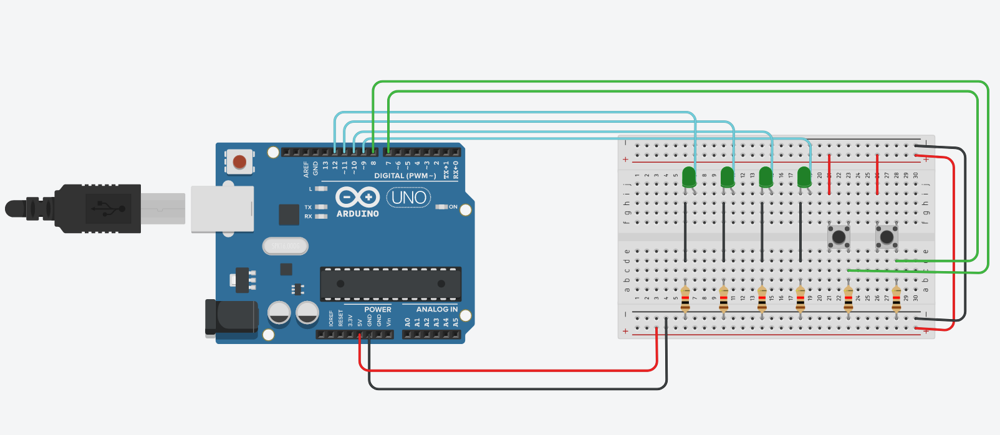

# Conception de solutions embarquées temps-réel - I2 - EPSI Bordeaux  

# Table of contents
- [Montage du circuit](#montage-du-circuit)  
- [Code source en l'état actuel](#code-source-en-létat-actuel)  

# Montage du circuit

Voici, ci-dessous la montage réalisé dans le cadre de l'atelier 2:  

  

Le bouton poussoir connecté à la broche 8 est le bouton par défaut.  

Le bouton poussoir connecté à la broche 7 a pour objectif de remettre le compteur à zéro. Cette fonctionalité n'est pas prête en l'état actuel du code.  

# Code source en l'état actuel  

Ci-dessous une implémentation du code, dans son état actuel. Voici les features fonctionnantes:
- génération d'un compteur par secondes (`millis()` non finalisé, donc `delay()` par défaut)
- allumage des leds en fonction de la valeur binaire correspondante
- extinction des leds une fois le compteur arrivé à plus de 15.  

Les features non-implémentées mais en cours:
- la gestion de la machine à états via une énumération sur les boutons
- le choix pour l'utilisateur de remettre le compteur à zéro
- le choix d'inverser le compteur

Des variables natives à l'environnement d'Arduino ont été utilisées avec l'aide de la [documentation officielle](https://www.arduino.cc/en/main/docs).

```c
#include <stdio.h>
#include <stdarg.h>

//doc: 
// Port registers allow for lower-level and faster manipulation
// of the i/o pins of the microcontroller on an Arduino board. 
// The chips used on the Arduino board (the ATmega8 and ATmega168) have three ports:

// B (digital pin 8 to 13)
// C (analog input pins)
// D (digital pins 0 to 7)

// here we are dealing with UNO R3

//  DDRD is the direction register for Port D 
//  (Arduino digital pins 0-7) 

// DDR and PORT registers may be both written to, and read. 
// PIN registers correspond to the state of inputs and may only be read.

// PORTD maps to Arduino digital pins 0 to 7
	// DDRD - The Port D Data Direction Register - read/write
	// PORTD - The Port D Data Register - read/write
	// PIND - The Port D Input Pins Register - read only

// PORTB maps to Arduino digital pins 8 to 13 The two high bits (6 & 7) 
// map to the crystal pins and are not usable
	// DDRB - The Port B Data Direction Register - read/write
	// PORTB - The Port B Data Register - read/write
	// PINB - The Port B Input Pins Register - read only

// PORTC maps to Arduino analog pins 0 to 5. Pins 6 & 7 are only accessible 
// on the Arduino Mini
	// DDRC - The Port C Data Direction Register - read/write
	// PORTC - The Port C Data Register - read/write
	// PINC - The Port C Input Pins Register - read only

// time settings
unsigned long time_per_second;
unsigned long interval = 1000;

// resete button
int resetButton = 7;

// button B states
enum button_state
{
    BUTTON_AUTOINCREMENT,
    BUTTON_AUTODECREMENT,
    BUTTON_MANUAL,

    INITIAL_STATE = BUTTON_AUTOINCREMENT 
};  

// functions declarations
void checkPinMode(int a, int n, ...);
void setDWrite(int a, int n,...);
int pinDRead(int n);

void setup()
{
  Serial.begin(9600);
  
  checkPinMode(OUTPUT, 4, 9,10,11,12);
  //DDRB |= B00111110; //pinMode(12, OUTPUT);
  //DDRB |= B00001000; //pinMode(11, OUTPUT);
  //DDRB |= B00000100; //pinMode(10, OUTPUT);
  //DDRB |= B00000010; //pinMode(9, OUTPUT);
  
  checkPinMode(INPUT, 2, 7,8);
  
  pinMode(resetButton, INPUT);
 
}

void loop()
{
 time_per_second = millis();
 int i,j,number,buttonState;

  for(i=15;i>=0;i--)
   {
    buttonState=pinDRead(8);
    if(buttonState==LOW)
    {
      number=i;
      for (j=9;j<=12;j++) 
      {      
        if (number%2==1)
          setDWrite(HIGH,1,j); //digitalWrite(j,HIGH);
        else
          setDWrite(LOW,1,j); //digitalWrite(j,LOW);  
        number=number/2;
      }
    }
     
    else
    {
        setDWrite(LOW, 5, 9, 10, 11, 12);
        //PORTB &= 11111101; //digitalWrite(9,LOW);
        //PORTB &= 11111011;//digitalWrite(10,LOW);
        //PORTB &= 11110111;//digitalWrite(11,LOW);
        //PORTB &= 11101111;//digitalWrite(12,LOW);
        break;
    } 
    if(digitalRead(resetButton) == HIGH)
    {
      i = 15;
      for(j = 9; j<13; j++)
      {
        digitalWrite(j, LOW);
      }
    }  
    delay(1000);
    
   }   
}


void checkPinMode(int a, int n, ...) 
{
  int args;
  
  va_list pins;
  va_start(pins, n);
  
  for (int i=1; i<=n; i++)
  {
    args = va_arg(pins, int);
    
    if(args >= 8)
    {
      args -= 8;
      if(a==OUTPUT)
      {
        DDRB |= 1<<args;
      }
    
      else
      {
        DDRB &= ~(1<<args);
        if(a==INPUT_PULLUP)
        {
          PORTB |= 1<<args;
        }
      }
    } 
    
    else
    {
      if(a==OUTPUT)
      {
        DDRD |= 1<<args;
      }
    
      else
      {
        DDRD &= ~(1<<args);
        if(a==INPUT_PULLUP)
        {
          PORTD |= 1<<args;
        }
      }
    }
  }
  
  va_end(pins);
}


void setDWrite(int a, int n,...) 
{
  int args;
  
  va_list pins;
  va_start(pins, n);
  
  for (int i=1; i<=n; i++)
  {
    args = va_arg(pins, int) ;
    if (args>=8)
    {
      args -= 8;
      if(a)
      {
        PORTB |= 1<<args;
      }  
    
      else
      {
        PORTB &= ~(1<<args);
      }
    }
    
    else
    {
      if(a)
      {
        PORTB |= 1<<args;
      }  
    
      else
      {
        PORTB &= ~(1<<args);
      }
    }
  }
}


int pinDRead(int n)
{
  
  if(n>=8)
  {
    n -= 8;
    int regState = PINB;
    int newPinState = ((regState>>n)&1);
    return newPinState;
  }
  
  int regState = PIND;
  int newPinState = (regState&(1<<n));
  return newPinState;
    
}
```  

