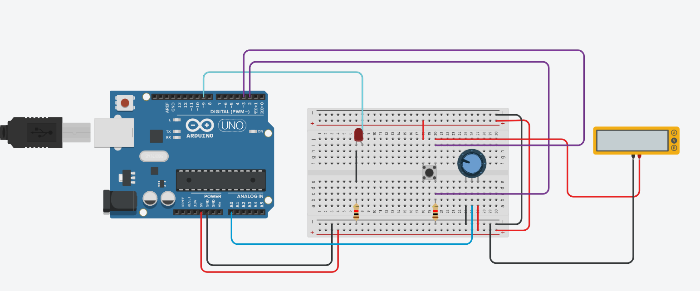

# Conception de solution embarquée temps réel - Atelier 3 

# Table of contents 
- [Auteur](#auteur)  
- [Livrables](#livrables)
- [Schéma du montage](#schéma-du-montage)
- [Programme](#programme)  

# Auteur

Jérémie LAERA

# Livrables 

## Schéma du montage  

  

## Programme  

```c 
#define KNOB 0
#define SETTING_BUTTON 2
#define ANALOG_PIN A0
#define ANALOG_OUTPIN 9

int button_state = 0;
int sensor_value = 0;
int output_value = 0;
int fade_amount = 0;

void generateFadingEffect();
void displayComponentsValues();

void setup()
{
  pinMode(ANALOG_OUTPIN, OUTPUT);
  pinMode(SETTING_BUTTON, INPUT);
  Serial.begin(9600);
}


void loop()
{
  generateFadingEffect();
  displayComponentsValues();
}


void generateFadingEffect(){
  int val =analogRead(KNOB);
  output_value = map(val, 1, 1023, 500, 5000);
 
  // printing button info
  Serial.println("Button : ");
  Serial.println(digitalRead(SETTING_BUTTON));
  delay(30);
  
  // triggering lights on/off using button
  if(digitalRead(SETTING_BUTTON) == 1)
  {
    for(int fadeValue = 0; fadeValue <= 255; fadeValue += 5){
      fade_amount = map(val, 1, 1023, fadeValue, 255);
      analogWrite(ANALOG_OUTPIN, fade_amount);
      delay(60);
    }
    digitalWrite(ANALOG_OUTPIN, HIGH);
  }
  else
  {
    for(int fadeValue = 255; fadeValue >= 0; fadeValue -= 5){
      analogWrite(ANALOG_OUTPIN, fadeValue);
      delay(60);
    }
    digitalWrite(ANALOG_OUTPIN, LOW);
  }
}

void displayComponentsValues(){
  // reading & printing sensor infos
  sensor_value = analogRead(ANALOG_PIN);
  
  analogWrite(ANALOG_OUTPIN, output_value);
  
  Serial.print("Sensor : ");  
  
  Serial.println(sensor_value);  
  
  Serial.print("Output : ");

  Serial.println(output_value);
}
```