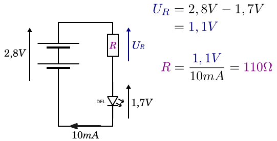
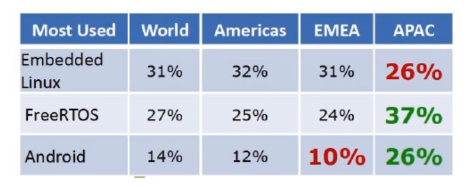

# Conception Solution embarquée

# Table of contents
- [Conception Solution embarquée](#conception-solution-embarquée)
- [Table of contents](#table-of-contents)
- [Evaluation & Liens utiles](#evaluation--liens-utiles)
- [Compétences visées](#compétences-visées)
- [Vue d'ensemble et contrainte de l'embarquée](#vue-densemble-et-contrainte-de-lembarquée)
- [Vue d'ensemble](#vue-densemble)
  - [Distinction d'un système embarquée](#distinction-dun-système-embarquée)
- [Rappel de C](#rappel-de-c)
  - [Subtilité de compilateur](#subtilité-de-compilateur)
  - [Syntaxe](#syntaxe)
  - [Callback](#callback)
- [Arduino](#arduino)
- [Atelier 1](#atelier-1)
  - [Sujet](#sujet)
- [Cours 2 14/01/21 - Entrée/Sortie Temps réel](#cours-2-140121---entréesortie-temps-réel)
  - [Base d'électronique](#base-délectronique)
  - [Les entrées/Sorties numériques](#les-entréessorties-numériques)
    - [Sorties numériques](#sorties-numériques)
    - [Machines à états](#machines-à-états)
    - [Entrées numériques](#entrées-numériques)
    - [Circuits ouverts](#circuits-ouverts)
  - [Synthèse](#synthèse)
  - [Atelier 2 - Horloge Binaire](#atelier-2---horloge-binaire)
- [Cours 3 - 04/02/21](#cours-3---040221)
  - [Entrées analogiques](#entrées-analogiques)
  - [Sorties analogiques](#sorties-analogiques)
  - [Périphériques et shields](#périphériques-et-shields)
    - [Capteurs](#capteurs)
    - [Actionneurs](#actionneurs)
    - [Bus I2C](#bus-i2c)
  - [Atelier 3](#atelier-3)
- [Cours 4 - Dernier cours 05/03/2021](#cours-4---dernier-cours-05032021)
  - [Système temps réel](#système-temps-réel)
    - [Définition](#définition)
    - [Contraintes](#contraintes)
  - [FreeRTOS](#freertos)
- [Free RTOS](#free-rtos)
  - [Compilation & test de programmes](#compilation--test-de-programmes)
  - [Utilisation d'entrées et sortie analogique](#utilisation-dentrées-et-sortie-analogique)
  - [Tâches et Timers](#tâches-et-timers)
  - [Files & Sémaphores](#files--sémaphores)
- [Télécharger FreeRTOS](#télécharger-freertos)
- [Atelier 4 - Quicksort sous FreeRTOS](#atelier-4---quicksort-sous-freertos)
- [Conclusion](#conclusion)
- [Glossaire](#glossaire)
  - [Microcontrôleur](#microcontrôleur)
- [Code Arduino](#code-arduino)
- [Théorème de l'échantillonage (Nyquist-Shannon)](#théorème-de-léchantillonage-nyquist-shannon)

# Evaluation & Liens utiles

MyLearningbox du cours: https://mylearningbox.reseau-cd.fr/course/view.php?id=24678   
Logins TinkerCAD: jeremie.laera@live.fr ev...4..ct  
Code Morse: https://fr.wikipedia.org/wiki/Code_Morse_international  
Ateliers individuels.  

# Compétences visées

- Concevoir l'électronique d'un système embarqué simple
- interagor logiciellement avec des entrées/sorties numériques ou analogiques
- respecter des contraintes de temps par programmation (notamment le temps réel)
- sélectionner le système d'exploitation temps-réel adéquat (au quotidien nous travaillons avec des OS qui ne sont pas en temps réel dur, nous verrons donc des OS fonctionnant en temps-réel dur et pure)  
- Paralléliser des traitements sur un système temps-réel  

# Vue d'ensemble et contrainte de l'embarquée

- Simulateur de systèmes embarqués avec parties électroniques simulées __TinkerCAD__ (AutoCad étant un autre outil de référence de CAO) proposé par __AutoDesk__ en ligne.  
- FreeRTOS en fin de module pour un vrai système de temps réel (Embedded Linux s'en rapproche). FreeRTOS étant le système temps réel le plus étendu au monde.    

# Vue d'ensemble 

- distinction d'un système embarqué
- chiffres
- plateformes de prototypage
- arduino

Informatique embarquée est une grande partie de l'info.

## Distinction d'un système embarquée

Ce sont des sous-système informatiques i.e. que le système embarqué n'est pas seulement un système informatique. En général en partie intégrante d'un système plus grand intégrant de l'électronique, hydraulique, mécanique... L'informatique est embarqué dans un système plus grande et intègre autre chose.     
- 88% de processeurs produits sont destinés à être embarqués (alors que les processeurs sur nos machines, ou sur un serveur n'ont font pas partie) 
- 
Il y a aussi des microcontroleurs.  

Souvent en temps réel car forte contraintes de temps. 
En informatique de gestion, il y a des contraintes fonctionnelles. En informatique des systèmes embarqués, il y a d'autres contraintes: 
  - Il y a des contraintes telles que la consommation(autonomie), fiabilité, et résistance d'utilisation et aux éléments(éléments, température, humidité, interférence), coût sur le matériel, contraintes de ressources sur le fonctionnement de l'application et contrainte de taille qui impacteront la performance de la machine produite.  

En chiffre: 250 Milliars de dollar en 2019 et plus de en 2027. Les tendances telles que la miniaturisation, ou les smart cities sont de rigueur. Une belle part de la production de l'embarqué est associé à l'Asie, ensuite, l'Europe et les USA (Amérique du Nord).  

Par utilisation:  
IoT: internet of things
BFSI: Banque et Financier
Retail: Vente & Distribution
Ethatique: Gouvernement, santé
Production:
Transport: 
IT & Télécom:  

Par traitement:
- flux de données
- sécurité
- suivi d'installations à distance
- gestion de réseaux  

Beaucoup de producteur, pure player de microcontroleurs et circuit intégrés (Microchip,Intel, Texas Instruments, Infineon...).  

Tendance sur le marché: 
- augmentation des ventes en grand public (embarqué à souvent été consacré à du civile ou militaire mais pas forcément à du grand public
- offre/demande de produit connectés (Le __Consumer Electronic Show__ ou __CES__ à Las Vegas est un événement important de l'électronique embarqué pour le grand public)
- automatisation industrielle
- domotique et optimisation énergétique des bâtiment

Langages:
- C/C++
- Python
- Assembly Langage
- Java
- MATLAB
- LabView
- JavaScript (oust dépendences npm)
- C#  

Plateformes de prototypages:
- Open sources(Arduino, Raspberry), pas facilement industrialisable
- Equivalents: Texas Instrument, Beagle Bone, 
- MicroChip/ PIC(Programmable Interface C): nombreuses versions


Nous utiliserons plus Arduino, car Raspberry est un ordinateur avec un système d'exploitation avec alimentation régulée, et non intégrée de base dans la carte.  
Arduino n'a pas de connectivité réseau de base, mais ne boot pas, donc rebranchable rapidement, avec régulateur de tension, prise (E/S) analogique. 

Pour extendre notre Arduino est pièce, on utilisera des __shields__. Structure d'un program composé de deux méthodes: `setup()` et `loop()`.  

Il existe des microcontroleurs, compatibles Arduino et présente à l'EPSI: Microcontroleur ESP 8266 (ESPRESSIF et ESPRESSIF 32) embarquant du Wi-Fi et Bluetooth. Ils sont compatibles avec Arduino.     
Le modèle 32 embarque les système AES RSA afin de pratiquer la cryptgraphie.  

Différence entre microcontroleur & microprocesseur: Un microprocesseur n'a pas de puce embarquée (I2C, analogie...) alors qu'un microcontroleur tout est embarqué (donc un système électronique complexe ne sera pas à mettre en place).

Il y a un marché considérable à ne pas négliger.  


# Rappel de C

C est à l'origine de langage qu'on utilise au quotidien (Java, PHP...)  

- processus de compilation (compilation plus complexe)wé
- principales syntaxes
- mécanisme de callback (utiles pour FreeRTOS)  

## Subtilité de compilateur

- préconpilation (directive preprocessor), #define #include..., détectera les erreurs de syntaxe de traduira le fichier en *.s* puis en *.o* en assembleur.  
- compilation : validation syntaxique, traduction de chaque fichier en .o. Les *.c* sont compilés séparément. Des erreurs de compilations sont possibles.
- edition des liens(linkage) : assemblage de tous les fichiers en un fichier executable. Des erreurs de linkage sont possibles.    

## Syntaxe

Typage fort.  

- data type:
  -  char
  -  short
  -  int ou int8/uint8 /int16/uint16...
  -  long
  -  bool(automatiquement disponible sous arduino, mais pas dispo sur toutes les versions de C.)

- opérateurs:
  - bitwise : &&, ||

- structure: struct: assembler des types différents au sein d'un seul. Les champs sont tous publics. C n'est pas OOP. Nous pouvons quand même assembler des types différents au sein d'un seul type appelé structure, par défaut public.   

## Callback

Mécanisme de callback, nécessaire avec RTOS.  

Fonctions: déclaration et définition.  
SI type* dans une fonction, alors mettre & devant l'argument

INclure un module .h contenant les déclaractions et type de fonction. avec # + nom du fichier.
Les fichiers .c connaissent les définitions et code.

En C, les fichiers *.h.* contiennent les déclarations et types des fonctions
Les fichiers *.c* contiennent les définitions et code des fonctions.  

Callback: lambda ou closure, passage d'une fonction en paramètre dans une autre fonction.
En FreeRTOS, pour créer une tâche, il faudra passer comme point d'entrée d'une tâche et cette fonction sera appelé lorsque la tâche aura besoin d'être exécutée.    

# Arduino  

Voici une image d'une carte Arduino Uno:

  

Voici une structure détaillée avec un niveau de granularité moindre: 

  

Voici les composants utiles associés avec Arduino:  

  

  

# Atelier 1  

Proposer un programme  qui émet un signal  morse au travers de la led 13 (sur la plareforme TinkerCAD).  

Intéragir logiciellement avec des entrées/sorties numériques ou analogique (E/S).  

Se rendre sur TinkerCAD, après avoir créer un compte, sélecitonner Circuit, puis créer un circuit. Faire clignoter le led en fonction d'un message Morse prédéfini.  

Ajouter un composant Arduino, puis sélectionner Texte dans l'option Code afin d'avoir le code en C à écrire.  

## Sujet  
Le but de l'atelier est de proposer un programme qui émet un signal morse au travers de la led 13.  

Le programme contient une variable char message[]="...". Sur la base des codes morses (https://fr.wikipedia.org/wiki/Code_Morse_international), proposer sur TinkerCad un programme qui allume, à intermittence selon ce code, la led interne d'arduino en fonction du contenu de la variable message composée exclusivement de majuscules et d'espaces.   

# Cours 2 14/01/21 - Entrée/Sortie Temps réel

## Base d'électronique  

Pour pouvoir effectuer des petits montages électroniques nous rappelerons quelques fondamentaux tels que:

- la loi de Kirchhoff
- la loi d'ohm
- les diviseurs de tension (avec un petit montage en illustration)

- loi fondamentale
- gestion des tensions
- répartition des flux

__Loi de Kirchhoff__:  
- dans toutes les mailles d'un circuit, on a la même tension, la somme des tensions est équivalente. Uad est la somme de Uab + Ubc + Ucd. Les tensions s'ajoutent quand elles sont en série.
- __la loi des noeuds__: sommes des intensités en entrée est égale à la somme des intensité en sortie. Par exemple (schéma cours: i1 + i2 = i3 + i4).  

Nous pourrons utiliser ces deux lois afin de gérer les tensions et intensité que l'on veut sur notre circuit.  

La __loi d'Ohm est une loi physique empirique qui lie l'intensité du courant électrique traversant un dipôle électrique à la tension à ses bornes__. Cette loi permet de __déterminer la valeur d'une résistance__.  
Le __dipôle électrique est un composant électrique possédant deux bornes__. Par exemple, __les lampes__, __les interrupteurs__, __les générateurs__, __les piles__, __les diodes__, __les DEL__, __les résistances__ et __les moteurs__ sont des dipôles. On distingue en général deux sortes de dipôles.    
- loi d'Ohm sur la résistance d'un circuit. Elle nous permet de calculer la résistance d'un composant afin que celui-ci ne crame pas sur le circuit.     
  - si l'on veut faire fonctionner correctement une LED qui tourne à 1,7V sur un circuit en série, il faudra ajouter une résistance avec le bon voltage et voir l'intensité (exprimée en MilliAmpère) sur le circuit.  
  - la formule de la loir d'Ohm est : U = R * I, soit R = U/I. On note :

U la tension aux bornes de la résistance ;  
I l’intensité du courant qui circule à travers la résistance ;  
R la valeur de la résistance.  
  > Dans la loi d'Ohm, la tension est exprimée en volts (V), la résistance en ohms (Ω) et l’intensité en ampères (A).  

  

Le résultat sera en ohms. Dans l'exemple penser à convertir les milliampère, ici 10 mA = 0,01A. Ce qui nous donne 110 ohms.  

- Les diviseur de tension, pour les courant continus sont également envisageable afin de distribuer la tension d'un circuit.  
__Le diviseur de tension est un montage électronique simple qui permet de diviser une tension d'entrée__, constitué par exemple de deux résistances en série. Il est couramment utilisé pour créer une tension de référence ou comme un atténuateur de signal à basse fréquence.  

  

Il faudra retenir le positionnement des LED et leur fonctionnement sur un circuit intégré.  
> En parallèle les tensions sont égales
> En série les tensions s'ajoutent.
> C'est l'inverse pour les intensités  

## Les entrées/Sorties numériques  

Liste des sujets:
- sorties numériques
- machines à états (pratique pour pouvoir coder des entrées numériques complexes à gérer)
- entrées numériques
- circuits ouverts ( comment gérer les circuits ouverts, et comment les fermers comme les boutons poussoir par exemple)

- comment envoyer et recevoir des signaux numériques
- Commandes numériques et LED
- Intégration de capteurs et boutons poussoir

### Sorties numériques

Sur l'Arduino il y a beaucoup de sortie numériques, éviter de prendre celles au tout début et à la fin car elles servent à la transmission du programme avec le kit de développement. On prend en générale les sortie à partir des valeurs 2,3. Afin de les configurer en sortie, il faut configurer les `pin` (`broche`) en output via le code en C ou en bloc pour les mettre en broche de sortie.   
- pour écrire en sortie utiliser la fonction `digitalWrite()`.
- pour alterner le voltage/créer une vibration utiliser la fonction `tone()` ou `noTone()`, par exemple lorsque nous mettons un piezzo ou buzzer afin de faire des musiques ou sonalités. Par exemple alterner entre 0 et 5Volts.  
 
- sur TinkerCAD, ajouter une carte Arduino Uno et une platine d'essai. Relier une broche à la ligne de points noirs supérieur de la platine afin d'alimenter la platine.
>  Sur les platines, les points noirs sont reliés par ligne sur les deux lignes supérieures, le centre de la platine est lui formé de colonnes. Il faudra donc relier les composants sur différentes colonnes. Il n'y aucune utilité à relirer deux broches Arduino sur une même colonne par exemple.  
- créer deux branchement, une noir pour le fil de terre à 0 volt(première ligne), et un rouge pour relier l'Arduino à la platine sur 5 volts sur la borne + (second ligne).  
- positionner le broche 3 sur la coordonné j7 par exemple (relier)
- positionner une LED juste en dessous
- relier la borne à 0 volt  
- déplacer le led et calculer la résistance en ohm nécessaire sachant que la led peut tourner à 20mA et que la broche fourni une tension de 5v. La résistance obtenu lors du calcul est de: R = 5/0,02 = 250 ohm. Positionner la résistance et lancer la simulation tout en simulant la broche 3.
- Entrer une valeur en ohm pour la résistance, ici 250.    

```c
void setup()
{
  pinMode(3, OUTPUT);
}

void loop()
{
  digitalWrite(3, HIGH);
}
```  

Si la valeur de la résistance est bien renseignée, la led devrait s'allumer.  

> Donc en sortie standard, nous aurons des LED, ou potentiomètre.   

Le bouton poussoir:  
__Le poussoir, aussi appelé bouton poussoir__, il ressemble comme deux gouttes d’eau à un interrupteur classique. À ceci près que son bouton en revient toujours à la même position après avoir été actionné.  
Pour pouvoir revenir à sa position initiale après utilisation, __le bouton poussoir est doté d’un mécanisme constitué d’un ressort de rappel__. Lorsque vous appuyez dessus avec le doigt, le ressort permet au bouton de revenir à sa place.  
Le poussoir est de plus en plus utilisé, notamment pour les circuits va-et-vient qui nécessitent plus de deux points de commande. L’avantage, c’est qu’il peut être actionné toujours dans le même sens (alors qu’un interrupteur classique sera levé ou baissé en fonction des circonstances).  
En outre, son installation est très simple et ne diffère pas de celle d’un interrupteur électrique traditionnel. Pour le branchement simple, deux fils suffisent (un relié à la borne L, l’autre relié à l’éclairage).  

### Machines à états  

Une __machine à états__ ou __automate à état__ est un système contenant des composants avec plusieurs états possibles. Par exemple un circuit contenant une LED, peut avoir la LED éteinte par défaut, mais l'allumer via la pression sur un bouton, ou alors la faire clignoter sous une autre pression et enfin l'éteindre avec une autre pression sur le bouton.  

- En programmation procédural (C), nous pourrons avoir un entier ou une énumeration qui contiendra les différents états, et dans la fonction `loop()` nous pourrons utiliser un `switch(etat)` et effectuer nos traitements.
- En OOP: Nous pouvons utiliser le Design Pattern Etat (State)  

Il faudra penser à gérer le relâchement du bouton par l'utilisateur. Bouton enfoncé et bouton relâché.  

  

### Entrées numériques

Les entrées numériques comme les boutons par exemple, peuvent être lues avec le code suivant:  

Configuration
```c
pinMode(broche, INPUT/INPUT_PULLUP);
```  

Lecture en entrée  
```c
int val = digitalRead(broche);
// HIGH si > 3V, LOW si < 0,5, indéterminé sinon
```  

### Circuits ouverts

Bouton poussoir relâché = circuit ouvert  
Nécessité de fermer le circuit avec une résistance.  

Un circuit ouvert avec une entrée digitale n'est jamais bon car des électrons peuvent graviter, donc il faut rajouter une résistance très forte afin de fermer le circuit.  


Deux façon de monter cela sur Tinkercad, soit en ajoutant le résistance (voir projet), mais celà nécessitera des soudures, soit en utilisant une résistance interne à la carte Arduino avec le code suivant:
```c
pinMode(broche, INPUT_PULLUP) // PULLUP pour un bouton relâché
INPUT_PULLUP << inverse >> le signal  
// sensible: résistance 10K si reliée au 5V
```  

Donc pour la deuxième façon, lorsque nous appuierons sur le bouton, la tension sera à 0V, puis une fois relâché, la résistance viendra récupérer la tension et fermer le circuit.  

## Synthèse
Nous avons vu les entrées et sortie ainsi que les machines a états puis les circuits ouverts.  

## Atelier 2 - Horloge Binaire

Faire un compteur binaire de 4 leds (0: éteinte, 1: allumée) en sec allant de 0 à 15. doté de 2 boutons poussoir A et B. A change de mode: le compteur aura donc plusieurs états via une machine à état. Cela sera une machine à états:    
- automatique +1. B sert à remettre à 0,  
- automatique -1. B sert à remettre à 15,
- manuel. B sert à augmenter manuellement le compteur.  

Le compteur augmentera de 1 toute les secondes.

Compétences:  
- concevoir l'électronique d'un système embarqué simple
- interagir logiciellement avec des E/S numériques
- respecter des contraintes de temps par programmation  

__Problématique formulée sous MyLearningBox:__  

Proposer un montage Arduino pour une horloge binaire de 4 leds (0: éteinte, 1: allumée) de 0 à 15.  

Etape 1 : Le compteur binaire augmente de 1 toutes les secondes et repasse à 0. Ne pas utiliser delay() et préférer les comparaisons entre valeurs obtenues par millis().  
Etape 2 : Ajouter deux boutons poussoir A et B. Le bouton A change de mode :  
- automatique +1 (comme dans l'étape 1). B sert à remettre à 0,
- automatique -1. B sert à remettre à 15,
- manuel. B sert à augmenter manuellement de 1 la valeur du compteur.

Si possible éviter les `delay()` car il consomme un tout petit peu de temps CPU, Chercher une alternative. Préférer les comparaisons entre valeurs obtenues par `millis()`.    

Chaque valeur allant de 1 à 15 peut être représentable en valeur binaire sur 4 bits, chaque bits sera une LED. Il faudra conditionner l'allumage en fonction. A chaque tic (millis()) de l'horloge conditionner l'allumage des led en fonction de la valeur. Essayer de mettre 125 ohm par résistance, car le courant en série diminuera la tension.     

Livrable attendu: PDF comportant la capture d'écran du montage ainsi que l'implémentation du code.  

Il est possible de récupérer la valeur d'un bit pour le C et tout langage dérivable:  

```c
n<<1 // mulitplie par 2 car décale un bit vers la gauche
n<<2 // par 4
```  

Check une valeur binaire:  
```c
if(octet & (1<<n))
```  

Combiné avec un bitwise.  

Exemple de code d'automate à état:  

```c  
#define BTN 3
#define LEF 4

enum {
    LED_OFF,
    LED_TO_ON,
    LED_ON,
    LED_TO_BLINK,
    LED_BLINK,
    LED_TO_OFF
} etat;

void setup() {
    etat = LED_OFF;
    // Init bouton (pullup) et led
}

void loop() {
    switch(etat) {
        case LED_OFF:
            if(digitalRead(BTN) == LOW) { // btn appuyé
                etat = LED_TO_ON;
            }
            break;
        case LED_TO_ON:
            if(digitalRead(BTN) == HIGH) { // btn relaché
                digitalWrite(LED, HIGH);
                etat = LED_ON;
            }
            break;         
        case LED_ON:
            if(digitalRead(BTN) == LOW) { // btn appuyé
                etat = LED_TO_BLINK;
            }
            break;
        case LED_TO_BLINK:
            if(digitalRead(BTN) == HIGH) { // btn relaché
                etat = LED_BLINK;
            }
            break;
        case LED_BLINK:
            digitalWrite(LED, (millis()-start / PERIOD)%2 ? LOW : HIGH);
            if(digitalRead(BTN) == LOW) { // btn appuyé
                etat = LED_TO_OFF;
            }
            break;
        case LED_TO_OFF:
            if(digitalRead(BTN) == HIGH) { // btn relaché
                digitalWrite(LED, LOW);
                etat = LED_OFF;
            }
            break;        
    }
}
```  

# Cours 3 - 04/02/21  

## Entrées analogiques  

Dans cette section nous verrons:
- le théorème de l'échantillonage
- les différentes entrées analogiques (comment manipuler celles qu'il y aura sur l'Arduino)
- les sorties analogiques (PWM qui sont ce qui se rapproche des vraies sorties analogiques)

Pourquoi en avons-nous besoin pour interprétant et échantilloner des signaux analogiques.  

__Le théorème de l'échantillonage (Nyquist-Shannon)__: un signal analogique varie dans le temps. La fréquence d'échantillonge min = 2 x la fréquence max du signal.  

Exemple: si nous avons une fréquence d'onde de 50 hertz soit 50 ondes par secondes, il nous faudra obtenir un échantillonage de 100 hertz afin de conserver le signal dans son intégrité et ne pas perdre d'information.  

La hauteur représente l'amplitude.

Les entrées analogiques sur l'Arduino:

- broches A0 - à A5 pour l'arduino Uno, de jusqu'à A15 pour AtMega.
- la lecture en analogique se fait en 500 micro-secs, donc une demie-milliseconde.
- pour une lecture, les valeurs vont de 0V à 2<sup>10</sup>-1, soit 1023V.  
- `analogRead()` permet de lire sous la forme d'un entier la valeur analogique d'une lecture en passant en paramètre la broche correspondante.
- la fonction `map()` est utile pour ramener cette valeur entre un minimum et maximum souhaité: `map(val, 1023, min, max)`. Ceci est également faisable en appliquant une règle de 3.   

Cela nous sera utile lorsque nous travaillerons avec des __potentiomètres__, sortes de résistance variables, qui nous fourniront des tensions variables. Un exemple de potentiomètre est un bouton de réglage de volume d'un amplificateur de volume.  

## Sorties analogiques

Les sorties analogiques:  
- `analogWrite()` pour écrire un signal

__PWM__ : __Pulse Width Modulation__.  

Les broches d'Arduino ont différentes fréquences.  

__DAC__: __Digital Analogique Converter__, n'est pas embarqué dans Arduino par défaut. Il est possible d'en acheter sur des microcontrôleurs spécifiques.  

Les signaux analogiques sont très utile dans le son.  

A retenir: il est possible de produire des fréquences avec une partie du temps à 5V avec le __PWM__.  

## Périphériques et shields  

Dans cette section nous verrons les périphériques et shields que nous pouvons placer sur une carte Arduino:
- les capteurs (par classification)
- les actionneurs (par classification)
- les bases de traitements du signal 
- les bus et séries notamment de type I2C (pièce souvent présente dans l'embarqué, spécificité de conception et d'utilisation)  

Les périphériques que l'on peut brancher sur Arduino même si le simulateur ne le permet pas.  

### Capteurs

__Capteurs à valeur unique__ tels que:
- le potentiomètre, bouton que l'on tourne pour avoir une tension différentes.  
- des capteurs photosensibles i.e. allumés ou éteints, avec une intensité lumineuse donnant éventuellement une valeur analogique.  
- des capteurs de températures, variables en fonction de la température ambiante.  
- des dérivés tels que le joystick analogique, joysticks permettant de savoir dans quelle direction un utilisateur dirige(gauche, droite, haut, bas...) avec une intensité variable. 

__Capteurs à valeur ondulatoires__ tels que:
- les microphones avec détection de vibration. Lorsque nous parlons dans un micro, la détection de variation analogiques de + tant de V à - tant de volt, cela va donc onduler et nous aurons une fréquence. Pour rappel, le __théorème de Nyquist-Shannon__ permettra par fréquence d'étudier cette variation. La fréquence se mesure en hertz, 50 à 100 d'après le théorème. Par exemple, pour une voix, nous pouvons prélever des sons, des harmonique. D'après le __théorème de Fourrier__, toute once peut être amenée à une somme de sinosoîdes avec des fréquences et des phases différentes. La compréhension d'un signal audio peut se faire en décomposant toutes les harmonies qui se trouvent dedans: cette décomposition se matérialise par un __spectre de fréquence__.    

> Les égaliseurs de son sont un exemple de représentation d'ondes contenant chaque fréquence sur une hauteur pour un son donné. Nous pourrons apercevoir des fréquences variables retrouvées sur l'onde. Les fréquences sont ajoutées ensuite les unes aux autres. Afin de pouvoir isoler une fréquence se trouvant sur une onde, il faut réaliser une __transformée de Fourrier__. 
> Pour les mp3, l'algorithme de la __transformée de Fourrier rapide__ est utilisé, suivi de la compression du __spectre de fréquences(via un algorithme de compression appelé algorithme d'Huffman)__.  
__Lorsque nous aurons à traiter des capteurs à valeurs ondulatoires, il faudra avoir recours à la transformé de Fourrier rapide (noté Fast Fourrier Transformation en anglais)__. Cette algorithme est efficace lorsque l'on sait quelle fréquence nous attendons.   

__Capteurs à valeurs multiplexées__ ou lorsque nous avons plusieurs valeurs:  
- il faudra multiplexer nos valeurs (nos capteurs), i.e. les mettre en série (sérialisation), il y a deux cas:
  - si il n'y a qu'une voie (1 fil de masse et un fil allant de 0 à 5V), nous positionnerons un bit de synchro
  - si il y a deux voie (système d'horloges et de données), c'est le principe de I2C en vulgarisé 

### Actionneurs

Lorsque nous voudrons faire quelque chose à notre Arduino et non plus faire voir quelque chose.  

Nous avons:
__Les acitonneurs numériques simples__:  
- les leds (HIGH, LOW) pour éteint ou allumé
- les PWM avec pour exemple une ed RGB classique (3 valeurs pour contrôler l'intensité du rouge, vert et bleu)
- des fréquences (fonction `tone()`), permettant de faire un peu de musique avec un buzzer

__Les actionneurs nnumériques complexes__: dans la plupart des cas nous plusieurs valeurs numériques souvent en sortie pour régler l'appareil.  
- Ex: servo-moteurs (moteur asservi permettant de gérer l'orientation et inclinaison avec précision, comme un bras articulé...)
- Ex: les led RGB en chaîne, quel led mettre et quelle couleur allumer

__Les actionneurs analogiques__:
- Haut parleurs (envoie un signal analogiques et même ondulatoire dans ce cas)
Pour ce dernier cas, il faudra envoyer un signal analogique si l'on veut entendre quelque chose.  

Il existe de nombreux autres exemples de capteurs et actionneurs.  

### Bus I2C  

A partir d'une certaine complexité, nos capteurs, actionneurs et autres pièce devront communiquer entre eux via des échanges de données. Pour ce faire, il faudra utiliser des __bus__.  

Le bus I2C est le plus utilisé et date de 1982, en 1992 le V1 sort et en 2014 sort la V6 avec plus de fréquence.  

__Il s'agit d'un canal de communication auquel se greffent des composants d'un système informatique (en général embarqué)__. Il ne figure donc pas dans nos ordinateurs.  

Il utilise 3 fils:
- un fil de masse
- un fil SDA (Data)
- un SDT (clock, horloge qui rythmera le lecture & transmission des données) 
- la transmission peut aller de 100kbps (kilobytes per second) à 5Mbps(megabytes per second)
- La librairie `wire.h` en Arduino nous permet d'utiliser les bus I2C
- Les kits peuvent contenir des pièces ainsi que les bus.  

Dans nos simulations, nous avons relié des composants. Si nos système, deviennent plus complexes, un bus I2C sera la meilleure solutions afin de relier nos composants et favoriser la lecture et transmission de données.  

## Atelier 3 

__Sujet__
Proposer un montage puis écrire un code pour que le système réponde aux contraintes suivantes :

- Une led,
- Un bouton permettant alternativement de lancer l'allumage graduel (fade in) ou l'extinction graduelle (fade out) de la led,
- Un potentiomètre réglant la durée de l'allumage/extinction entre 500ms et 5 sec
__Rappel__ : Utiliser le PWM et la persistance rétinienne pour simuler l'illumination partielle de la led.
- Compétences
- Concevoir l’électronique d’un système embarqué simple
- Interagir logiciellement avec des E/S analogiques
- Respecter des contraintes de temps par programmation
__Livrables__  
Fichier texte contenant les sources de votre programme.  

# Cours 4 - Dernier cours 05/03/2021

## Système temps réel

Un système temps réel dur. 

Dans cette section, nous verrons, les spécificités d'un système temps-réel:
- définitions
- contraintes
- FreeRTOS

### Définition   

IL s'agit d'un système dans lequel la contrainte de temps est aussi importantes que le résultat.  
Dans le domaine des loisirs: 
- jeux vidéos, Gyropode, RA(AR), 
- communication : VoIP, visioconférence, réseau mobile
- industrie/énergie: automatisation, régulation, refroidir un réacteur...
- transport: aéronautique avec le norme DO-178C, Rail, Automobile  
- médical: avec la norme ISO62304  

En matière de taxonomie:  

Le temps réel dur ne tolère aucune variation des contraintes de temps.  
- non-respect de contraintes de temps = dysfonctionnement (impact direct, climatique ou médiac par exemple)

Le temps réel souple est moins exigeant et moins grave:  
- non-respect des contraintes peut rendre l'expérience ou le produit inutilisable ou pénible
- il peut y avoir des conséquences fonctionnelles: audio/vidéo, jeux, ...  

### Contraintes

Pour le développeur:
- définir les différentes tâches, les prioritaires qui nécessite le bon fonctionnement, et les autres moins vital à placer après
- mettre en place des mécanismes de synchronisation (thread ou mutex)  

Mémoire afin d'aller au plus vite:
- statique (se passer d'avoir à allouer ou désallouer) dynamique
- Garbage Collector, prend des ressources qui sont parfois utiles en matières de temps  

On se pose la question de se passer d'une gestion de mémoire dynamique et se passer d'un garbage collector éventuellement.  

## FreeRTOS

Dans cette section nous nous focaliserons sur le système d'exploitation temps réel FreeRTOS:
- Hello World
- Entrées/Sorties
- Tâches et Timers
- Files, Sémaphores
- Atelier utilisant FreeRTOS afin d'effectuer de la programme parallèle avec le système de tâche contenu au sein de l'OS.  

> Il faut savoir que __EmbbededLinux__ est également un système d'exploitation temps réel répandu dans le monde mais pas aussi proch d'un vrai système temps réel que __FreeRTOS__.  

IL s'agit d'un système d'exploitation temps réel dur, avec possibilité de désactiver cette fonctionalité de temps réel dur. FreeRTOS:  
- est sous Licence MIT et OpenSource (ouvert) 
- a la notion de Thread (appelée "tâches" en FreeRTOS)
- faible encombrement cpu/mémoire (on peut compiler soit-même le noyau et enlever les parties inutiles)
- ordonnanceur (préemptive tout comme sous nos OS, l'ordonnanceur empêche une tâche de se terminer pour pouvoir laisser un peu de temps aux autres), ou coopératif (lorsque la tâche est terminée elle laisse la main aux autres).  Cf Windows 3.11 en tâche coopérative. Le mode est choisisable. Il est possible d'activer une échéance/priorité sur les tâches, ce qui est une caractéristique du temps réel.     
- gestion avancée sur les interruptions (telle qu'une interruption d'un programme pour traiter des événements matériel par exemple)
- mode faible consommation électrique, très intéressant en embarqué car c'est une grosse contrainte en matière de durée de vie d'une batterie par exemple.  

Atouts  
- communauté et ressources (a:FreeRTOS chez Amazon)
- licence commerciale libre (sous MIT)
- noyau personnalisable (système écrit et compilé en C) par des fichiers tels que `FreeRTOSConfig.h`. Il suffit de modifier se *.h*  pour activer ou désactiver des caractéristiques  

Marché  
- 20% du marché 
- contre 22% pour embedded Linux
- 19% os maison (beaucoup d'entreprise font leur propre système d'exploitation pour faire de l'embarqué ce qui représente une certaine part du marché), 13% android

  

Le tableau ne compte pas les % à 100% car il faut rajouter les OS maison.  

Attention à ce comparatif, car embedded Linux n'est pas un système temps réel dur et à un noyau plus lourd. En fonction des continents les utilisations en % peuvent varier (EMEA, APAC...).   

__A retenir__: Les développeurs devront utiliser les système temps réel dur avec du multi-tâches (multi-threading), de la personnalisation du noyau du système afin d'économiser au possible de la 
mémoire ou de l'énergie, et cibler les tâches prioritaires.  

# Free RTOS

- compilation et test d'un programme
- utilisation d'entrées et sortie analogique
- réaction aux événements matériels
- lancement et synchronisation de tâches et timers  

## Compilation & test de programmes

- `hello world`, à partir d'un programme de démo. Modifier le `blinky_demo.c` ou rajouter un fichier
- spécificité: noyau est compilé avec le programme avec paramétrage du compilateur C. Il est recommandé de suivre ce que la documentatopn officielle conseille.  
- il est possible de configuer le noyau avec le fichier `FreeRTOSConfig.h`: de nombreuses configurations telles que les mutex, la stack overflow (débordement de pile...), changer le tick rate (rythme de gestion des threads au sein de l'ordonnanceur)... Cf fichier `FreeRTOSConfig.h`. Il y a donc la total maitrise du noyau.     

## Utilisation d'entrées et sortie analogique  

Voici les constantes et fonctions pour la lecture:  
- entrée/sortie par le biais de constantes et fonctions: inclure le fichier `driver/gpio.h`:  
  - constantes: 
    - `GPIO_PIN_0..16` combinables avec `|`
    - `GPIO_NUM_0..16` pour les valeurs de broches   
  - fonctions:  
  

Voici les constantes et fonction pour l'écriture:  

  

Voici les méthodes pour la gestion des interruptions:  

  

- `ISR` connote les sous-routines (subroutines). 
- le mot clé volatile assure qu'une variable n'est pas dans un registre.  

## Tâches et Timers

Il faut utiliser un fichier: `freertos/task.h`.  

Voici les mots clés et fonctions importantes:  

  

Pour le temps il faudra écrire dans un fichier appelé `freertos/timers.h`  

Voici les mêmes infos pour manipuler le temps avec FreeRTOS:  

  

## Files & Sémaphores

Les files vont nous permettrent d'échanger des données entre thread/tâches.  

Voici ce qui est disponible concernant les mots clés et code:  

  

Les sémaphores (poste de signalisation & de surveillance) et mutex (sémaphore à valeur 1): ils peuvent être définis dans le fichier `freertos/semphr.h`.   

Un mutex est un verrou empêche que l'on utilise une certaine variable/ressource pendant que quelqu'un d'autre(personne/processus) utilise cette variable.  

 

Faire de l'embarqué consiste à se préoccuper de tous ces problèmes. FreeRTOS gère les entrées/sorties numériques et analogique, gère les événéments et tâches ainsi que des files. Il s'agit d'un 
système temps réel dur très complet.    

# Télécharger FreeRTOS  

Aller sur le site officiel et télécharger le zip.  
- dezipper et se render dans `FreeRTOSvxxxx/FreeRTOS/Demo` et chercher le microcontroller adapter à notre OS. Possible sur __POSIXGCC__ pour Linux.  
- ouvrir le projet de démo comportant le microcontrolleur en fonctionde l'OS avec un éditeur adéquat (Visual Studio avec fichier de config *.sln* ou CodeBlocks), et vérifier qu'une compilateur C ou C++ est installé. Se rendre ensuite dans `Demo App Source` puis dans le fichier `main.c`. Il appelle une fonction appelé `main_blinky()` qui se trouve un fichier `main_blinky` sous `Blinky_Demo`.       

- instructions C: `#IF` et `#ELSE`, conditionne la compilation.  

# Atelier 4 - Quicksort sous FreeRTOS  

Implémenter un tri par pivot (aka quicksort) pour un tableau de 220 éléments en parallélisant grâce à des tâches FreeRTOS en parallélisant grâce à des tâches FreeRTOS.
Lorsqu'une tâche travaille sur une partie du tableau, une autre tâches travaillera sur une autre partie sans empiéter. Faire varier le nombre de tâches pour voir les performances.      

Quicksort: un curseur en fin de vecteur qui collectera l'élément le plus grand, si l'élément est bougé, on peut déplacer le cursuer d'un cran vers la gauche et ainsi de suite. L'idée est que le pivot à 
la fin ait les éléments plus petits que lui à sa gauche et les éléments plus grande que lui à sa droite.  
Pour finir de trier le tableau, faire récursivement les tâches pour les parties à gauche et à droite du pivot actuel. Ce tri est performant surtout sur des tableaux désordonnés. Utiliser plusieurs tâches afin de trier les sous-tableaux obtenus. Ne pas récréer des sous-tableaux et utiliser les index.      

Livrable:  `main_blinky.c` ou lien Github.  

# Conclusion

Au fil de ce cours nous avons vu comment:
- concevoir l'électronique d'un système embarqué simple
- interagir logiciellement avec des E/S numériques ou analogique
- respecter des contraintes de temps par programmation  
- sélectionner le système d'exploitation temps-réel adéquat
- Paralléliser des traitements sur un système temps réel


# Glossaire

## Microcontrôleur  

Un __microcontrôleur__ (en notation abrégée __µc__, ou __uc__ ou encore __MCU__ en anglais) est __un circuit intégré qui rassemble les éléments essentiels d'un ordinateur__ : processeur, mémoires (mémoire morte et mémoire vive), unités périphériques et interfaces d'entrées-sorties. Les microcontrôleurs se caractérisent par un plus haut degré d'intégration, une plus faible consommation électrique, une vitesse de fonctionnement plus faible (de quelques mégahertz jusqu'à plus d'un gigahertz) et un coût réduit par rapport aux microprocesseurs polyvalents utilisés dans les ordinateurs personnels.  

Par rapport à des systèmes électroniques à base de microprocesseurs et autres composants séparés, les microcontrôleurs permettent de diminuer la taille, la consommation électrique et le coût des produits. Ils ont ainsi permis de démocratiser l'utilisation de l'informatique dans un grand nombre de produits et de procédés.  

Les microcontrôleurs sont fréquemment utilisés dans les systèmes embarqués, comme les contrôleurs des moteurs automobiles, les télécommandes, les appareils de bureau, l'électroménager, les jouets, la téléphonie mobile, etc.   

# Code Arduino

- `setup()`: code d'initialition des variables et E/S
- `loop()`: fonction principal où les itérations se feront  
- `digitalWrite(number_of_pin, state)`: écrira/allumera la led d'une broche arduino, si `HIGH` est spécifié en second argument. Cela l'éteindra si `LOW` est passé en second argument.  

# Théorème de l'échantillonage (Nyquist-Shannon)

L'échantillonage nous sert à convertir un signal analogique en un signal numériques.    

Un signal rentre dans un __Convertisseur Analogique Numériques__ (__CAN__) et sort en signal binaire (suite de 0 et 1).    