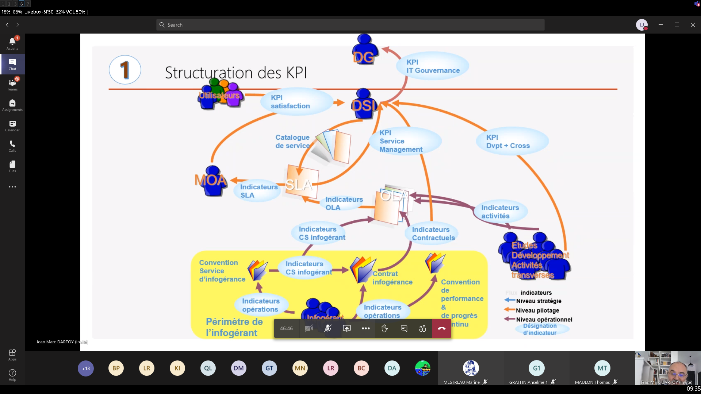

# Gouvernance et KPI d'un SI

Interlocuteur: Jean-Marc DARTOY
Spécialité: Gestion des SI et KPI
Mail: jm.dartoy@free.fr  

# Table of content

- [Gouvernance et KPI d'un SI](#gouvernance-et-kpi-dun-si)
- [Table of content](#table-of-content)
- [Introduction](#introduction)
  - [Les systèmes dans une organisation/entreprise](#les-systèmes-dans-une-organisationentreprise)
  - [Les NTIC](#les-ntic)
  - [Les composants d'un SI](#les-composants-dun-si)
- [La gouvernance du SI](#la-gouvernance-du-si)
- [La performance du SI](#la-performance-du-si)
  - [ITIL (sInformation Technology Infrastructure Library)](#itil-sinformation-technology-infrastructure-library)
  - [E SCM -CL (eSourcing Capability Model for Client Organizations)](#e-scm--cl-esourcing-capability-model-for-client-organizations)
  - [CMMI ( capability maturity model integration)](#cmmi--capability-maturity-model-integration)
  - [CObIT (Control Objective for Information and Relatied Technology)](#cobit-control-objective-for-information-and-relatied-technology)
  - [Lean Six Sigma](#lean-six-sigma)
  - [Evaluation](#evaluation)
- [Système d'information & KPI](#système-dinformation--kpi)
  - [Méthodes du marché](#méthodes-du-marché)
    - [ITIL](#itil)
    - [eSCM](#escm)
    - [CMMI](#cmmi)
    - [CObIT](#cobit)
    - [Lean Six Sigma](#lean-six-sigma-1)
  - [Indicateurs de tableaux de bords](#indicateurs-de-tableaux-de-bords)
    - [Les types d'indicateurs](#les-types-dindicateurs)
    - [Tableau de bord IT](#tableau-de-bord-it)
  - [Questions](#questions)
  - [L'IT Scorecard](#lit-scorecard)
    - [Vision financière - Global IT](#vision-financière---global-it)
- [Cours du 05/01/2020](#cours-du-05012020)
  - [Démarche Ishikawa](#démarche-ishikawa)
- [Context MyCafe](#context-mycafe)
- [Fiche indicateur](#fiche-indicateur)
- [Glossaire](#glossaire)

# Introduction

- comprendre les impact de l'informatique au sein d'une entreprise.  
- permettre d'augmenter les choix d'un nouveau SI à l'aide d'indicateur financier
- pouvoir évaluer la performance d'un SI
- comprendre la place du SI et sa problématique dans l'entreprise.

> le SI = système d'information ou dès fois référence au système informatique 

## Les systèmes dans une organisation/entreprise

Un système est un ensemnble cohérent de fonctions concourant à un même objectif dans l'entreprise. 
Trois composantes: hommes, outillage et processus.  
Ceci doit être contraint par un budget.  

Les entités sont: avant vente/vente, production, financier, informatique (DSI)...

La direction définira des règles, déclinables pour chaque service au sein d'une SI.  

La différence entre système d'information et système informatique peut différer selon si nous sommes dans une PME ou grande entreprise.  

## Les NTIC

L'arrivée impact le SI: les téléphones portables, les tablettes, l'IA.   

## Les composants d'un SI

Homme  
Outillage  
Processus (ISCM, CMMI, ITIL)  

__TCO__ : métrique sur les coûts liés au postes de travail.  

L'informatique apporte maintenant de la valeur pour l'entreprise.  

Le CIGREF a cartographié l'ensemble des rôles dans un SI.  

Le levier principal est l'innovation pour gagner de l'argent.  

# La gouvernance du SI

Définition: voir la définition des l'OCDE.  

Cause de l'apparition: certains nombres d'entreprises ont connu des pertes et faillite, car elle n'était pas suffisamment surveillée. Donc la gouvernance a été une réaction face à cette crise et perte d'un certain nombre d'entreprise. Au niveau de l'IT, il faut faire la même chose: il faut surveiller.   

Cf définition, CIGREF.
- 7 piliers  
- 10 pratiques 

L'informatique est devenu un levier majeure au sein des entreprises.  

Modélisation de processus:
- RACI
- BPM
- Roue de deming
- BSC
- SWOT
- TdB et graphes  

Référentiels (méthode dans la gouvernance IT):  
- ITIL, CMMI
- Cobit - ValID
- eSCM
- ISO 27001  RiskIT

Un DSI peut représenter de 3 à 5% de CA d'une entreprise dans les années 1980 à 2000. A partir des années 2000 les approches vont changer vers une approche "service". Il y a les SLA, qui seront les services délivrés au métiers. Ensuite, le OLA seront dérivés. 

La gouvernance IT s'est développée dans la continuité de la gouvernance d'entreprise. Une fois les process identifiés, il faut les outiller. 

Le budget IT dépendra du volume de la demander afin de garder le nombre d'effectif afin de produire la baisse de coûts unitaires.   

Faire attention au type d'indicateur et à ce qu'ils disent. Il ne faut pas beaucoup d'indicateurs.  

# La performance du SI  

Les méthodes du marché: vision de Gartner (CObIT pour le pilotage et gouvernance, eSCM (démarche permettant de mieux gérer un fournisseur de services), CMMI RACI, processus de gestion des opérations (ITIL), six sigma, processus de gestion des projets (PMI)...).  

Les indicateurs et tableaux de bords: six sigma utilisé à la base dans le système industriel. Elle aide à gérer l'industrialisation de l'IT. On dit que l'IT est seulement en train de s'industrialiser.  

Les 4 méthodes: CObIT, E-SCM, CMMI et ITIL permettent d'aider à piloter l'IT.    

## ITIL (sInformation Technology Infrastructure Library)

Né en fin des années 1980, c'est une démarche ayant pour objectif d'amélioer la fourniture des services informatiques pour le gouvernement anglais. L'ITIL prend effet dans le monde au cours des années 1990 et est actuellement à sa version 4.  

La démarche apporte une terminologie commune au monde de l'IT au niveau de l'entreprise afin que tous les acteurs parlent de la même façon. Elle apportera des références par rapport au marché. Enfin il faut penser client et engagement de services. L'ITIL peut durer entre 3 et 5 ans au sein de l'entreprise.      

Exemple: établissement de process pour différents domaines -> service desk, fourniture de services...   

L'idée est de définir deux trois indicateurs par domaine, afin d'aider à la planification. Les indicateurs peuvent évoluer avec le temps par but de pertinence et d'apport d'informations. On ne met donc pas tous les indicateurs proposés par l'ITIL en évidence.   

- Avantages de l'ITIL: augmentation de la satisfaction du client, réduction des risques, coût, amélioration de la communication (jargon commun), normes, productivité accrue, amélioration de la qualité des services. 
- Causes d'échec de mise en place: 
  - manque d'implication du management de l'entreprise (il faut un soutient constant de la DG de l'entreprise, cf courbe de désillusion).  
  - trop de temps passé sur les processus complexes: il faut rester dans la simplicité. 
  - absence d'instruction écrite et formalisée, de manière simple et claire
  - absence de l'identification du propriétaire du processus. 
  - focalisation est la seule performance seulement (cela ne sera pas le cas dès le début)
  - ambition de tout faire  (L'ITIL est un moyen de progrès continu)  
  - interruption des efforts dans la durée (ITIL dure de 3 à 5 ans, et les processus doivent avoir une maturité) 
  - ignorance d'autres approches que l'ITIL (ITIL n'est qu'une brique parmis d'autre. Il y a d'autre démarches gérer d'autres activités telles que le développement et pilotage des applications, améliorer les processus de l'IT... il faudra donc combiner avec le six sigma, le CMMI, le CObIT etc...). 
  - prise en compte de tous les composants de l'ITIL (ne pas prendre en compte les plus complexes)   

Un gain financier, via un ROI est attendu, afin de gagner entre 25 et 30% des coûts de production à terme. La montée de puissance de la maturité de l'équipe sur les processus nécessitera un peu de temps et de sur-investissement.  

Il y a 3 notions en lien avec la logique de contrat de service mis en exergue par l'ITIL:
- les SLA: contrat de service entre le fournisseur et son client s'appuyant sur un catalogue de service, écrit avec des termes non-techniques. La DSI créé un propre portail pour les utilisateurs métiers afin que les utilisateurs métiers puissent y accéder.
- le catalogue de service: receuil de service utilisateur standardisé permettant de construire le SLA
- les OLA: Operation Level Agreement, dérivées de SLA mais par rapport aux métiers de l'IT (ex: administrateur réseau, opérateur, utilisateur PC Windows, Linux etc...) écrit en termes technique si possible. Il y a autant d'OLA qu'il y aura de type d'acteur. Les documents sont en internes, au sein de la DSI et sont accessibles pour les utilisateurs internes. Les OLA ne sont pas toujours implémentées mais devraient l'être. Idéalement un SLA se décline en n OLA qui parleront aux métiers de l'IT.   

L'OGC, père de l'ITIL fourni une notation de 1 à 5 sur les processus.  

__Exemple de processus__: étude de la diminution du nombre d'incident.
    - problèmes traités
    - maitrise des mises en production
    - automatisation des change standards
    - qualité de traitement des incidents

Le coût de l'IT sera géré et diminué en finalité.  

Un processus a:
- un propriétaire (process owner)
- un réferent (assiste le propriétaire)
- un piloteur 
- un manager du processus (process manager)
- un solveur 
- un ou plusieurs analystes

Les niveaux de maturité:
- focus technologique
- focus service
- focus client
- focus affaires
- focus chaîne de valeur

## E SCM -CL (eSourcing Capability Model for Client Organizations)

Démarche créée il y a un vingtaine d'année, qui s'applique sur la gestion d'un prestataire/fournisseur de service. Il s'applique à tout type de service et sourcing.  

La démarche s'exprime en niveaux de capacités et 95 bonnes pratiques. Les activités sont fournies sur une base PDCA (Plan Do Check Act).   
C'est semblable à l'ITIL avec le système de pratique et modèle de maturité.  

L'E SCM a été appliqué par La Poste en France.  

## CMMI ( capability maturity model integration)

Démarche née dans les années 1990 aux Etats-Unis avec des pratiques et modèles de maturité.  

La démarche s'applique à la gestion de projet, à l'ingéniérie...  

Fondé sur un modèle PDCA.

## CObIT (Control Objective for Information and Relatied Technology)

Démarche arrivant en 1996 sous sa première version, ayant pour idée d'avoir des pratiques liées à la gouvernance, avec également des processus regroupés par domaine et des modèles de maturité.  

## Lean Six Sigma

Lean signifie "produire au juste nécessaire" afin de limiter le gaspillage. Il faut produire au juste milieu et éviter le gaspillage lié à la surproduction.  

Voici les 7 types de gaspillages:  
- surproduction: produire plus que ce que le client demande
- temps (temps): temps d'inactivité, délais...
- temps de transport: surtout dans le monde industriel
- temps de travail superflu: travaux qui n'apportent rien, exemple: dans un processus industriel étiqueter une étiquette sur un produit déjà étiqueté.
- gestion des stocks: avoir du stock/matériel que l'on ne peut pas vendre
- mouvements/déplacement:
- non qualité/conformité: 

Le __sig sgima__:méthodologie d'amélioration de performance des processus existant structuré en phrases.  
Cela passe par le __DMAIC__ en son coeur:
- define
- measure
- analyze
- improve
- control

Autre méthodologie: le __DFSS__ (__Define For Six Sigma__)  

Le niveau de sigma est lié au nombre d'écart type qui sépare la moyenne des limites de spécifications basses et hautes. Il faut produire entre -6sigma et 6sigma. Etude d'une variation afin de l'éliminer si possible.  

Le six sigma utilisera le __SIPOC__ afin de formaliser l'ensemble des processus afin de définir et voir où sont les pertes liés au gaspillages
__SIPOC__ = sSupplier ,Inputs, Process, Outputs, Customer

Six Sigma est utilisé dans le nucléaire, l'aéronautique, l'industriel, et maintenant l'IT.  

## Evaluation

Envoyer à jm.dartoy@free.fr

Gouvernance de la DSI:  

1. Combien de piliers sont liés à la gouvernance SI? Lequels?

D'apèrs le CIGREF, il y a 7 piliers liés à la gouvernance d'un SI:
- la différenciation
- l'innovation
- le coeur de métier
- l'avantage coopératif
- la gouvernance des données
- la gouvernance des services
- les coûts

2. Combien d'axes? Lesquels?

Il y a 4 axes pour la gouvernance d'un SI:
- la définition de la vision stratégique
- les mises en opérations comme la mise en place des systèmes et leur exploitation ainsi que le support aux utilisateurs
- les projets: projet de création et projet de transformation
- la gestion et l'optimisation des ressources IT et des processus existants. 

Méthodes et normes de la DSI:  
3. Combien de méthodes sont utiles? Et à quoi servent-elles?

Il y a 4 méthodes utiles: CObIT, E-SCM, CMMI et ITIL permettant d'aider à piloter l'IT.  
Ses 4 méthodes peuvent voir une cinquième démarche se greffer: le Lean Six Sigma, méthodologie & héritage du géant Toyota.  

Elles permettent de mettre en avant l'idée d'avoir des pratiques liées à la gouvernance d'un SI, avec également des processus regroupés par domaine ainsi que de modèles de maturité. 
Le résultat peut se traduire par: 
- l'augmentation de la satisfaction du client 
- la réduction des risques & coûts 
- l'amélioration de la communication (jargon commun dans le cas de l'ITIL) 
- la mise en place de normes (ITIL) 
- une productivité accrue 
- une amélioration de la qualité des services

L'idée principale est de montrer qu'au fil des années (1960, 1980, années 2000), la pensée a su évoluer vers une pensée orientée service et satisfaction client. On peut également associer les politiques de gouvernance d'un SI au time-to-market(ère de l'immédiateté) de manière indirecte.    

4. Quelles sont les liens entre ces méthodes?

Ces méthodes peuvent toutes être utilisées dans le domaine de l'IT premièrement. Elles permettent toutes de bâtir un référentiel commun au sein du SI et emploient des implémentations similaires afin d'en faire découler un gain par le biais d'un ROI (Return On Investment). Dans chacune de ses méthodes, nous retrouvons des notations numériques afin de déterminer des modèles de maturité (chiffre pouvant aller de 1 à 5) et mettent en saillance des méthodes de travail telles que le PCDA (Plan Do ACt Check). 

Elles ont pour objectif d'améliorer des processus existants afin d'optimiser la qualité des services fournis et d'atteindre une satisfaction client optimale.

Les leitmotifs de ses réferentiels sont donc:
- un but pour l'amélioration de processus au sein d'un SI
- une gestion de la gouvernance du SI optimal avec une amélioration des performances des processus 
- obtention d'un gain sous forme de retour sur investissement notamment
- la mise en place d'indicateurs (KPI pour Key Performance Indicator)
- la mise en place de modèles de maturité afin de mesurer la stratégie dans le temps (sur des semestres sachant que le processus global peut aller de 3 à 5 ans).  
- la mise en place de pratiques

# Système d'information & KPI

## Méthodes du marché

4 ou 5 items primordiaux pour construire des tableaux de bords en fonction du domaine de la DSI. En fonction de ce qu'on veut remonter avec des méthodes et indicateurs variés.  
Ne pas trop prendre d'indicateurs pour ne pas avoir un pilotage trop dense.  

4 ou 5 Méthodes: ITIL, CMMI, eSCM, Six Sigma, CObIT. Il y en a d'autres : (ABC, TCO, ASL...).   

Chaque méthode a son propre modèle d'évaluation, processus, activités et boucle d'amélioration.  

### ITIL 

Traite les problématiques liées à la production. 
Objetctif en matière de résolution des incidents côté ITIL: fournir le service de gestion des incidents afin que l'utilisateur s'en sorte.  
  - Example: Une personne ne peut pas imprimer. Fournir un service afin de traiter cet incident et réparer l'imprimante et orienté l'utilisateur vers une autre imprimante afin d'amener à une solution immédiate.  

Ce process va permettre d'éliminer les incidents récurrents. 

ITIL possède pléthore d'indicateurs. En prendre un ou deux par type de process et périmètre. En général, nous trouvons 5 processus et arrivont avec une quinzaine d'indicateurs.  
On peut changer les indicateurs s'ils n'apportent plus d'information pertinentes au SI.  

### eSCM

eSCM est la relation client/fournisseur donc de sourcing, comporté de 4 niveaux (de maturité) représentés par des couleurs sous la forme de pratiques. Toutes les formes de sourcing sont utilisables avec eSCM.   

Il y a 2 grands modules eSCM-SP et eSCM-CL. 

### CMMI

Traite les problématiques liées au développement avec des niveaux de maturité également.  
On a aussi des process et on défini un modèle de maturité. 

### CObIT

Idem avec d'autres processus. On peut retrouver des sujets traités par d'autres méthodes.

### Lean Six Sigma

Chasse au gaspillage, 7 types de gaspillages, mise en oeuvre d'un modèle DMAIC.  
Faire 6x l'écart type et on arrive à 99.xx pourcentage.  

## Indicateurs de tableaux de bords

L'objectif est de mettre en place des tableaux de bords pour piloter un SI et de remonter les informations essentielle à la direction générale.    

### Les types d'indicateurs

L'image suivante résume les types d'indicateurs:  

Les KPI IT Gouvernance vont nous intéresser même si les autres ne sont pas à délaisser et sont mis en place dans un tableau de bord IT/IT scorecard.    

On veut une vision/un axe financière, operationnelle, prise en compte du futur et orientation utilisateur.   

- __CA/ETP__: chiffre d'affaire par temps plein
- __QOS__: quality of service
- __OTD__: On-Time Delivery

On pose les indicateurs sur une fiche, puis on cherche à les calculer en français puis avec les mathématiques par la suite. Les indicateurs doivent tous être mesurables.  

Mettre du DMAIC pour les mettre en oeuvre.  

- Définir le projet de son périmètre, définir la périmètre de l'indicateur
- M: que va mesurer l'indicateur
- A: analyser quel résultat nous allons obtenir et si c'est ok 
- I: on y touche pas
- C: on y touche pas 

Chaque indicateurs doit être SMART (acronyme Spécifique, Mesurable,...). S'il ne l'est pas, nous n'en voudrons pas.  

__KPI volets operationnels__:
- temps de traitement des billets
- respect des temps de réponse
- adhésion à SLA
- taux de réussite du déploiement
- ...

__KPI organisationnel__:
- taux moyens sur les systèmes prioritaires
- coût du centre de services
- respect des dépenses budgétées
- ratio d'optimisation des coûts fixes
- taux de productivité
- ...  

Outils: Excel (même si trop manipulable), Oblicore, Service Now IT, CA USD, GPLI... A l'epsi GPLI est utilisé.   

IL y a 3 type d'indicateurs:
- volumétrie (select * from..., example, nb d'incidents...)
- efficacité de process (% d'incidents traités dans la backlog, suivi du backlog)  
- performance économique du process(nb incidents réouverts, charge consacrée à la résolution des incidents)

Nous verrons ultérieurement s'il sont SMART ou pas.  

### Tableau de bord IT

Tableau de bord: vision synthétique sur un certain nombres de domaine. 

## Questions

1. Que doit contenir un tableau de bord IT?

Il contiendra les quelques résultats provenant d'indicateurs sélectionnés en fonction du périmètre défini (1 voire 2 indicateurs donc 10 pour 5 processus). Ces résultats doivenrt aider la DSI à maîtriser et anticiper les activités.
Exemple d'indicateur basé sur les 4 axes/piliers/objectifs, certains considèrent qu'il y en a 7: finance, opérationnel, prise en compte du futur et orientation utilisateur.  

Allons-nous générer de la valeur?  

2. Comment le mettre en oeuvre par rapport à la stratégie de l'entreprise?

Installation et déploiement des outils pour avoir les bonnes informations. Cela sera piloter par la DSI.
Utiliser le DMAIC pour définir et traiter les KPIs. Modéliser ce qui est représentable par rapport au périmètre de l'entreprise. Utiliser les bons outils (Oblicore, GPLI, pas trop Excel...)  

3. Proposer des KPIs opérationnels de type ITIL? Faire un tableau de bord sachant qu'il y a une problématique sur les backlogs glissant des incidents sur 30 jours.  

- temps de traitement des billets
- adhésion au SLA
- taux de réussite du déploiement
- ...

Il faut positionner des qualiticien et des gens côté gestion de performance et métier pour définir et établir des tableaux. Il suffit des quelques heures pour définir ce type de tableau après avoir regrouper des ressources (gestion de performance, manager IT, autre qualiticien). Eliminer tous les indicateurs difficilement calculables. Une fois les indicateurs obtenus, travailler sur les expressions en language informatique (SQL...).  

Exemple de processus:  

__Gestion du changement__: nouvelle version d'application, effectuer une sauvegarde, mise à disposition d'un nouveau PC... Définir la liste des changements autorisés standards. 

Volumétrie:   
1) Connaissance du SI et SQL puis connaissance particulière des outils. 
2) SQL avec une clause WHERE, avec une recherche sur les changements particuliers.  
3) voir
4) voir
5) voir
6) voir
7) voir

## L'IT Scorecard

### Vision financière - Global IT

Budget IT: 5 - 6 % du budget global

Le __TCO__ (__total cost of ownership ou coût de possession__) est un outil aidant les managers à définir les informations.  
- coût directs 
- coût indirects ((possession d'un poste (serveur, matérieln logiciel), issu des opérations utilisateur, help desk...)

Le Gartner met à disposition des outils payants pour calculer des deux types de coûts. Microsoft en concurrence a également mis en place une méthode/démarche appelée __REJ__. Il en va de même pour VMWare.  

Evaluation de la performance: 

L'IT Scorecard nous permet d'avoir une vision financière sur les dépenses et de voir la régularité et flexibilité du SI.  

Comment faire pour mesurer la performance d'un SI?  
- déterminer les exigences fonctionnelles et non-fonctionnelle. 
- adapter les pratiques de la société à la DSI.   
- disposer d'outils, approches et méthodes

Gestion des risques: loi de programmation militaire.    
Les principaux risques en IT.  
__PRA__: Plan Reprise d'Activités

# Cours du 05/01/2020  

## Démarche Ishikawa

Démarche issu du milieu industriel Japonais, permettant de diagnostiquer le pourquoi pour un problème donné. 

Similaire à une matrice cause-effets
Une cause peut avoir un ou n effets.   

Démarche associée aux 5 pourquoi, aussi démarche Japonaise.  

# Context MyCafe

MyCafe, utilise la 5G et veut apporter un tableau de bord sur ces futurs modèles de machine à café, 1052 clients et 15 techniciens. 
Projet: Mettre une carte électronique au sein des machines pour les superviser à distance.    

Pourquoi mettre en place un système de gouvernance IT (Origine de la gouvernance IT)?  
> Historiquement afin de suivre les processus qui seront employés, Faire par la suite les choix technologies. Augmenter la vision de l'entreprise par le biais du tableau de bord de la DSI afin d'avoir des indicateurs. Avoir des gains financiers, NTIC. Créer de la valeur ajoutée sous la forme de CA et remonter les informations (transparance). Il faudra maintenir la gestion des serveurs.  

Que doit contenir comme information ce système de gouvernance IT?
- Piliers de l'IT gouvernance:  
> 7 piliers? maitrise des risques (fondation, connaître et gérer les risques impliqués) -> alignement stratégique (établir une stratégie efficace en continu), performance des processus (outils de pilotage pertinents ITIL, CObIT), ressources et compétences, -> création de valeur (CA, bénéfices, démontrer la valeur & la contribution des actions) 
- Exemple de ScoreCoard
> Non: Utiliser les TCO(coût global du produit lors de son cycle de vie) afin d'avoir une vision financière sur les dépenses, et régulariser le SI (en toute transparence). L'IT Scorecard permet de déterminer les exigences fonctionnelles et non-fonctionnelle, adapter les pratiques de l'entreprise à la DSI, disposer d'outils, approches et méthodes. Le Gartner met en place différents outils, en concurrence il y a le REJ(Rapid Economic Justification) amené par Microsoft. Productivité, Fonctionnement des cartes électroniques.   

Construire un tableau de bord de ScoreCard IT:  
>...

Constuire le tableau de bord avec des valeurs réelles.  

En groupe: travailler sur Pourquoi le café n'est-il pas bon? Utiliser soit la méthode d'Ishikawa soit les 5 pourquoi. Travailler en groupe.  

# Fiche indicateur

Fiche énumérant les indicateurs, fournissant une traçabilité et facilite le travail.    

# Glossaire

__PRA__: Plan Reprise d'Activités

