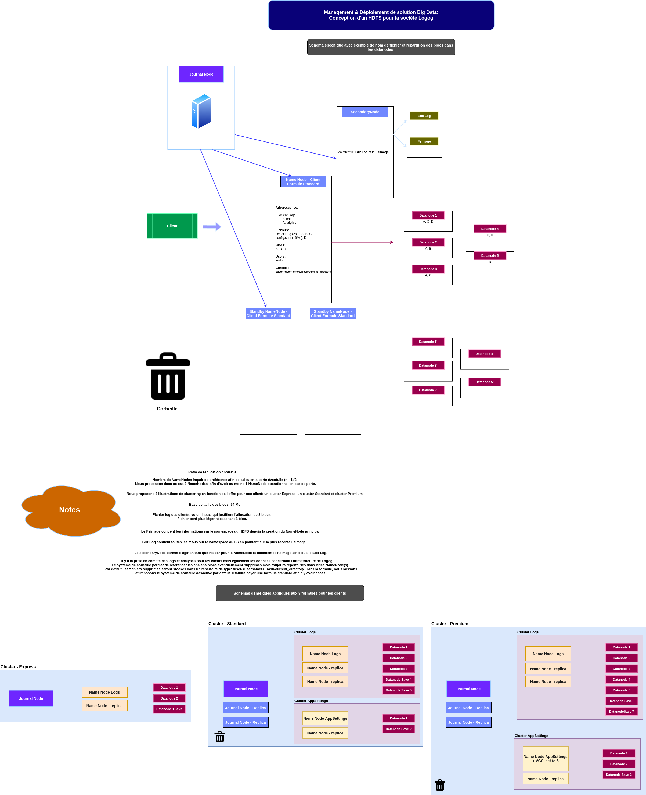

# Atelier 1 - Conception de cluster(s) Hadoop/HDFS  

# Acteurs

|Nom|
|---|
|Jérémie LAERA|
|Arthur TOULOUMOND|  

# Proposition de schémas & Justifications en notes

Nous proposons en premier lieu une schématisation spécifique pour un cluster Hadoop donnée, suivi de notes justifiant de nos choix architecturaux.  

Enfin nous proposons la schématisation de 3 clusters en fonction de la formule choisie:  

  

