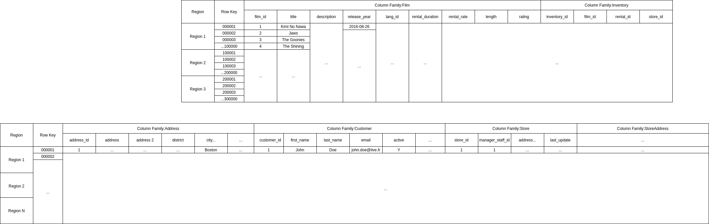

# Management & Déploiement de solution Big Data

Auteurs: Jérémie LAERA, Arthur TOULOUMOND  

# Table of contents  
- [Livrables](#livrables)  
  - [POC du schéma de Location de film pour l'entreprise Sakital](#poc-du-schéma-de-location-de-film-pour-lentreprise-sakital)
  - [POC du script de création de la base HBase](#poc-du-script-de-création-de-la-base-hbase)  

# Livrables  

## POC du schéma de Location de film pour l'entreprise Sakital  



## POC du script de création de la base HBase

En SQL, considérant que nous sommes depuis un terminal connecté à une instance d'HBase en lançant la commande `hbase shell` (on présuppose que l'on se trouve sur un environnement où tout l'outillage a été installé):    

```sql
create 'film', 'film_id', 'title', 'description', 'release_year', 'lang_id', 'rental_duration', 'rental_rate', 'length', 'rating'
create 'inventory', 'inventory_id', 'film_id', 'rental_id', 'store_id'  

create 'customer', 'customer_id', 'first_name', 'last_name', 'email', 'active'
create 'customer_address', 'address_id', 'address1', 'address2', 'district', 'city' 
create 'store', 'store_id', 'managaer_staff_id', 'address'
create 'store_address', 'store_address_id', 'address'
```  


Un début de programme de création de table HBase en Java:  

```java
import java.io.IOException;

import org.apache.hadoop.hbase.HBaseConfiguration;
import org.apache.hadoop.hbase.HColumnDescriptor;
import org.apache.hadoop.hbase.HTableDescriptor;
import org.apache.hadoop.hbase.client.HBaseAdmin;
import org.apache.hadoop.hbase.TableName;

import org.apache.hadoop.conf.Configuration;

public class CreateTable {
      
   public static void main(String[] args) throws IOException {

      Configuration conf = HBaseConfiguration.create();

      HBaseAdmin admin = new HBaseAdmin(conf);

      HTableDescriptor tableDescriptor = new
      HTableDescriptor(TableName.valueOf("film"));

      tableDescriptor.addFamily(new HColumnDescriptor("film_id"));
      tableDescriptor.addFamily(new HColumnDescriptor("title"));
      tableDescriptor.addFamily(new HColumnDescriptor("description"));
      tableDescriptor.addFamily(new HColumnDescriptor("release_year"));
      tableDescriptor.addFamily(new HColumnDescriptor("lang_id"));
      // etc

      HTableDescriptor tableDescriptor2 = new
      HTableDescriptor(TableName.valueOf("inventory"));

      tableDescriptor.addFamily(new HColumnDescriptor("inventory_id"));
      tableDescriptor.addFamily(new HColumnDescriptor("film_id"));
      // et ainsi de suite pour les autres tables & colonnnes... 
      // compiler, exécuter et déployer le jar au besoin  


      admin.createTable(tableDescriptor);
      admin.createTable(tableDescriptor2);
      System.out.println(" Tables created ");
   }
}
```