# Management & Déploiement de solutions Big Data  

# Table of contents
- [Objectifs & Evaluation](#objectifs--evaluation)  
- [Introduction](#introduction)  
  

# Objectifs & Ids & Evaluation

Id Cloudera (Hortonworks):  

Atelier en groupe:  à remettre sur MyLearningBox 
QCM: individuel

Objectifs du module:  
- théorie & bases sur le management & déploiement de solutions Big Data.  

Mail de l'intervenant: labasse@gmail.com  

# Introduction 

2,5 exa bytes: nb d'octets créés dans le monde par jour. Google essaie de les exploiter.  

- organiser un cluster Hadoop (solution permettant de structurer des soluces big data)
- concevoir des MapReduce (traitements)
- coder un mapper/reducer 
- structurer une BDD orientée colonnes  
- intéroger cette BDD  

- Linux, Shell Script, Java   
- VM VirtualBox lançant une machine virtuelle HortonWorks, qui contient une sandbox d'Hadoop

Big Data:
- NoSQL, BigData
- Hadoop
- Mise en oeuvre

HDFS:
- vue d'ensemble
- clusters & services
- administration

MapReduce:
- principe
- implémentation Java
- Hadoop Streaming  

HBase:
- BDD fondé sur HDFS orienté colonne
- structures & utilisation  

# Big Data

- enjeux du NOSQL & Big Data    
- panorama des solutions  
- intérêt des distributions Hadoop  


## Enjeux du NOSQL & Big Data

Cf : Théorème CAP. On peut pas avoir les 3.   

Partitionnement des données et cohérence: NOSQL avec HBase MongoDB...  

NOSQL: Not Only SQL, système pas forcément __ACID__.  
- avantage: monter en charge et avoir des structure plus souples.  

Différents types de DBMS dans le NOSQL avec déclinaisons:  
- orienté colonne, avec notion de colonne family (HBase, Cassandra)
- orienté document (MongDB)
- clé/valeur (redis, dynamoDB, Oracle NOSQL Database)
- graph (Neo4J)

La matrice de choix permet de voir vers quel choix s'orienter en fonction de facteurs et contraintes de cohérences.  

## Panorama des solutions

Le Big Data souhaite répondre aux 3 V: Volume(géré avec plus d'une machine nos données), Variété(sources de données variées), Vitesse(parallélisation pour traitements et requêtes). On peut rajouter: Véracité (élimination et validation de données), et Valeur(déduction et anticipation grâce au ML).  

Avant Hadoop, il n'y avait pas de solution Big Data disponible; les premiers à l'époque étaient Google qui avait eu à ingérer des volumes de données considérables.
- en 2003 ils publient leur Google File System et un libre sur le MapReduce.
- en 2004, Yahoo, propose une première implémentation appelée Hadoop (par Doug Cutting), repris par Apache
- en 2008, Hadoop devient top-level, sous Apache

Aujourd'hui il reste une référence pour le Big Data avec son système de fichier appelé HDFS.  

Son coeur est:
- HDFS 
- MapReduce enrichi avec un système de resource Yarn (Yet Another Resource Manager), qui optimise le MapReduce lors du passage en V2. Système de gestion & monitoring. MapReduce travail sur disque à l'origine.
- système de BDD comme HBase ou Cassandra
- système d'exploitation des BDD ou d'HDFS: Hive (qui fait du MapReduce), Spark(performant & recommandé car utlra performant sur le MapReduce car travail en mémoire) & propose du ML
- gestion du cluster avec Zookeeper (petit BDD efficace basée sur HDFS), Zookeeper pour Gardien de ZOo pour gérer toutes ces ressources et processus. Ambari (Web), distcp, Oozie( sorte de `cron` amélioré, outil de plannification de tâches, donc spécifique à notre éco-système).  
- ETL: à la façon Hadoop, Spark, Scoop (orienté BDD relationnel), avro (sérialisation de données, car on aura souvent des données sous forme de texte), Kafka/Storm (flux et gestion de flux et alimentation de clusters).  

## Intérêt des solutions

C'est un éco-système énorme. Nous démarrons sur un cluster sous la forme d'une distribution. 

Difficultés:  
- besoin d'homogénéité des clusters
- incompatibilité d'outils entre versions

Distributions:  
- Cloudera: Noyau Open Source + propriétaire
- HortonWorks: Racheté par Cloudera 
- MapR: open source + payant , Map R FS (offre Amazon)
- Pivotal: Outils propriétaires orienté Analytics)    

Ce panorama est tellement important qu'il faut intégrer tout cela dans une distribution.  

# HDFS

Hadoop a en son coeur un système de fichiers (HDFS), reparti sur plusieurs machines.  

## Vue d'ensemble  

C'est un système de fichiers distribués, donc sur plusieurs machines, ces différentes machines permettent une réplication des données.  

Il fonctionne avec:
- un système de réplication (avec redondance pour ne pas perdre de la donnée)(ratio de répliquation par défaut à 3).  
- système de bloc (64 Mo par bloc par défaut). Donc une machine possède 2 bloc, la donnée sera répliquée 6 fois, les deux blocs seront en 3 exemplaires sur chacune des machines du cluster. Par exemple, un fichier *fic1* fait 130Mo et est stocké sous HDFS, il aura donc besoin de 3 bloc si la taille par défaut est préservée (un bloc A, un bloc B puis un bloc C) car 130 est > à 64 * 2.   
- optimisé pour écrire une fois et lire autant de fois que l'on veut (Write Once). Nous ne modifions pas les fichiers en Hadoop, une modification impliquera une suppression.  

Hadoop FS:
- couche d'abstraction d'accès à HDFS ou à d'autres systèmes de fichiers.  (interopabilité)
- accès par URI: hdf://, file://, ftp://, s3://, gfs://, ...    

## CLusters & Services

Clusters:  
- système de stockage et compression natif (répertoire et fichier mais possibilité de compresser les stockages et transfert avec l'algorithme de compression souhaité).
- algorithmes: pour la lecture: gzip, bzip, pour le transfert: lzo/snappy(plus performance).   

Permissions:  
- par défaut, c'est du Linux.
- possibilité d'ACL (utilisateur, groupes, multiples) posix
- désactivable: avoir seulement un sudo ou un système de user Kerberos utilisable

Par défaut, il y aura un user group Linux et une compression activée.  

## HDFS - Services  

Nous avons donc un système de fichier, géré par bloc. Nous allons voir sont gérés ces blocs ainsi que ce système de fichiers.  
Il y a plusieurs services qui permettent la gestion de ce file system.  

Ici nous allons parlons d'HDFS Service:
- __NameNode__: reference les répertoires et les fichiers dans ces répertoires (il ne stocke que les références et donc pas les données), il référence également les journaux de logs, i.e. les informations concernant ces répertoires et fichiers et donc les blocs.
- __DataNode__: stocke les données (noeuds de données), données des fichiers. Aucune utilité d'activer le RAID sur les DataNode. Nous stockons en réalité les blocs contenant les fichiers.   

L'exemple d'illustration montre un stockage sous HDFS avec un ratio de réplication paramétré à 2. On peut observer que si un DataNode tombe, aucun bloc ne sera perdu, car ils sont bien répliqués et répartis par redondance.  

Voici un exemple d'interogation du NameNode:  
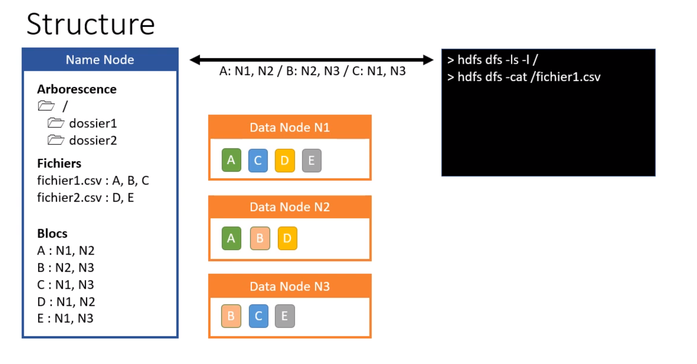  

Le NameNode renvoie les références. 

Voici un exemple de demande d'écriture avec le commande `put`:  
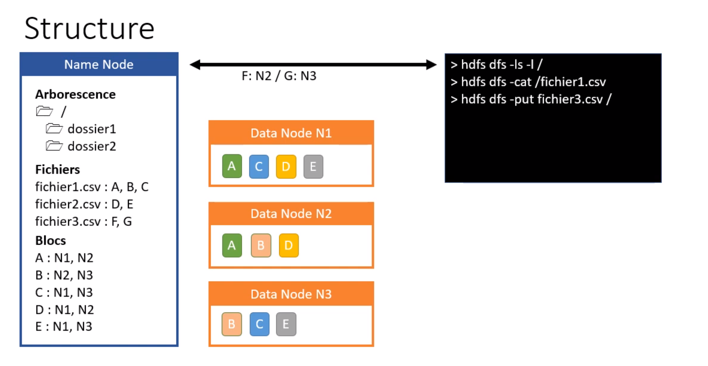  


La charge sera à gérer lors de la lecture des données contenues au sein des fichiers référencés.  

> En réalité les noms des blocs ne seront pas sous la forme de lettres mais la forme d'un code. Les lettres visent simplement à faciliter la compréhension du HDFS.  

Nous allons maintenant voir comment avoir de la redondance au niveau de NameNode. Car pour le moment nous ne montrons qu'un seul NameNode, mais s'il tombe, tout notre système de fichiers tombe. Nous allons donc expliquer la redondance en détail lors de la partie sur l'administration.  

## Administrations 

Il est possible de:
- vérifier l'intégrité de HDFS (`fcsk/`) qui vérifiera si tous les blocs sont au bon endroit.
- système d'équilibrage, datanode non-equilibré, trop sollicité, donc équilibrer un taux de remplissage à + ou - par tranche de pourcentages. On utilise la commande `sudo hdfs balancer`. Opération très longue (heures/jours) car le cluster continue à tourner.  

- fédération de clusters: isolation d'arborescence: nous pouvons isoler des répertoires dans différents NameNodes. Pour l'utilisateur cela sera transparence. 
- cycle de vie: versionning de fichier en HDFS afin d'avoir plusieurs versions d'un même fichier(ancien blocs, et nouveau blocs du fichier). Il y a un système de corbeille qui récupère les blocs dans la corbeille. Les fichiers restent référencés dans le NameNode tant qu'ils n'ont pas été supprimés de la corbeille. 

Si le NameNode tombe, on perd notre HDFS, donc problème de disponibilité. Il faut donc mettre plusieurs NameNodes actifs: cf Journal Node. 

- journal node: NameNode actif avec des NameNodes en standby qui effectuent quand même certains tâches. La NameNode actif fera les écriture, et les autres ne feront que répliquer les opérations.   
  - Le NameNode actif sera décider par un serveur appelé Journal Node, qui gère les NameNodes. Si NameNode tombe, le journal décidera quel NameNode le remplace. Ains grâce à ce journal node, nous pourrons avoir un nombre de NameNodes pair ou impair car perte possible de (n-1)/2 noeuds. (__HA par Quorum__) __HA__ = __High-Availability__ CLuster. 
  - Si le journal Node tombe, il faut redonder le nombre de Journal Node, en un nombre forcément impair (1,3,5)..   La formule plus haut permet de voir le nombre de perte par Journal Node/Named Node & Data Node: (n-1)/2 , donc si nous avons par exemple 5 journal: (5-1)/2 = 2. Nous perdrons donc 2 journaux nodes. Cela nous permet donc de voir le nombre de nodes qu'il nous faudra en fonction du besoin.  

Une machine est en général l'équivalent d'un datanode.  


# Atelier 1 - 01/03/21  

__Sujet__  

Votre entreprise Logog propose l'historisation de logs à ses clients : elle stocke les logs et propose une analyse et des alertes basées sur des algorithmes de détection d'anomalie.
Les logs de ses clients et ceux de son infrastructure, par la même occasion, sont stockés sur un cluster Hadoop.  
Chaque client peut choisir entre 3 formules :

- Express : Stockage des logs avec sauvegarde
- Standard : Express + stockage de fichiers de configuration
- Premium : Standard + historique des 5 dernières versions des fichiers de configuration  
  
Proposer une arborescence HDFS ainsi qu'une organisation de cluster HDFS pour cette entreprise. L'organisation peut être un schéma ou une énumération mais elle doit préciser le nombre d'instances de chaque services, les paramétrages éventuels si ils ne sont pas par défaut en justifiant chaque choix.
__Compétences__  

Organiser un cluster Hadoop  

__Livrable__  
Pdf contenant un schéma du cluster et une justification de vos arbitrages.

# Cours 2 - 02/03/21  

## Utilisation de la machine virtuelle d'Hadoop

- démarrer la machine virtuelle
- recommandé: changer et mettre un faux domaine dans `etc.hosts` sous Windows puis redémarrer la machine.  Exemple:  

```
127.0.0.1     localhost
127.0.0.1     sandbox-hdp.hortonworks.com
127.0.0.1     sandbox-hdf.hortonworks.com
```  

Voic les URL à retenir lors du démarrage de la machine virtuelle:  
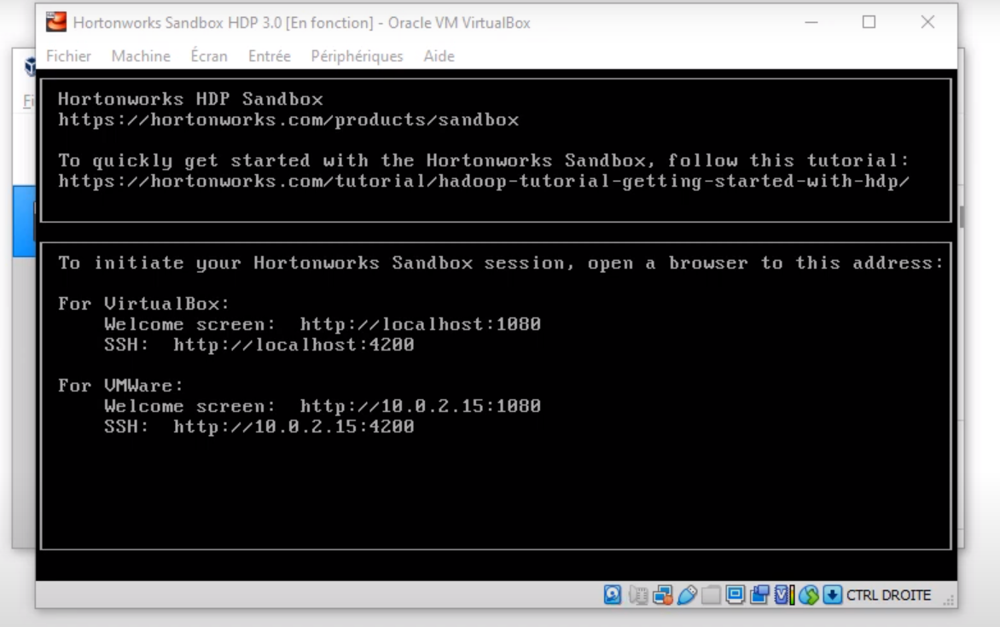  

Voici la configurationde l'URL pour l'interface de Putty:  
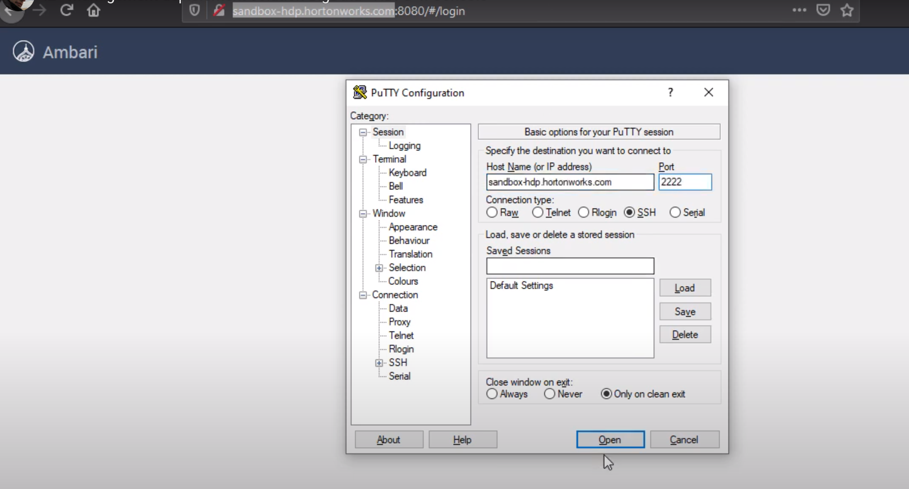    

Ensuite se rendre sur l'URL avec celle renseignée sur note fichier host: `sandbox-hdp.hortonworks.com:port`. Avec le port spécifié dans l'url que VirtualBox montre une fois la machine démarrée.  
On atteri sur le navigateur Ambari. Pour configurer un mdp, il faut lancer un ssh, par exemple putty sur Windows et accéder à la machine virtuelle avec l'adresse et le port du serveur.  
Définir le mot de passe: `ambari-admin-password-reset`  et changer le mdp.  

Entrer ensuite le mdp.  Par défaut, le user est `admin`.  

Ensuite sur l'interface, démarrer le serveur HDFS avec le boutont Action puis __start__.  

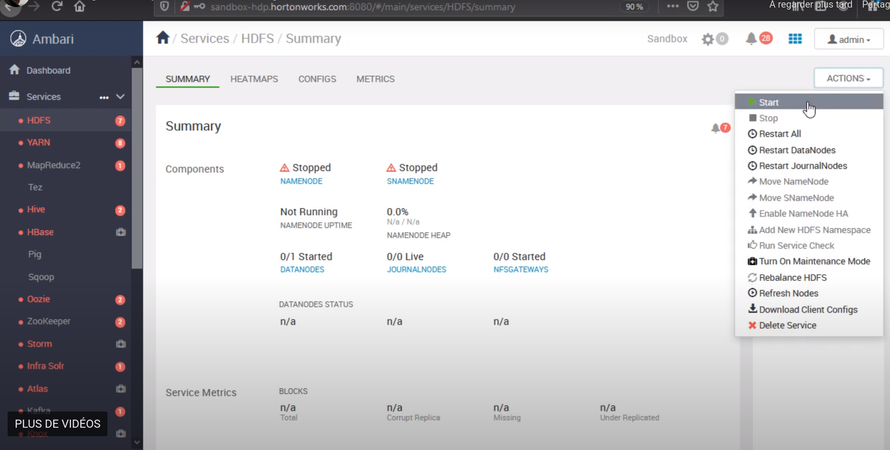  


A partir de ce moment-là nous disposerons d'un serveur HDFS. Nous aurons des logs qui s'enrichiront au fur et à mesure des tâches que nous effectuerons.  
Nous avons au début un NameNode et un DataNode au début.

Secondary Node: process qui va mettre  àjour le fsimage en lisant les données qui transitent (daemon).

Notre HDFS est démarré et nous pouvons donc à partir de notre terminal sous putty par exemple commencer à travailler avec.  

 
- lister les dossier présent sur le serveur HDFS avec: `hdfs dfs -ls /`. On s'aperçoit que l'on est bien sur notre file system HDFS et non plus sous le centOS du putty. Le super user est `hdfs`. Les autres users sont des applications. 
- voir les différents users: `hdfs dfs -ls /user`.  

Dans HDFS il n'y a pas la notion de `cd`. Il n'y a de notion de répertoire courant.  
- se mettre en super user afin d'avoir des accès élevés: `sudo -u hdfs hdfs dfs -ls -l /user/hdfs`    
- créer un répertoire pour le user `root`: `hdfs dfs mkdir bazar`
- lister : `hdfs dfs -ls /user/root`
- placer un fichier dans ce nouveau répertoire placé dans notre serveur HDFS: `hdfs dfs -put myfile.txt bazar`
- vérifier en listant le répertoire: `hdfs dfs -ls /user/root/bazar` 
> Si nous avons un taux de replication à x, les fichiers une fois placés seront répliqués en fonction de x.  

- synthétiser plusieurs fichiers dans un même répertoire sous la forme d'un seul fichier (très utile pour récupérer les résultats d'un MapReduce afin de récupérer les résultats de chaque reduced): `hdfs dfs -getmerge bazar/* my_results`. `my_results` sera le fichier de synthèse, concaténation de tous les fichiers situés au sein du répertoire `bazar`.   


## Utilisation en Java

On pourrait coder un programme accédant au HDFS en Java, en utilisant une URI avec un objet de type `FileSystem`. Il faut passer l'URL du NameNode. Il s'agit d'un équivalent du code avec le putty en Java. Penser à inclure les packages Java Hadoop afin de reconnaître les objets et méthodes. 

Nous avons vu en console et en Java comment manipuler l'arborescence de fichier sous un serveur HDFS démarré et régler avec un mot de passe.  

## Atelier 2  

Traduire les 3 formules par des dossiers.    
Trouver un référencement aux clients.  

# Cours 3 - 08/03/21  

- MapReduce
- Implémentation en Java
- Implémenetation en Python  

Note: Firebase = BDD Google.  

Pour l'atelier, il faudra lancer HDFS, MapReduce & YARN.  

## MapReduce

- Algorithme omniprésent dans le BigData.  

4 étapes:
- split: répartition des données sur chaque noeud (fait auto)
- map: production de coupls (clé, valeur)
- shuffle and sort: regroupement par clé (fait auto)
- reduce: traitement de toutes les valeurs par clé(1 à N clés)    

Exemple: établir la filmographie d'acteurs:  
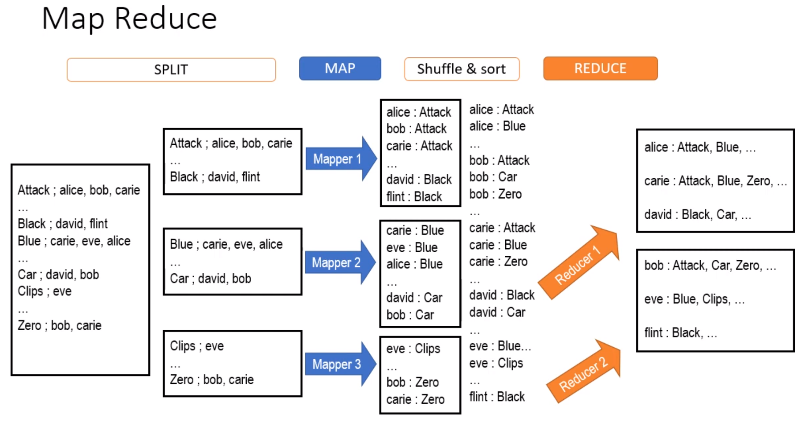  

Un clé sera envoyé à un reducer et un seul. Les reducers et traitements peuvent se lancer en parallèle. Il se peut y avoir 2 reducers travaillant sur la même clé, et ceux-ci auront les mêmes valeurs pour travailler, afin de faire une course entre les reducers.  

En synthèse, nous avons des flux de données énormes (fichiers...) et que nous séparons en flux envoyés sur chaque mapper. Chaque mapper effectuera les traitements demandés sur les clés, sans se préoccuper des autres mappers (de manière stateless). Les regroupements seront faits puis envoyés sur des reducers. Un reducer ne traitera jamais la moitié d'une clé, il traitera toujours une clé en entier sauf plantage et effectuera la synthèse des valeurs pour la clé donnée.      

## Implémentation en Java 

- hériter de `Mapper<KeyIn, ValIn, KeyOut, ValOut>`, si c'est un fichier csv, keyIn sera la clé de la ligne en entrée...  
  - objet de type `Writable`, on pourra écrire en sortie dedans.  
  - méthode `mapper()` avec la méthode `context.write()`  
- les types clés et valeurs de sortie doivent correspondre à ceux en entrée.  
- méthode `reduce()` qui prend un itérable correspondant à toutes les valeurs pour un clé traitée.  
- configuration avec un jar le nombre de reducers à produire.  

- avec Hadoop Streaming et le lancement avec n'importe quel langage. Mapper & Reducers.   

## Implémentation en Python  

- VSCode avec __SSH FS__ pour mettre des configurations avec spécifications de l'host, port, repértoire, usernamen password.  
  - récupérer un fichier (généré via un script PHP): `wget -O data/inputxx.csv https://syllab.com/BDOE928/?d=2021-03-08%2000:02&max=20000`  
  - `hdfs dfs -mkdir /user/root/age/in`  
  - `hdfs dfs -put inputxxx.csv /user/root/age/in`
  - `hdfs dfs -ls /user/root/age/in`  
Nos données d'entrées sont donc présentes.  

Voici les scripts python traitant les données (des lignes csv de nom, prénom, âge et UID):  
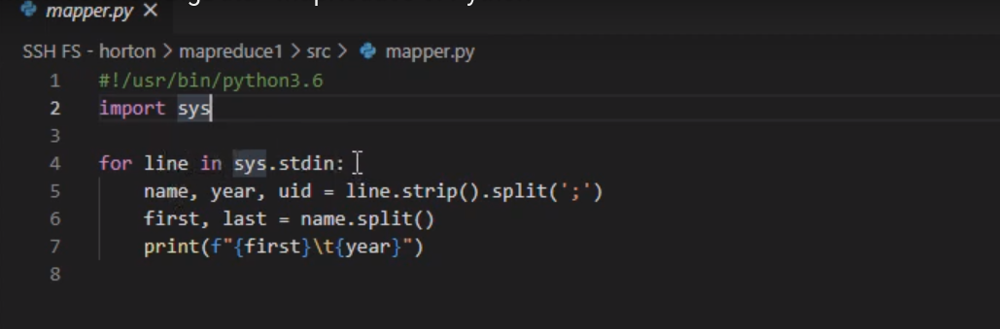  (mapper)  

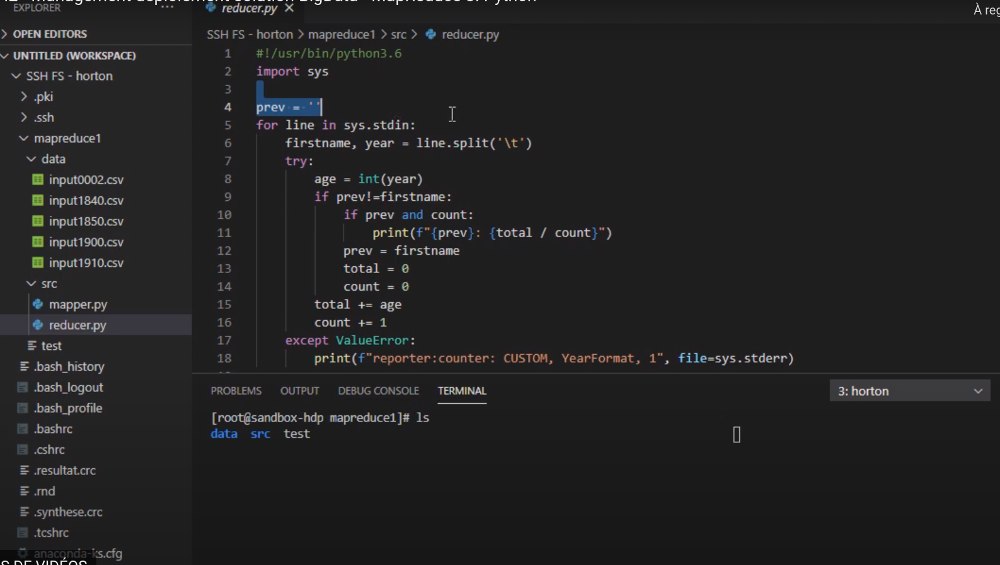  (reducer)  

- tester un mapper python: `cat data/inputxxx.csv | src/mapper.py`.  
- tester le reducer: `cat data/inputxxx.csv | src/mapper.py | src/reducer.py`   

- Lancer le MapReduce sur HDFS, via Hadoop Streaming: `hadoop jar /usr/hdp/current/hadoop-mapreduce-client/hadoop-streaming.jar -D mapred.reduce/tasks=2 -files src/mapper.py,src/reducer.py -mapper mapper.py -reducer reducer.py -input /user/root/age/in -output /user/root/age/out`.    
- se rendre sur l'URL générée par l'invite de commande, et voir les map en cours et les reduces produits
- si nous faisons un `ls`: `hdfs dfs -ls /user/root/age/out`, et que nous apercevons un répertoie `_SUCCESS`, c'est que notre opération s'est bien déroulée avec un résultat à succès. Nous aurons également les fichiers créés listés.  

## Atelier 3  

__Sujet__  
Mettre le CSV en PJ dans un répertoire hdfs puis écrire trois mappers et deux reducers (en script ou java) pour obtenir par une combinaison adéquate :

Montant des locations par client (mail)
Montant des locations par rating
Film le + loué par rating
__Compétences__  
Concevoir un traitement MapReduce
Coder un mapper et un reducer en java (ou autre langage)
__Livrable__  
Zip des scripts/sources ou lien GitHub/GitLab

Utiliser un reducer sur une deuxuème requête (astuces) (5 fichiers à écrire).  

# Cours 04 - 09/03/21  

## HBase

Hadoop nous permet de stocker des données sous la forme de fichiers, mais également sous la forme de BDD.  

Nous parlerons de cluster HBase.  

### Structure

Table avec clés de ligne, et ensemble de famille de colonne (orienté colonne).  

Colonne: appartient à une famille de colonne (conseillé de ne pas dépasser 10 familles par table, par souci de performance). Possède un identifiant de colonne(nom minuscule court). Conseil: 1,2 ou 3 familles dans un base Hadoop. La famille peuvent donc posséder x colonnes, et nous accédons à une colonne avec `famille:colonne`.   

Cellule: ligne/colonne(identifiant), versionné (versionner les valeurs/colonnes pour garder les dernières versions).  

Stockage sous forme de région (serveur), qui prend en charge un certain intervalle de clés. On pourra interrgoer les clé pour avoir les données rattachés.  

Un entrée est pointée par sa clé, sa colonne (famille:nom), sa version par défaut toujours la dernière et la valeur de la cellule que l'on veut définir.   

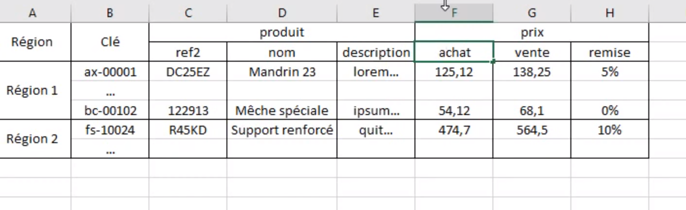  

Nous pouvons avoir des colonnes, qui peuvent être vidés (et ne prendront donc aucun stockage), avec chaque cellule stockée indépendamment. Nous évitons donc les stockages inutiles.  

### Opérations  

__définition__: create, describe, alter, drop, enable, disable(activer/désactiver colonnes temporairement)  
__manipiulation des cellules__: get (interroger une famille ou celulle), delete (supprimer une celulle ou tout l'enregistrement), put (créer et modifier), scan (parcours de plusieurs lignes).  

### Administration

Organiser les rôles dans un cluster HBase:

- Hbase master: rôle du plus haut organisateur
- Hbase region serveur: pour stocker une region
- Zookeeper: gère la redondance et affectation, haute dispo sur notre cluster, assignation des régions (répartition de la charge), ensemble de services permettant de gérer d'autres services hadoop. Zookeeper est un orchestrateur.   

- Hbase master multiples (2 - plus l'infini)
- Redonder le Zookeeper, avec un nombre impair de Zookeeper en cas de perte par Quorum(n-1/2).  
- redonder les regions serveurs car un zookeeper répertorie les regionserveurs actifs.  

Interfaces REST, HBase Thrift possibles pour interroger nos base Hadoop. Possible d'interroger par ligne de commande.    

- Equilibrage des régions  
- Haute disponibilité (rajouter et superviser des regionservers)  

### HBase Shell (Batch)

Outil de ligne de commande pour manipuler HBase.  

Création et remplissage & scan & filtre  

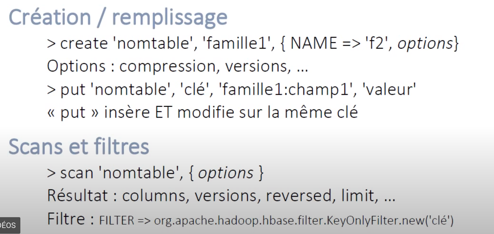  

### MapReduce  

Permet d'interroger une base Hbase par un langage comme du Java. Java propose une API permettant d'effectuer de telles manipulations.    

Instructions et objets Java:  

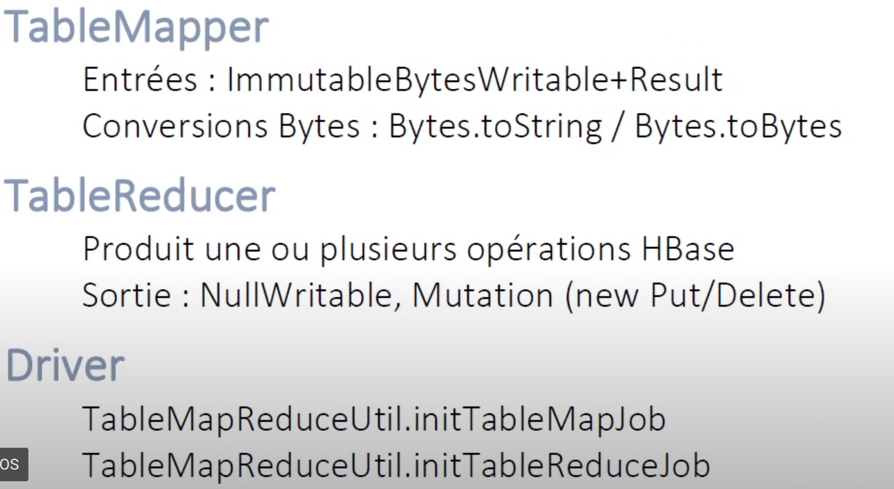  

## Atelier 4 - Optionnel  

__Sujet__  
Étape 1 : Proposer un schéma de base HBase pour des tables destinées à consulter les films, les clients et les locations de la base Sakila dont la structure relationnelle MySQL est décrite ici.

Remarque : A chaque table MySQL ne correspond pas une table HBase

Étape 2 : Écrire le script HBase Shell de création de la base

__Compétences__  
Structurer une base de données orientée colonne
Interroger une base orientée colonne
__Livrable__  
Un document PDF contenant la structure de chaque table :

__Nom de table__  
Composition de la clé (à partir de quel(s) champ(s))
Familles de colonnes : Nom, Versions, description, Liste de colonnes (+description)
Un copier/coller du script de création de la base HBase.


