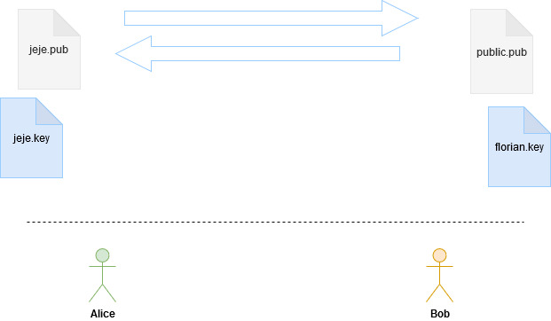

# TP 2 - Livrable 

|Libellé document|Collaborateurs|Date|Version|
|-----------------|--------------|---|-------|
|Sécurité Informatique - Introduction à la cryptographie appliquée|LAERA Jérémie|09/10/20|1.0|
||Mathieu DORVILLE (Cryptographie Symétrique)||||
||Florian GAUTIER (Cryptographie asymétrique)||||

<hr>

# Table of contents

- [TP 2 - Livrable](#tp-2---livrable)
- [Table of contents](#table-of-contents)
- [Utilisation d'un algorithme de hachage](#utilisation-dun-algorithme-de-hachage)
  - [Contrôle d'intégrité d'un téléchargement](#contrôle-dintégrité-dun-téléchargement)
- [Chiffrement de fichier à l'aide du chiffrement symétrique AES](#chiffrement-de-fichier-à-laide-du-chiffrement-symétrique-aes)
  - [Chiffrement de fichier](#chiffrement-de-fichier)
  - [Déchiffrement du fichier](#déchiffrement-du-fichier)
- [Manipulation des protocoles de chiffrement asymétrique](#manipulation-des-protocoles-de-chiffrement-asymétrique)
  - [Préparation de la biclef](#préparation-de-la-biclef)
  - [Chiffrement et déchiffrement de fichiers](#chiffrement-et-déchiffrement-de-fichiers)
  - [Signature électronique](#signature-électronique)

> Les réalisations et commandes sont effectuées sous une machine tournant sous un OS natif Linux (Arch Linux). Les différentes interactions seront réalisées avec les personas Alice et Bob, habituellement utilisés lors de démonstrations. 


> Note: Nous partons du postulat qu'en cryptographie appliquée, 4 notions/utilités sont essentielles afin de valoriser la sécurité d'un système donné: __l'authenticité__, la __confidentialité__, __l'intégrité__ et la __non-répudiation__.

# Utilisation d'un algorithme de hachage

Une __fonction de hachage__ est utilisée afin de vérifier __l'intégrité__ d'une donnée. Il s'agit d'un outil d'abord mathématique puis informatique utilisé afin de transformer une donnée lambda en une autre donnée de taille fixe composée de valeurs numériques et alphanumériques. Cet donnée transformée en appelée « empreinte ».    
La fonction de hachage (notée `H` en appellation mathématique) génère ainsi des empreintes numériques (notées `h`): soit une chaîne de caractères qui représente la donnée pour laquelle elle a été générée. Cette chaîne est de longueur fixe et dépend de l'algorithme utilisé.  
  
Nous avons donc l'équation suivante:   
`H(M) = h`

Où `H` est la fonction de hachage, `M` est la donnée/message et `h` est l'empreinte générée.

Les fonctions hachages sont utilisées lors des téléchargements de fichiers sur internet (__*.iso*__, __*.ddl*__...). Une personne lambda va déposer un fichier ou un dossier de fichiers, associé à une empreinte. Les fichiers sont accessibles sur internet et téléchargeables pour x ou y internaute.
L'internaute qui télécharge (récepteur) doit ensuite vérifier l'intégrité à savoir l'exhaustivité et exactitude des données. Pour ce faire,il doit comparer l'empreinte actuelle du fichier télécharger à l'originale déposée lors du dépôt du fichier. Si un delta est perçu, c'est que le fichier a pu être altéré entre le moment de sa disponibilité sur internet où lors du processus de téléchargement.  
On parle également de somme de contrôle (checksum).      

La robustesse de la fonction de hachage dépend de sa probabilité de tomber sur une __collision__. C'est-à-dire que la clé étant de longueur fixe, peut-être devinée une fois toutes les possiblités écoulées, et stockée par la machine dans une BDD, BDD ensuite parsée par un programme. Si, il y a collision, il ne faut plus utiliser la fonction. L'exemple actuel est `md5` anciennement utilisé dans les sites web codés traditionnellement en PHP ou Java EE.   

La liste ci-dessous montre une énumération non-exhaustive de fonctions de hachage:
- `md5`
- `md6` 
- `sha-1`
- `sha224`
- `sha256`
- `sha384`
- `sha512`
- `sha-3`
- `Spectral Hash`
- `Tiger`
- ...

Toute personne essayant de s'en prendre au donnée et qui tente de casser une fonction de hachage ou autre système cryptographique est appelé un « attaquant ».  

## Contrôle d'intégrité d'un téléchargement

Nous allons procéder au télécharger du logiciel `Gnupg` et de la vérification de son intégrité.  

- Afin de télécharger le logiciel `gnupg`, nous nous rendons [sur le site officiel de gnupg](https://www.gnupg.org/download/). Nous sélectionnons le fichier au format __*Tarball*__ (facilement manipulable sous Arch) et le téléchargeons.  
- La liste des hash officiels à se fier pour les fichiers est consultable à [l'adresse suivante](https://www.gnupg.org/download/integrity_check.html).   

Nous vérifions ensuite l'intégrité du logiciel en comparant l'empreinte actuelle avec celle présente sur la page officielle. Pour ce faire, nous utilisons le binaire `openssl` (installable via `pacman`).
- utilisation du binaire `openssl` avec la commande (Digest Message Command) `sha1`:  
<pre>
captain@captain ~/Downloads $ ls -lha
total 6,8
-rw-r--r--  1 captain users 6,8M  9 oct.  12:10  gnupg-2.2.23.tar.bz2  

captain@captain ~/Downloads $ openssl sha1 gnupg-2.2.23.tar.bz2
<strong>SHA1(gnupg-2.2.23.tar.bz2)= <span style="color:#0E3;"> bd949b4af7426e4afc13667d678503063c6aa4b5</span></strong>
</pre>   


Nous comparons avec [les hash officiellement affichés sur le site de GnuPG]((https://www.gnupg.org/download/integrity_check.html)):  

<pre>
<strong><span style="color:#0E3;">bd949b4af7426e4afc13667d678503063c6aa4b5 </span> gnupg-2.2.23.tar.bz2</strong>
489bc6de0a078248086f3214ca298dd6145ec497  gnupg-w32-2.2.23_20200903.exe
991a7a53e778a3de5ba8aad711e0bc9453101f4b  libgpg-error-1.39.tar.bz2
406b02873833427898d16bcc8483bc5c91c73d4a  libgcrypt-1.8.6.tar.bz2
3b524585ddd456c486a8134ba318a394e356f9a2  libksba-1.4.0.tar.bz2
6d81bf42fa91ed2894df8b65764ce899e39776f8  libassuan-2.5.3.tar.bz2
3bbd98e5cfff7ca7514ae600599f0e1c1f351566  ntbtls-0.2.0.tar.bz2
f9d63e9747b027e4e404fe3c20c73c73719e1731  npth-1.6.tar.bz2
693bdf9f48dfb3e040d92f50b1bb464e268b9fb0  pinentry-1.1.0.tar.bz2
90a1b678703b0cabdb953035a4bee012e5685dce  gpgme-1.14.0.tar.bz2
be3b9a3e53e653881c219e1fb3cc7c0aaa6c9174  scute-1.6.0.tar.bz2
61475989acd12de8b7daacd906200e8b4f519c5a  gpa-0.10.0.tar.bz2
e708d4aa5ce852f4de3f4b58f4e4f221f5e5c690  dirmngr-1.1.1.tar.bz2
a7d5021a6a39dd67942e00a1239e37063edb00f0  gnupg-2.0.31.tar.bz2
13747486ed5ff707f796f34f50f4c3085c3a6875  gnupg-1.4.23.tar.bz2
d4c9962179d36a140be72c34f34e557b56c975b5  gnupg-w32cli-1.4.23.exe
</pre> 

Nous observons que le premier hash __bd949b4af7426e4afc13667d678503063c6aa4b5  gnupg-2.2.23.tar.bz2__ est égal au hash retourné plus haut lors de la commande `sha1`.    

# Chiffrement de fichier à l'aide du chiffrement symétrique AES

> Dans les manipulations à venir, __Alice__ sera représentée par __Mathieu__ tandis que __Bob__ par __Jérémie__.  

La cryptographique symétrique ou chiffrement conventionnel est une technique en cryptographie appliquée permettant de __chiffrer et déchiffrer un message/donnée avec la même clé__ à l'aide de fonctions mathématiques réversibles. La clé utilisée sera unique et porte également le nom de « clé secrète » ou encore « clé partagée ».       

L'interaction entre les entités se déroulent en plusieurs étapes:  
<ol> 
  <li>Génération de la clé partagée par Alice </li>   
  <li>Passation de la clé à Bob, de manière sécurisée</li>
       
  <li>Chiffrement du message par Alice, avec sa clé partagée</li>
  <li>Envoi de la donnée chiffrée à Bob</li>

  <li>Réception de la donnée chiffrée par Alice</li>
  <li>Déchiffrement du message avec la clé partagée reçue d'Alice</li>
</ol> 
  


Les algorithmes de chiffrement symétrique existent sous deux familles:
- algorithmes de chiffrement par flux (stream ciphers)
  - Le message est de longueur quelconque. Utilisation de l'opérateur booléen XOR.
  - génération d'une valeur appelé __keystream__ à partir d'une clé (__seed__). Dérivé d'une clé initiale formée d'un vecteur d'initialisation (noté IV).
  - exemple d'algorithme: 
    - `RC4`, `SEAL`, `PKZIP`
- algorithmes de chiffrement par bloc (block ciphers)
  - Le message est de longueur quelquonque, découpé en blocs de taille fixe. Le dernier bloc a peu de chance d'être rempli à fond afin d'être comblé. On ajoute donc du __padding__ afin de le combler.  
  - chaque bloc en clair donnera toujours le même bloc chiffré. On peut choisir un __mode d'opération__ pour traiter les blocs. 
    - Exemple de mode d'opération 
      - `ECB`, non recommandé car il réagit faiblement face aux attaques. 
      - `CBC` (Cipher Block Chaining) est le standard actuel en mode d'opération, nécessitant également un vecteur d'initialisation pour le premier bloc et des XOR afin de définir les blocs suivants. Pour déchiffrer il suffit de XORer dans l'autre sens. 
      - `CFB` (Cipher Feedback), vecteur d'initialisation avec une clé qui sera XORée. Déchiffrement: déchiffrer le vecteur d'initialisation. 
      - `OFB` pour Output Feedback. 
      - Autre exemples: `GCM`, `XTS`, `CTR`.
     
  - exemple d'algorithme par bloc: 
    - `DES` (Data Encryption Standard), `AES` (Advanced Encryption Standard) qui est le standard actuel,`IDEA`, `Blowfish` etc. 

Les algorithmes de chiffrement symétrique permettent de mettre en oeuvre trois des quatre notions de sécurité évoquées au début de cet écrit:
- __authentification__
- __confidentialité__
- __intégrité__ (en combinant avec un message codé comme `MAC` ou `HMAC`).  

## Chiffrement de fichier

Nous procédons donc à la génération du fichier à crypter avec les deux entités suivantes:
- Alice (Mathieu)
- Bob (Jérémie)

Alice créé le fichier `hello.txt` et alimente le fichier avec la donnée "hello world". Elle utilise ensuite `openssl` afin de chiffrer en utilisant l'algorithme __AES-256-CBC__ et génère en sortie le fichier `hello.crypt`. Elle crée dans la foulée une clé (mot de passe) qu'elle fournira à Bob.      

Voici la commande qu'Alice utilise (de point de vue de la machine de Mathieu):
```bash
mat@mat ~ $ openssl enc -aes-256-cbc -in hello.txt -out hello.crypt
```  
- la commande `enc` s'occupe de l'encodage avec l'algorithme de chiffrement `AES 256`.  
- l'option `-in` indique la donnée d'entrée ici le fichier `hello.txt`.
- l'option `-out` indique la donnée a créer en sortie, ici le fichier crypté à partir du fichier d'origine: `hello.crypt`.

Alice fourni son fichier crypté à Bob avec son mot de passe. De l'autre côté Bob a effectué la même manipulation.  

## Déchiffrement du fichier

Bob (Jérémie) réceptionne le fichier d'Alice (Mathieu) et s'active dans le but de le déchiffrer avec le mot de passe fourni par Alice.  

Il décrypte en utilisant `openssl` sous la forme de la commande suivante:    

```bash
captain@captain ~ $ openssl enc -aes-256-cbc -d -in hello.crypt -out hello.decrypt
enter aes-256-cbc decryption password:
*** WARNING : deprecated key derivation used.
Using -iter or -pbkdf2 would be better.
```  
- la commande `enc` gère l'encodage en employant le même algorithme de chiffrement: `AES 256`.  
- l'option `-d` signifie `decrypt`.
- l'option `-in` indique l'entrée soit le fichier `hello.crypt` envoyé par Alice.
- l'option `-out` indique la sortie, soit le fichier `hello.decrypt` à produire.  

Ensuite, il liste les fichiers pour vérifier la création du nouveau fichier et observe le contenu de ce dernier:    

<pre>
captain@captain ~ $ ls -lha
total 1,5M
drwx------ 28 captain users 4,0K  9 oct.  12:34  .
drwxr-xr-x  4 root    root  4,0K 24 sept. 02:13  ..
drwxr-xr-x  2 captain users 4,0K  5 oct.  00:03  .android
drwxr-xr-x 10 captain users 4,0K  9 oct.  00:31  AUR
-rw-r--r--  1 captain users  195  8 oct.  00:54  .bash_aliases
-rw-------  1 captain users 8,1K  9 oct.  01:24  .bash_history
-rw-r--r--  1 captain users   21  9 août  18:27  .bash_logout
-rw-r--r--  1 captain users   57  9 août  18:27  .bash_profile
-rw-r--r--  1 captain users  562  9 oct.  01:09  .bashrc
drwxr-xr-x 29 captain users 4,0K  9 oct.  11:52  .cache
drwxr-xr-x  4 captain users 4,0K 24 sept. 11:43  .cinnamon
-rwxr--r--  1 captain users  318  5 oct.  17:24  colors.sh
drwxr-xr-x  2 captain users 4,0K  1 oct.  22:07  .conda
drwxr-xr-x 38 captain users 4,0K  9 oct.  11:36  .config
drwxr-xr-x  2 captain users 4,0K 24 sept. 12:12  Desktop
drwx------  2 captain users 4,0K  9 oct.  12:10  Downloads
drwxr-xr-x  4 captain users 4,0K 30 sept. 23:22  eclipse
-rwxr-xr--  1 captain users   83  9 oct.  00:19  .fehbg
drwx------  3 captain users 4,0K  5 oct.  00:03  .gnome
drwx------  2 captain users 4,0K  8 oct.  01:07  .gnupg
-rw-r--r--  1 captain users  264  4 oct.  22:39  .gtkrc-2.0
<strong>-rw-r--r--  1 captain users   32  9 oct.  12:32  hello.crypt </strong>
<strong>-rw-r--r--  1 captain users   12  9 oct.  12:34  hello.decrypt</strong>
drwxr-xr-x 10 captain users 4,0K  8 oct.  09:06  I2
drwxr-xr-x  3 captain users 4,0K  5 oct.  00:04  IdeaProjects
drwxr-xr-x  2 captain users 4,0K  9 oct.  00:18  ImagesCaptain
drwxr-xr-x  5 captain users 4,0K  8 oct.  14:32  .ipython
drwxr-xr-x  4 captain users 4,0K 30 sept. 23:49  .java
drwxr-xr-x  3 captain users 4,0K 24 sept. 12:12  .kde4
drwxr-xr-x  5 captain users 4,0K  1 oct.  17:05  .local
drwxr-xr-x  8 captain users 4,0K 24 sept. 02:51  ly
-rw-------  1 captain users   52  9 oct.  08:57  .lyxauth
drwx------  5 captain users 4,0K 24 sept. 11:28  .mozilla
-rw-r--r--  1 captain users    0  9 oct.  01:15  .nanorc
-rw-r--r--  1 captain users 3,6K  7 oct.  11:38 'notes2 (1).txt'
drwxr-xr-x  5 captain users 4,0K 29 sept. 12:46  package-query
drwx------  3 captain users 4,0K 24 sept. 11:33  .pki
drwxr-xr-x  3 captain users 4,0K 30 sept. 23:52  PycharmProjects
drwxr-xr-x  2 captain users 4,0K  8 oct.  14:29  .pylint.d
lrwxrwxrwx  1 captain users   32 29 sept. 13:48  resolv.conf -> /run/systemd/resolve/resolv.conf
-rwxr--r--  1 captain users  476 29 sept. 14:06  system.sh
-rw-r--r--  1 captain users 1,3M  9 oct.  11:16 '[TP1] Solution.zip'
drwxr-xr-x  5 captain users 4,0K 24 sept. 11:35  trizen
drwxr-xr-x  3 captain users 4,0K 24 sept. 11:33  .vscode-oss
-rw-r--r--  1 captain users  313  7 oct.  02:15  .Xresources
-rwxr--r--  1 captain users  177 29 sept. 12:44  yaourt_install.sh

captain@captain ~ $ cat hello.decrypt
hello world
</pre>  

- `cat` nous permet de vérifier que le contenu du fichir `hello.decrypt` correspond au contenu original du fichier avec son encryptage (Alice confirme à Bob ce qu'elle avait écrit dans le fichier).    

# Manipulation des protocoles de chiffrement asymétrique

> Dans les manipulations suivantes, __Alice__ est représentée par __Jérémie__ et __Bob__ par __Florian__.    


La cryptographie asymétrique contrairement au chiffrement symétrique permet d'effectuer des échanges via des actions de chiffrement et déchiffrement avec l'utilisation de deux clés au lieu d'une.  

- chaque participant dispose d'une paire de clés (biclef)
  - clé privée (généralement au format numérique)
  - clé publique (généralement au format numérique)

La clé publique servira au chiffrement tandis que la clé privée servira au déchiffrement.

Le chiffrement asymétrique se matérialise par deux applications:
- le chiffrement et déchiffrement de donnée
- la signature électronique

Exemple d'algorithme:
- `RSA` pour `Rivest Shamir Adleman`
- La Protocole d’échange de clés __Diffie-Hellman__
- `DSA` pour `Digest Signature Algorithm`

Les algorithmes de chiffrement asymétrique permettent de tackler les quatres notions de sécurité évoquées au haut de cet écrit: __authentification__, __confidentialité__, __intégrité__ et __non-répudiation__.  

## Préparation de la biclef

Alice (Jérémie) effectue la génération de la clé privée et Bob (Florian) en fait de même de son côté avec le binaire `openssl` en passant la commande `genrsa`:

```
openssl genrsa -aes256 -out jeje.key 2048 
```  

Alice entre un mot de passe afin d'augmenter la sécurité sur sa clé privée ici: `xxxxxxxx`.  

- `aes256` fait référence à l'algorithme de chiffrement `AES 256`.  
- l'option `-out` indique la donnée à produire en sortie soit la clé privée d'Alice `jeje.key`
- `2048` fait référence au nombre de nombres décimaux et chiffres binaires acceptés par la version de l'algorithme.  

Alice et Bob partent de leur clé privée respective et génèrent leur clé publique qui en sera un dérivé.  
 
Elle génère ensuite sa clé publique, en renseignant également le mot de passe de sa clé privée avec la commande `rsa` pour `RSA key management`:
```
openssl rsa -in jeje.key -pubout -out jeje.pub
```  
- l'option `-in` prend la donnée en entrée soit la clé privée d'Alice `jeje.key`.
- l'option `-pubout` indique la génération d'une clé publique à produire à partir de la privée en sortie.
- l'option `-out` indique la donnée en sortie soit la clé publique d'Alice `jeje.pub`.     

Afin de communiquer, Alice échange sa clé publique avec Bob, qui de son côté a lui-aussi généré et échangé sa clé publique: `public.pub`.    

> Les clés privées devraient être stockées de préférence dans `~/.ssh/rsa_id` et les clés publiques devraient être stockées dans le répertoie `~/.ssh/rsa_id.pub`.  

## Chiffrement et déchiffrement de fichiers  

Alice (Jérémie) et Bob (Florian) se créént deux fichiers en local, suite à l'échange de leur clé publique.    

La cinématique est la suivante:  
  

Alice (Jérémie) chiffre son fichier avec la clé publique de Bob: `public.pub`.
Bob (Florian) chiffre son fichier avec la clé publique d'Alice `jeje.pub`. 

Ci-dessous le chiffrement du texte
```bash
openssl rsautl -encrypt -pubin -inkey public.pub -in jeje_fichier.txt -out jeje_fichier.crypt
```  
- la commande `rsault` est l'utilitaire `RSA` utilisé pour chiffrer le fichier en entrée `jeje_fichier.txt`.  
- l'option `-encrypt` désigne le chiffrement.  
- les options `-pubin` et `-inkey` connotent l'utilisation de la clé publique envoyée par Bob afin de crypter le fichier d'Alice.  
- en sortie avec l'option `-out`, le fichier crypté `jeje_fichier.crypt` est créé.     

Alice (Jérémie) envoie son fichier crypté à Bob (Florian) que lui-seul sera capable de déchiffrer avec sa clé privé. En outre, Alice reçoit un fichier crypté de la part de Bob qu'elle seule pourra déchiffrer avec sa propre clé privée:  

Ci-dessou la commande d'Alice afin de décrypter le fichier `chiffre_florian.crypt` provenant de Bob avec la même commande `rsault`:    
```bash
openssl rsautl -decrypt -in chiffre_florian.crypt -out dechiffrey_florian.decrypt -inkey jeje.key  
```  

- l'option `-decrypt` permet d'effectuer un déchiffrement.
- `-in` prend donc le fichier crypté reçu de Bob: `chiffre_florian.crypt`
- `-out` produit en sortie un fichier décrypté nommé ici `dechiffrey_florian.decrypt` en utilisant la clé privé d'Alice: `jeje.key`.  

Alice se concerte avec Bob et vérifier que le contenu correspond bien au contenu original. Bob de son côté a effectué les mêmes manipulations et commande and adaptant les noms de fichiers.  


## Signature électronique 

Alice (Jérémie) génère un fichier `.sha256` et crée ensuite un fichier `.sig` qui sera répresentatif de sa signature avec la commande `dgst`.    

```bash
openssl dgst -sha256 -out jeje_file.sha256 jeje_fichier.crypt
```   

- l'option `-sha256` en employée afin de générer l'empreinte de type `sha256`.
- le fichier `jeje_file.sha256` est généré en sortie.  

Alice (Jérémie) signe ensuite avec sa clé privée un fichier `jeje_file.sig` qui contiendra sa signature électronique. De sont côté Bob (Florian) en aura fait de même.

```bash
openssl rsautl -sign -inkey jeje.key -in jeje_file.sha256 -out jeje_file.sig
```  

Alice (Jérémie) reçoit un fichier signature de la part de Bob et envoie en même temps sont fichier .sig à ce dernier. Elle utilise la clé publique de Bob, au préalable envoyée fin de déchiffrer le fichier `.sig`.  

Alice se prépare ensuite à vérifier le hash récupéré avec la commande `rsault`:  

```bash
openssl rsautl -verify -pubin -inkey public.pub -in signatureFLORIAN.sig -out FLORIAN.verify
```    
- le fichier `FLORIAN.verify` est généré en sortie du traitement.  

<pre>
captain@captain ~/I2/securite_informatique/TPs/SECU_INFO_exercice_2 $ cat FLORIAN.verify
<strong>SHA256(crypteFLORIAN.crypt)= b785ea83fbbb34f060c2a1db2076da4c9d6dd6e5d28f4ebf9a232d0bca4a1778</strong>

captain@captain ~/I2/securite_informatique/TPs/SECU_INFO_exercice_2 $ openssl dgst -sha256 crypteFLORIAN.crypt
<strong>SHA256(crypteFLORIAN.crypt)= b785ea83fbbb34f060c2a1db2076da4c9d6dd6e5d28f4ebf9a232d0bca4a1778</strong>
</pre>  

Alice compare ensuite le hash obtenu en examinant le résultat des deux commandes précédemment passées. Il est également possible d'utilier le binaire `diff`.    

L'échange s'est effectué avec succès et la signature a été déchiffrée.  

Si le déchiffrement est effectué avec la clé d'un autre utilisateur, le fichier ne sera pas correctement décrypté car ici les notions de confidentialité de non-répudiation sont mises en avant. C'est la clé qui prouve bien qui est l'émetteur en lien avec la signature au préalable créée.   

