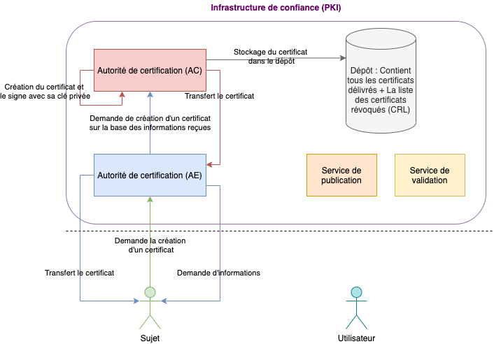

# Sécurité Informatique des échanges

# Notations & Contact

- interros + TPs
- thierry.meyer@tm-consultants.fr

# Table des matières
- [Sécurité Informatique des échanges](#sécurité-informatique-des-échanges)
- [Notations & Contact](#notations--contact)
- [Table des matières](#table-des-matières)
- [Cryptographie appliquées - Fondamentaux](#cryptographie-appliquées---fondamentaux)
  - [Cryptographie & Cryptanalyse](#cryptographie--cryptanalyse)
  - [La cryptographie fourni 4 services de sécurité:](#la-cryptographie-fourni-4-services-de-sécurité)
  - [La cryptographie possède les acteurs suivants:](#la-cryptographie-possède-les-acteurs-suivants)
  - [Les algorithmes cryptographiques (cipher)](#les-algorithmes-cryptographiques-cipher)
  - [Les clefs cryptographiques (cryptographic keys)](#les-clefs-cryptographiques-cryptographic-keys)
  - [Point de vue mathématique](#point-de-vue-mathématique)
  - [Les One Time Pad (OTP) - Algorithme de chiffrement](#les-one-time-pad-otp---algorithme-de-chiffrement)
  - [La fonction Booléenne XOR ("exclusif")](#la-fonction-booléenne-xor-exclusif)
- [Les systèmes cryptographiques](#les-systèmes-cryptographiques)
  - [Les fonctions de hachage (One Way Hash Functions)](#les-fonctions-de-hachage-one-way-hash-functions)
    - [Principaux algorithmes](#principaux-algorithmes)
    - [Utilité](#utilité)
- [La cryptographie symétrique](#la-cryptographie-symétrique)
  - [Objectif](#objectif)
  - [Utilité](#utilité-1)
- [La cryptographie asymétrique](#la-cryptographie-asymétrique)
  - [Chiffrement](#chiffrement)
  - [Utilité](#utilité-2)
  - [Inconvénient & Stratégies](#inconvénient--stratégies)
- [Infrastructures à clés publiques (PKI)](#infrastructures-à-clés-publiques-pki)
  - [Les acteurs d'une PKI](#les-acteurs-dune-pki)
  - [Le cycle de vie d'un certificat](#le-cycle-de-vie-dun-certificat)
- [Références](#références)
- [TPs](#tps)
- [Glossaire](#glossaire)

# Cryptographie appliquées - Fondamentaux

Objectifs: savoir quels algorithmes utiliser ou ne pas utiliser en cryptographie. Comment casser un mécanisme cryptographique?

## Cryptographie & Cryptanalyse

__Cryptography__: art et science de garder les écritures secrètes. Sous-ensemble de la cryptologie. Créer des algorithmes de chiffrement et les utiliser.  

La cryptologie se constitue de la __cryptographie__ et de la __cryptanalyse__. Ces deux approches sont complémentaires.      

__Cryptanalyse__: art de décrypter les algorithmes. Phase offensive. C'est l'art de décryptage.  

## La cryptographie fourni 4 services de sécurité:
- authentification (garantir l'id de l'expéditeur d'un message à un destinataire)
- intégrité (données/message doit être exhaustif/complet et exact)
- confidentialité (garantir que seul le destinataire pourra consulter le message)
- non-répudiation (faire en sorte que l'expéditeur ne peut pas nier avoir effectué une action/envoi)  

## La cryptographie possède les acteurs suivants:
- l'utilisateur (users)
  - expéditeur (sender)
  - destinataire (receiver)
  - tiers de confiance (trusty)
- le cryptographe (Cryptographer)
- le cryptanalyste (Cryptanalyst)

Deux notions:
- message
  - message clair (plaintext ou cleartext)
  - message chiffré (ciphertext): message clair qui a été chiffré
- chiffrement (encryption)
- déchiffrement (decryption): déchiffrer pour retrouver le message en clair

> <strong>Attention:  le terme "décryptage" est mal approprié pour décrire le déchiffrement. Il connote plus l'acte offensif. En anglais il n'y a pas cette différence.</strong>

> Nous verrons que les fonctions de hachage, et chiffrements seront combinés afin de sécurité les échanges.  

## Les algorithmes cryptographiques (cipher)

Ce sont des manipulation que l'on va faire sur le message clair.  
Il y a deux types de manipulations:  
- mécaniques
- mathématiques

Des algorithmes ou fonction de hashages sont donc employés.  

## Les clefs cryptographiques (cryptographic keys)

Il s'agit d'une __clé de chiffrement__.  

## Point de vue mathématique

M/P -> message clair
C -> message crypté
E -> fonctionne de chiffrement
D -> fonction de déchiffrement

Alors:  
`E(M) = C et D(C) = M et D(E(M)) = M.`  

## Les One Time Pad (OTP) - Algorithme de chiffrement

Les __OTP__ sont des algorithmes de chiffrement. Ils peuvent être parfaits si deux consignes sont respectées.  

- clefs cryptographiques à une seule utilisation, de la même longueur que le message.
  - la clé ne doit être utilisée qu'une seule fois
  - elle doit être générée de manière aléatoire

Néamoins l'aléatoire n'est pas certifié car les clefs sont stockées sur les ordinateurs, et les ordinateurs sont des machines déterministes. Il est possible de ressortir les clefs.  

## La fonction Booléenne XOR ("exclusif")

Cf: Algèbre de Boole.  

Les opérateurs AND, OR et XOR.

XOR: la valeur est à 1 si et seulement si pas toutes les valeurs sont à 1, contrairement à OR. Représenté par un symbole sphérique contenant un croix sur les schémas.  

XOR: la table de vérité en en binaire, se transpose sur des chaines de caractères, dont les valeurs converties en binaire sont comparées (table ASCII), si elles sont les mêmes (1), alors on générera un bit 0 (soit une valeur différentes correspondant à la valeur cryptée).  

Cf: Tables de vérité

XOR est commutatif et associatif. Nous pouvons l'utiliser afin de manipuler les éléments et les inverser.  

# Les systèmes cryptographiques

Il y a trois grandes familles:  
- les fonctions de hachage
- la cryptographie symétrique
- la cryprographie asymétrique

## Les fonctions de hachage (One Way Hash Functions)

C'est une fonction (notée H) qui génère des empreintes numériques: soit une chaîne de caractères qui représente la donnée pour laquelle elle a été générée. Cette chaîne est de longueur fixe et dépend de l'algorithme utilisé.  
On nomme cette donnée __*h*__, soit une __empreinte__(__hash__).  

L'algorithme ne permet pas de retrouver la donnée à partir de l'empreinte: c'est irréversible. Vérifie l'intégrité.
La seule façon serait d'essayer de casser l'empreinte.  

Donc:   
`H(M) = h`

C'est utilisé lors des téléchargements de fichiers (iso, ddl...). Nous devons vérifier la signature. Si, elle diffère, c'est que le fichier a été altéré.  

La robustesse de la fonction de hachage dépend de sa probabilité de tomber sur une __collision__. C'est-à-dire que la clé étant de longueur fixe, peut-être deviner une fois toutes les possiblités écoulées, et stocker par la machine dans une BDD, puis parsées. Si, il y a collision, il ne faut plus utiliser la fonction. L'exemple actuel est `md5`.  

Pour combler cela: on peut renforcer les fonctions:
- utilisation d'un sel (salt)
- concatenation de la donnée avec une chaîne de caractère "aléatoire" pour complexifier le cassage de l'empreinte.  

### Principaux algorithmes

- __MD5__ : Message Digest Algorithm
- __SHA__ (Secure Hash Algorithm)
  - SHA 1
  - SHA 256 (longueur de l'empreinte)
  - SHA 384 (longueur de l'empreinte)
  - SHA 512 (longueur de l'empreinte)

Il ne faut plus utiliser MD5 et SHA 1.

### Utilité

- contrôle d'intégrité: fichier téléchargeable, outil de détection d'intrusion
- confidentialité: stocker des valeurs qu'on veut dissimuler, comme des mots de passe. (`/etc/shadow` sous un serveur Linux).

# La cryptographie symétrique

- consiste à chiffrer et déchiffrer un message via:
  - la même clé
  - le même algo

Les participants partagent donc tous la clé.

Deux grandes familles:
- algorithmes de chiffrement par flux (stream ciphers)
  - message de longueur quelquonque. Utilisation de l'opérateur booléen XOR.
  - génération d'une valeur appelé __Keystream__ à partir d'une clef (__seed__). Dérivé d'un clé initiale formé d'un vecteur d'initialisation.
  - exemple: RC4, SEAL, PKZIP
- algorithmes de chiffrement par bloc (block ciphers)
  - message de longueur quelquonque, découpé en blocs de taille fixe. Le dernier bloc a peut de chance d'être rempli à fond afin d'être comblé. On ajoute donc du __padding__ afin de le combler.  
  - chaque bloc en clair donnera toujours le même bloc chiffré. On peut choisir un __mode d'opération__ pour traiter les bloc. Exemple de mode d'opération __ECB__, non recommandé car il réagit faiblement face aux attaques. Exemple 2: __CBC__ (Cipher Block Chaining) est le standard actuel en mode d'opération, nécessitant également un vecteur d'initialisation pour le premier bloc et des XOR afin de définir les blocs suivants. Pour déchiffrer il suffit de XORer dans l'autre sens. Exemple 3: __CFB__ (Cipher Feedback), vecteur d'initialisation avec une clé qui sera XORée. Déchiffrement: déchiffrer le vecteur d'initialisation. Exemple 4: Output Feedback (__OFB__). Autre exemples: __GCM__, __XTS__, __CTR__(en utilisant un compteur)...   
  - exemple d'algorithme par bloc: __DES__ (Data Encryption Standard), __AES__ (Advanced Encryption Standard) qui est le standard actuel, __IDEA__, __Blowfish__...  

- vecteur d'initialisation (noté IV): bloc de données aléatoire servant à démarrer la moulinette (chiffrement du premier bloc). Ne pas utiliser le même IV avec deux clefs différentes.  
- L'empreinte (__hash__) est souvent chiffrée en symétrique, avec le biais d'une clé (message authentication), qui permettra plus tard de recalculer le __hash__. Il faudra réfléchir à une manière d'échanger la clé afin qu'elle ne tombe pas entre les mains d'autrui.         

## Objectif

- garantir l'intégrité grâce à la cryptographie symétrique. Gérer les contrôles d'intégrité de flux entre application.
  - __MAC__ (Message Authentication Code)
  - __HMAC__ (keyed-Hash Message Authentication Code)

## Utilité

- authentification
- confidentialité
- intégrité (en combinant avec un message codé comme MAC ou HMAC).

> __HTTPS__ utilise le chiffrement symétrique par bloc. Pour chaque échange avec un serveur web, il y a une génération de clé. Le chiffrement doit être combiné avec du chiffrement asymétrique afin d'échanger les clés.

Cf: Echange de clef symétrique Diffie-Hellman.

# La cryptographie asymétrique

- chaque participant dispose d'une paire de clefs (biclef)
  - clé privée (nombre)
  - clé publique (nombre)

- une sert à chiffrer, l'autre à déchiffrer
- les clés sont générées à partir de fonctions mathématiques
- repose sur des problèmes mathématiques non-resolus
  - factorisation d'un nombre entier formé de grands facteurs premiers
  - résolution d'un logarithme discret sur un corp fini
  - résolution d'un logarithme discret sur un corp elliptique

Deux applications:
- chiffrement (clé publique et privé)
- signature électronique

## Chiffrement

Les participants échange leur clé, et se mettent d'accord sur un algorithme à utiliser.  

__Exemple:__ échange de clé via HTTPS. Le serveur envoie sa clé privé, et la navigateur créé une clé, puis un canal se créé: le __TLS__.  

L'échange de clefs symétrique est démontré par les mathématiciens Diffie-Hellman et nécessite une étape asymétrique.  

Principaux algorithmes

- __RSA__: Rivest Shamir Adleman    
- __EIGamal__   
- __Systèmes à courbes elliptiques__  
- __DSA__: Digest Signature Algorithm  

__RSA__ est actuellement recommandé.  
__Clé publique__: composé d'un __*modulus*__ et __*exposant*__. Voir la génération de clé publique et le calcul de clé privée.  

> La commande `genrsa` permet de générer une clé privée.  

## Utilité

- authentification
- confidentialité
- intégrité
- non-répudiation

## Inconvénient & Stratégies

- une seule clé: pour combler, limiter les accès avec un `chmod 400` sous Linux. Il faut également chiffrer la clé privée avec un __passphrase__, sauf dans le cas d'un serveur/data center. Cette passphrase est la clé pour chiffrer de manière symétrique la clé privée. Ce mot de passe permettra de dévérouiller la clé privée. Sécuriser la clé privée est un must.   
- La bonne pratique est d'utiliser un gestion de mot de passe.     

- l'identité de l'expéditeur doit être prouvée. Il faut tier appelé __certificat__ afin de l'identifier. Sur internet, via HTTPS, un certificat contient les identités à vérifier.  

# Infrastructures à clés publiques (PKI)

> __PKI__ signie __Public Key Infrastructure__ et l'acronyme en français se transforme en __ICP__ pour __Infrastructure à clé publique__.  

Nous avons vu les fonctions de hachage et chiffrements symétrique et asymétrique. Pour le chiffrement asymétrique, il faut s'assurer que dans son voyage, la clé ne soit pas récupérée et altérée par une personne malveillante. Il faut donc mettre en place un __tiers de confiance__ ou __autorité de certification__.   

Dans la litérature les 3 termes suivants se trouvent et signifie la même notion :
- infrastructure à clés publiques: ICP
- infrastructure de gestion des clés: IGC
- public key infrastructure: PKI

Une __PKI__ est un ensemble de composants physiques (ordinateurs, équipements cryptographiques, cartes à puces), de procédures humaines et de logiciels, destiné à gérer les clés publiques des utilisateurs d'un système.  

> Problème de départ: garantir l'authenticité d'une clé publique.    

Résolution du problème: introduction de __certificat électronique__.  

Un __certificat électronique__ est un document électronique contenant des données publiques (proche d'une carte d'identité). Ils sont employés dans des actions tels que des accès à un site web, envoi de mails... Le certificat inclu la clé publique. Un certificat est créé par une __autorité de certification__. Le certificat a plusieurs contraintes:  
- il doit être propre à l'entité pour laquelle il est destiné.  
> Les certificats wildcards sont des certificat utilisé pour des domaines.  
- il permet de présenter de manière clair l'identité de l'entité
- il contient la clé publique   
- il contient l'identité de l'entité émettrice  
- il doit être infalsifiable (signé électroniquement par l'entité émettrice)  
- il doit indiquer l'utilisation qu'il peut être fait de la clé publique qu'il contient
- il doit présenter de manière clair sa période de validiter, il est valide pendant une certaine période  
- il doit porter un numéro d'identification    

La norme/format `X509v3` décrit le certificat électronique et en propose un standard.  

Le certificat est en fait un fichier, disponible sous différent formats:
- `.pem` -> __Privacy Enhanced Electronic Mail__. Encodé en base 64. Ils commencent par la mention `BEGIN CERTIFICATE` et se termine par `END CERTIFICATE`.  
- `.cer`, `.crt`, `.der` -> certificat DER au format binaire.  
- `.p7c`, `.p7b` -> fichier contenant plusieurs certificats ou plusieurs __CRLs__ (Certificate Revocation List) -> (Standard PKCS#7 qui spécifie comment les fichiers contenant plusieurs certificats doivent être structurés).
- `.p12` -> (Standard __PKCS#12__) -> fichier contenant le certificat et la clé privée. Procurer une passphrase pour la clé privée.  

> Les clés publiques sont dans des fichiers `.pub`.  
> Les clés privées sont dans des fichiers `.priv`.  
> Les fichiers encodés en base 64 peuvent se reconnaitre lorsque les chaînes de caractères se terminent par un `=`, marque de __padding__ de la base 64.  
> `openssl` permet de générer des clefs et certificats.  
  > `openssl x509 -in certificate_name.extension -text | less` renverra un certificat ciblé (remplacer par le nom du fichier à analyser) ainsi que les informations (champs standards et d'extensions)      
  > se rendre sur un navigateur `qwant` par exemple, et cliquer sur le cadenas et analyser le certificat pour y trouver les informations sur des champs standards (`version`, `numéro de saisie`, `algorithme de signature du certificate`, `émetteur`, période de validité) qui pourront contenir des champs d'extensions comme pour le champs émetteur (`CN`: common name, `O`: organization, `C`: country).  

Les certifications `x509` contiennent des champs standards et des champs d'extensions, contenant des informations supplémentaires sur les champs standards.    

C'est de cette manière que fonctionnent les certificats pour un système ouvert tel __qu'internet__.  

## Les acteurs d'une PKI

- Propriétaire du certificat: __sujet__ ou __porteur__. Celui pour lequel le certificat est délivré. Il possède la biclef et souhaite la faire certifier par un tiers. *Exemple*: __Qwant__.  
- Utilisateur du certificat: entité qui récupérera la clé publique contenu dans le certificat. Il l'utilisera conformément à l'usage prévu dans le certificat. *Exemple*: Tout client/navigateur web accédant au domaine __Qwant__.  
- Infrastructure de confiance: Gère tout le cycle de vie du certificat. Elle est composé, à minima d'une __autorité de certification__ (__AC__ ou __CA__ pour __Certificate Authority__) mais peut également disposer:
  - d'une __autorité d'enregistrement__ (__AE__)  
  - d'un service de publication
  - d'un dépôt pour les __liste de certificats révoqués__ (__LCR__ ou __CRL__)
  - d'une __autorité d'horodatage__ (__AH__)
  - d'une __autorité de validation__ (__AV__)
  - ...  

  

## Le cycle de vie d'un certificat

- __initialisation__
  - demande auprès de l'AE d'un certificat (le sujet doit avoir une biclef)
  - retour d'un challenge (élément chiffré à déchiffrer par le sujet pour garantir qu'il est bien en possession de la clé privée) avec informations en plus dans un formulaire vers l'AE
  - vérification des informations renvoyées côté AE.
  - ensuite, l'AE demande la création du certificat à l'AC en envoyant en même temps les données et la clé privée.
  - l'AC généère le certificat, signe la clé et éventuellement le publie dans un dépôt.
  - l'AC retransmet la certificat avec la clé vers l'AE, qui à son tour retransmet vers le sujet.
- __validation/utilisation__ 
  - validation avant l'utilisation de la clé publique
    - mise en oeuvre d'une LCR
    - mise en oeuvre d'une autorité de validation (service de validation) (AV)
  - vérification du status du certificat
  - utilisation du certificat (extraction et utilisation de la clé par les logiciels (navigateurs...))
- __revocation / suspension__
  - un certificat peut être révoqué:
    -  si la clé privée a été volée/compromise. (suspicion/compromission de la clé privée)  
    -  si l'on a plus l'usage.
    -  si l'entité utilisatrice n'est plus dans la société, n'existe plus
  - la demande est transmis à l'AE puis à l'AC qui répercutera la demande dans le service de publication.
  - les certificats seront placés dans un annuaire appelé LCR (Liste des certificats révoqués) avec la signature de l'AC dessus.
  - Problème: la liste LCR deviendra longue et difficile à parcourir:
    - mise en place de CRL avec de découper des LCR en CRL publiées à intervalles réguliers. Le champ __CRL distribution point__ contiendra les adresses révoquées.
    - Un __CRL__ est au format X509v2. 
    - alternative: vérifié par l'OCSP: Online Certificate Status Protocol.
- __renouvellement__
- __création des supports physiques__

__Domaine de confiance__: zone à l'intérieur de laquelle la validité d'un certificat s'opère.  

# Références

|Références|Auteur|Date de parution|
|----------|------|----------------|
|Applied Cryptography|Bruce Schneier||
|Serious Cryptography|Jean-Philippe Aumasson||
|Cryptography quantique (podcast)|Renaud Lifchitz||

- __Mimikatz__: application de test d'intrusion développé par Benjamin Delpy.  
- __Zerologon__: faille sur les systèmes Windows/ Microsoft a signalé des attaques.
- __Nolimitsecu__: podcast hebdomadaire, sur des thèmes très variés.
- __Le Comptoirsecu__: podcast hebdomadaire, avec une approchae différente.  
- __Misc__: magasine francophone sur divers sujets.

# TPs

- __TP 1__: retrouver le texte clair, par une attaque au clair choisi, on sélectionne une partie du texte et le dérouler dans l'algorithme (à faire pour vendredi). Objectif: Développer un script capable de récupérer le texte en clair. Rendre un algorithme avec le message décrypté.   
  - Sachant que __P__ = __Plain text__, __C__ = __EnCrypted Text__ et __k__ = __key__.  
  - On a l'équation: __P1 = P2 xor C2 xor C1__.    
  - Placer un texte clair, et le placer avec ou sans espace et voir si une correpondance si retrouve dans le premier plain text.   
- __TP 2__: Manipuler `openssl` afin de générer des certificats. Fourni un compte-rendu détaillé des manipulations.

# Glossaire

- __ANSI__: Agence National pour la Sécurité Informatique
- __ransomware__: logiciel malveillant ayant pour but d'attaquer en bloquant/chiffrant les contenus de disques durs. On s'attaque donc aux données.    
- __SSH__: terminal/protocole distant, chiffré, sécurisé pour accéder à une machine/serveur à distance et interagir avec les ressources.  
- __challenge__: fait de chercher l'identité (authentification). Nous vérifions que l'entité en question possède la même clé que nous. 
- __IMAP__: serveur permettant la consultation de mails (outlook, gmail...)
- __TLS__: système de chiffrement utilisé avec HTTPS, pour chiffre les données en échange entre client et serveur. Il peut être combiner avec __SMTP__.  
- __RGS__: Règlement général pour la sécurité. Enumère les normes pour les entreprises.  